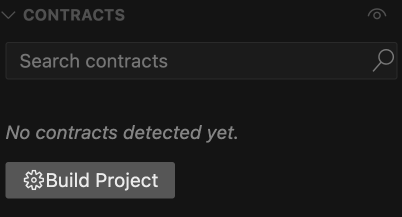
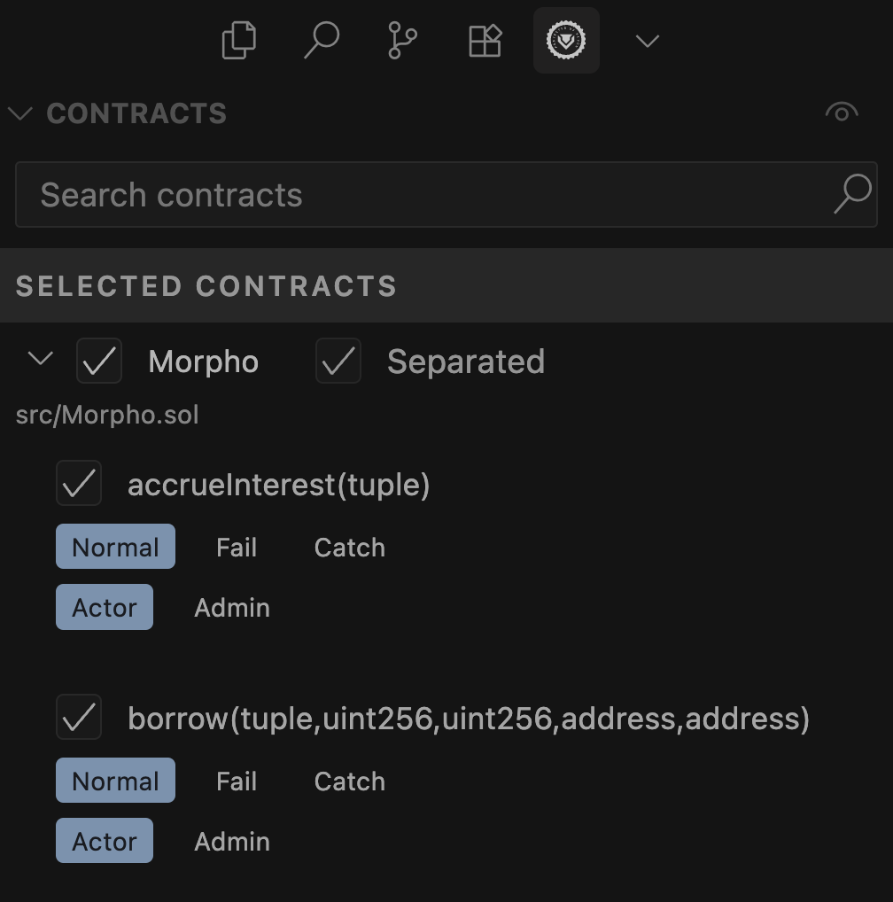
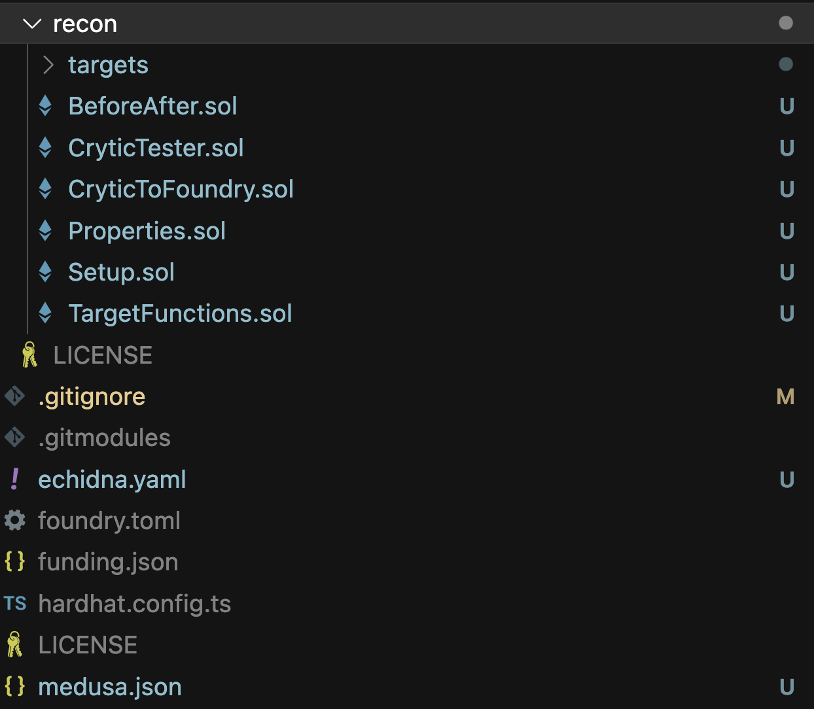
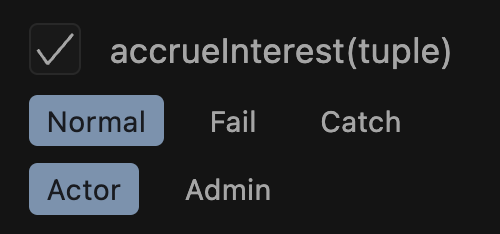
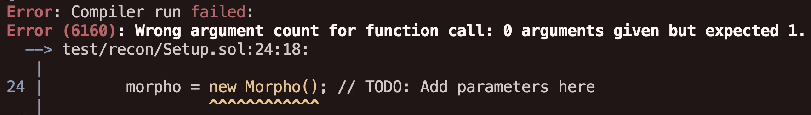
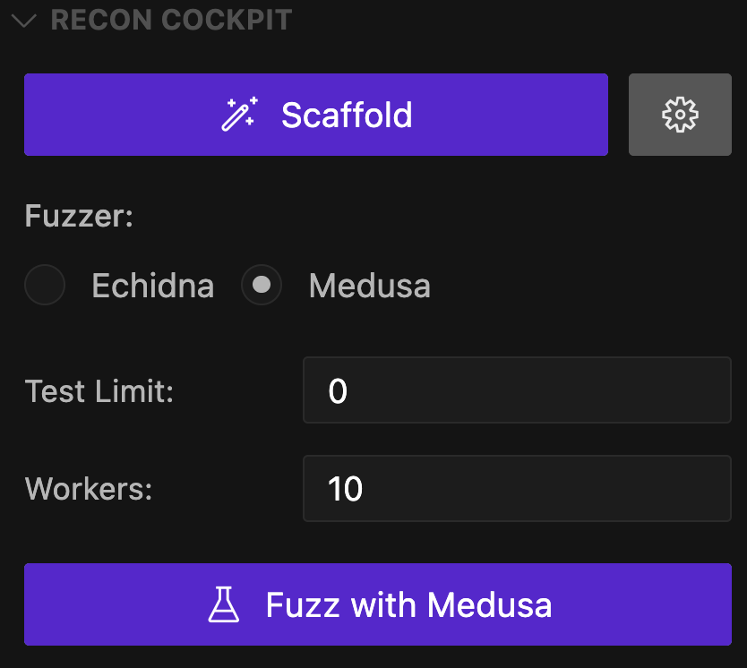
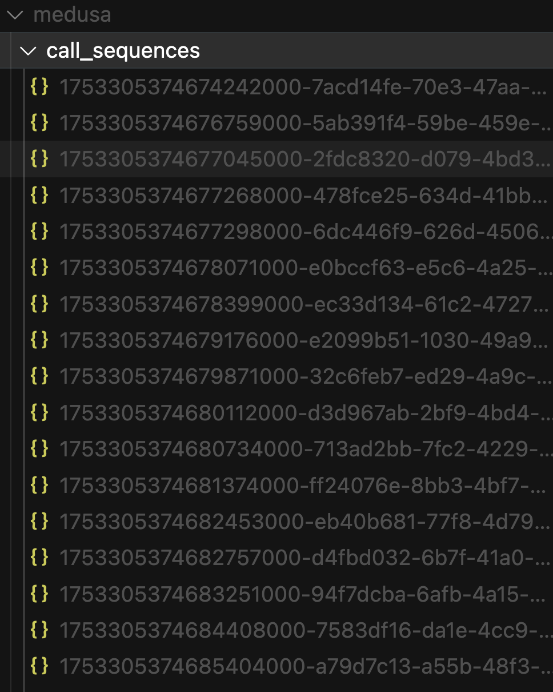
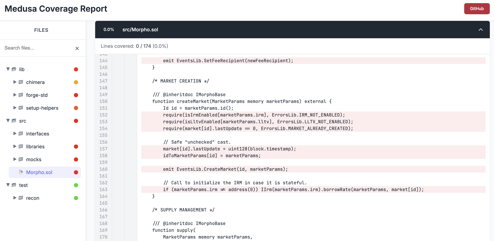
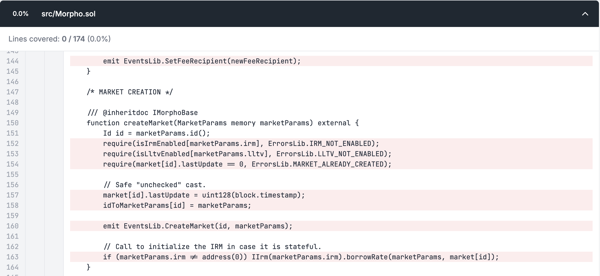
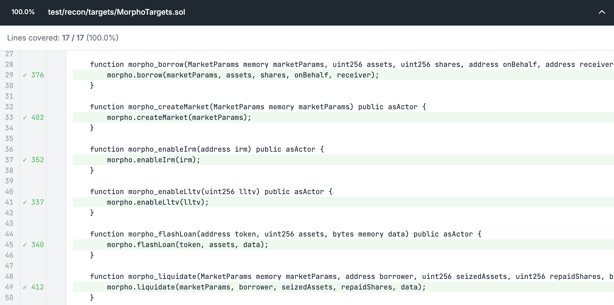

# Invariant Testing with Chimera Framework

## What is the Chimera Framework?

In this section going to look at what the [Chimera Framework](../oss/chimera.md) is and see how we've used it to create our [Create Chimera App](../writing_invariant_tests/create_chimera_app.md) template. 

We'll also look at an example of how we can use Chimera to scaffold Morpho, a simple real-world contract that will allow us to understand how we can write invariant tests.

### The Core Concept

The key idea of the Chimera Framework is that it allows you to write property tests using a single format and everything related to the underlying means by which you make the assertions is abstract away all so that you can effectively write your test in Solidity and use any tool ([Echidna](https://github.com/crytic/echidna), [Medusa](https://github.com/crytic/medusa), [Halmos](https://github.com/a16z/halmos) or [Kontrol](https://github.com/runtimeverification/kontrol)) to verify them.

In this first section we'll just be focused on understanding the Chimera Framework and will look at how to use each tool in later sections.

## The Four Phases of Invariant Testing
Before diving into the example let's first look at some of the key points of how to best execute invariant testing that will help reduce decision-making fatigue and allow you to do a better job.

We've developed this approach because at the end of the day, the time spent writing the test is a sunken cost. The primary value of invariant testing is in preventing bugs, so standardizing the way you write tests is key if you don't want to waste time on design decisions that you should be able to reuse between test suites and prevent you from finding more bugs. 

After looking at these different phases we'll get into scaffolding Morpho but you can skip ahead to the [Getting Started](#getting-started) section if you want to start right away.

### Phase 1: Setup Phase
In this phase your only goal should be to deploy the contracts in a meaningful state.

### Phase 2: Coverage
The next phase is all about achieving line coverage over the contracts of interest that you're testing. This is key because without it you can define any number of properties but they will be worthless because you won't be meaningfully testing them without actually reaching all possible states in your target system. 

### Phase 3: Write Properties
This phase is pretty straightforward, you define properties using your understanding of the system in English then translate them into implementations in Solidity.

### Phase 4: Iterate
The final phase is iteration, where you reflect on the properties you've written and determine if there are further properties that you could additionally implement. We'll see down below how this can often be limited by the way that we reached coverage as using things like mocks limits the state space we can explore in dependencies of the system.

The approach that we're taking with using stateful fuzzing is essentially just asking the tool for the steps that a normal user may execute in our system to achieve a specific goal instead of asking whether a state is feasible in our ways through a formal tool we simply want to get to the reproducer.

## The Philosophy of Testing

The key benefit of invariant testing is not necessarily the tests themselves but rather ability that they give you to think about and test edge cases and your understanding of the system.

The Chimera framework is here to offload the required thinking related to setting up the test suite to help you streamline your process and get you through achieving coverage and breaking properties as soon as possible.

## The Chimera Framework Contracts

The key idea behind the Chimera framework, is to use the following contracts:

- **Setup** - where deployment configurations are located
- **TargetFunctions** - explicitly state all the functions that should be called as part of state exploration
- **Properties** - used to explicitly state the properties to be tested
- **BeforeAfter** - an abstraction used to track variables over time to define more complex properties
- **CryticTester** - the entrypoint from which a given tool will execute test
- **CryticToFoundry** - used for debugging broken properties with Foundry

so that you don't have to make decisions about your test suite configuration and can get to writing and breaking properties faster (for more details on these checkout the [Chimera Framework](../writing_invariant_tests/chimera_framework.md#the-contracts) page). 

Our goal with this framework is to help you write 99% of the time using the same format that you're used to in Foundry, then give you an easy way to hook into other tools that we believe are way more powerful for testing with a particular method so that you can actually get to evaluating properties faster.

In `Setup`, we're going to put all of our deployment configuration. This can become very complex but as of now all you want to think about is that we need to specify how to deploy all the contracts of interest for all of our tools.

The `TargetFunctions` are the key of our opinionation, it allows you to explicitly state all the functions that should be called as part of state exploration. For more complex codebases you'll generally have multiple sub-contracts which specify target functions for each of the contracts of interest in the system which you can inherit into `TargteFunctions`. Fundamentally, any time you're thinking about exploring state the handler for the state changing call should be located in `TargetFunctions`.

The `BeforeAfter` contract is an abstraction that allows us to track variable transitions over time to assert more complex properties. 

## Why This Framework Exists

We mentioned above that Chimera allows you to simplify your invariant test suite creation process and run multiple tools to test the invariants you define, but we can say that more fundamentally this framework exists to standardize how state space is explored, meaning how the state of a smart contract state is altered. The primary reason we want to standardize this is because if we all agree on a way to explore state and check for properties, then we can all build tools that are interoperable.

But most importantly, we can optimize these tools so that we don't have to have this generic tool that is a hundred or a thousand times slower than what it could be if we just standardize it a bit. That's really our goal - we want to standardize how you explore state and we'll show you this today. We want to standardize how you check for global properties and how you debug repros. That's also something you'll see there today.

Our goal is really to help you be able to run other tools because the idea that there is one tool that does everything is just not true and so we believe you should be able to use as many tools as you want.

## Getting Started
To follow along, you can clone the [Morpho repository](https://github.com/morpho-org/morpho-blue). We'll then see how after you've cloned Morpho you can use the [Recon Builder](../free_recon_tools/builder.md) to get all the Chimera scaffoling for our contract of interest. 

Looking at our primary goals for this section they are: 
1. setup - create the simplest setup possible that allows you to fully test the system's state
2. coverage - understand how to read a coverage report and resolve coverage issues 

## Practical Implementation - Setting Up Morpho

Once you've cloned the Morpho repo locally you can make the following small changes to speed up compilation and test run time: 
- disable `via-ir` in the `foundry.toml` configuration
- delete the entire existing test folder

**TODO: screenshot of the above changes**

Our next step is going to be getting all the Chimera scaffolding added to our repo which we'll do using the [Recon Extension](../free_recon_tools/recon_extension.md) because it's the fastest and simplest way. 

> Note: you can also generate your Chimera scaffolding without downloading the extension using the [Recon Builder](../free_recon_tools/builder.md) instead

After having downloaded the extension you'll need to build the project so it can recognize the contract ABIs that we want to scaffold:



We can then select the contract for which we want to generate target functions for, in our case this will be the `Morpho` contract: 



The UI additionally gives us the option to scaffold only a subset of all state-changing functions in the contract by clicking the checkmark next to each. For our case we'll keep all the default selected target functions.

After scaffolding, all the Chimera Framework contracts will be added to our `test` folder and fuzzer configuration files will be added to the root directory:



### Fail Mode and Catch Mode

Our builder offers some additional "modes" for the generated target functions: **fail mode** and **catch mode**:



Fail mode will force an assertion failure after a call is successful. We use this for defining what we call canaries, tests that confirm if certain functions are being covered because the assertion will only fail if the call to the target function completes successfully.

Catch mode is useful to instead either skip a target function call or add a test to the catch block with an assertion to determine when it reverts. This is a key mindset shift of invariant testing with Echidna and Medusa: a revert is not a test failure, a revert will simply cause the call to be skipped, therefore the only thing that will result in a test failure in one of these fuzzers is an assertion failure (unlike Foundry where a reverting call automatically causes the test to fail).

This is important because you don't want to end up over-clamping your handlers and excluding cases which revert because in invariant testing these can reveal interesting states that could help find edge cases. 

> If you're ever using Foundry to fuzz instead of Echidna or Medusa, you should disable the `fail_on_revert` parameter in your Foundry config to have similar behavior to the other fuzzers and allow tests written for them to be checked in the same way.

## Compilation Issues and Solutions

At this point we have our testing suite scaffolded, now we just need to resolve the following copmilation error that we get with the created setup:



Since at this point we don't want to worry about our setup we can just comment out the deployment of the `Morpho` contract to resolve the compilation error: 

```javascript
    function setup() internal virtual override {
        // morpho = new Morpho(); // TODO: Add parameters here
    }
```

Now when we run `forge build` it should successfully compile! 

> NOTE: if you're using the Recon Builder you'll most likely have to spend some time resolving compilation errors due to incorrect imports because the Builder isn't capable of automatically resolving these in the same way that the extension does.

## Setup

Generally you should aim to make the `Setup` contract as simple as possible, this generally helps reduce the number of assumptions made by your setup and also makes it simpler for collaborators to understand the initial state that the fuzzer starts from. 

In our case because of the relative simplicity of the contract that we're deploying in our test suite we can just check the constructor arguments of the `Morpho` contract:

```javascript
contract Morpho is IMorphoStaticTyping {
    ...

    /// @param newOwner The new owner of the contract.
    constructor(address newOwner) {
        require(newOwner != address(0), ErrorsLib.ZERO_ADDRESS);

        DOMAIN_SEPARATOR = keccak256(abi.encode(DOMAIN_TYPEHASH, block.chainid, address(this)));
        owner = newOwner;

        emit EventsLib.SetOwner(newOwner);
    }

    ...
}
```

from which we can see that we simply need to pass an owner of the deployed contract. 

We can therefore modifier our `Setup` contract accordingly so that it deploys the `Morpho` contract with the `address(this)` (the default [actor](../glossary.md#actor) that we use as our admin) set as the owner of the contract: 

```javascript
abstract contract Setup is BaseSetup, ActorManager, AssetManager, Utils {
    Morpho morpho;
    
    function setup() internal virtual override {
        morpho = new Morpho(address(this)); 
    }

    ...
}
```

We now have the contract which we can call target functions on deployed! This completes step 1 of 2 and now we can run the fuzzer!

### How We Can Reuse Tests

Because we only implemented our deployments in a single `setup` function this can be inherited and called in the `CryticTester` contract:

```javascript
contract CryticTester is TargetFunctions, CryticAsserts {
    constructor() payable {
        setup();
    }
}
```

to allow us to test with Echidna or Medusa and also inherited in the `CryticToFoundry` contract to be tested with Foundry, Halmos and Kontrol:

```javascript
contract CryticToFoundry is Test, TargetFunctions, FoundryAsserts {
    function setUp() public {
        setup();
    }
}
```

This is the key insight of using the Chimera Framework: if your project compiles in Foundry, it will work in any of the above mentioned tools automatically. 


## Running Medusa and Coverage Analysis

At this point, we've achieved compilation and our next step will simply be to figure out how far this allows the fuzzer to get in terms of line coverage over our contract of interest.

Before running you'll need to make sure you have [Medusa](https://github.com/crytic/medusa) downloaded on your local machine.

With Medusa downloaded you can use the _Fuzz with Medusa_ button from the Recon Cockpit section of the Recon extension to start your fuzzing campaign:



> You can also run Medusa using `medusa fuzz` from the root of your project directory

We can see from the output logs from running Medusa that its entrypoint into our created test scaffolding is the `CryticTester` contract:

```bash
⇾ [PASSED] Assertion Test: CryticTester.add_new_asset(uint8)
⇾ [PASSED] Assertion Test: CryticTester.asset_approve(address,uint128)
⇾ [PASSED] Assertion Test: CryticTester.asset_mint(address,uint128)
⇾ [PASSED] Assertion Test: CryticTester.morpho_accrueInterest((address,address,address,address,uint256))
⇾ [PASSED] Assertion Test: CryticTester.morpho_borrow((address,address,address,address,uint256),uint256,uint256,address,address)
⇾ [PASSED] Assertion Test: CryticTester.morpho_createMarket((address,address,address,address,uint256))
⇾ [PASSED] Assertion Test: CryticTester.morpho_enableIrm(address)
⇾ [PASSED] Assertion Test: CryticTester.morpho_enableLltv(uint256)
⇾ [PASSED] Assertion Test: CryticTester.morpho_flashLoan(address,uint256,bytes)
⇾ [PASSED] Assertion Test: CryticTester.morpho_liquidate((address,address,address,address,uint256),address,uint256,uint256,bytes)
⇾ [PASSED] Assertion Test: CryticTester.morpho_repay((address,address,address,address,uint256),uint256,uint256,address,bytes)
⇾ [PASSED] Assertion Test: CryticTester.morpho_setAuthorization(address,bool)
⇾ [PASSED] Assertion Test: CryticTester.morpho_setAuthorizationWithSig((address,address,bool,uint256,uint256),(uint8,bytes32,bytes32))
⇾ [PASSED] Assertion Test: CryticTester.morpho_setFee((address,address,address,address,uint256),uint256)
⇾ [PASSED] Assertion Test: CryticTester.morpho_setFeeRecipient(address)
⇾ [PASSED] Assertion Test: CryticTester.morpho_setOwner(address)
⇾ [PASSED] Assertion Test: CryticTester.morpho_supply((address,address,address,address,uint256),uint256,uint256,address,bytes)
⇾ [PASSED] Assertion Test: CryticTester.morpho_supplyCollateral((address,address,address,address,uint256),uint256,address,bytes)
⇾ [PASSED] Assertion Test: CryticTester.morpho_withdraw((address,address,address,address,uint256),uint256,uint256,address,address)
⇾ [PASSED] Assertion Test: CryticTester.morpho_withdrawCollateral((address,address,address,address,uint256),uint256,address,address)
⇾ [PASSED] Assertion Test: CryticTester.switch_asset(uint256)
⇾ [PASSED] Assertion Test: CryticTester.switchActor(uint256)
```

Which allows it to call all of the functions defined on our `TargetFunctions` contract (which in this case it inherits from `MorphoTargets`) **in a random order with random values passed in**. 

> NOTE: The additional functions called in the above logs are defined on the `ManagersTargets` which provide utilities for modifying the currently used actor (via the [`ActorManager`](../oss/setup_helpers.md#actormanager)) and admin (via the [`AssetManager`](../oss/setup_helpers.md#assetmanager)) in the setup.

After running the fuzzer, it also generates a corpus which is a set of call sequences that allowed the fuzzer to expand line coverage:



This will make it so that previous runs don't need to explore random inputs each time and can use inputs that it found that expand coverage to guide its fuzzing process and add mutations (modifications) to them to attempt to unlock new coverage or break a property. You can think of the corpus as the fuzzer's memory which allows it to retrace its prevoius steps when it starts again.

> Note: If you modify the interface of your target function handlers you should delete your existing corpus and allow the fuzzer to generate a new one, otherwise it will make calls using the previous sequences which may no longer be valid and prevent proper state space exploration. 

## Coverage Reports and Debugging

You'll notice that after stopping Medusa (use `crtl+c` if you're running from the command line) it will generate a coverage report (Chimera comes preconfigured to ensure that Medusa and Echidna always generate a coverage report) which is an html file that displays all the code from your project highlighting in green lines which the fuzzer reached and in red lines that the fuzzer didn't reach during testing. 



The coverage report is one of the most vital insights in stateful fuzzing because without it, you're blind to what the fuzzer is actually doing. 

## Debugging

Now let's add a simple assertion that always evaluates to false to one of our target function handlers: 

```javascript
    function morpho_setOwner(address newOwner) public asActor {
        morpho.setOwner(newOwner);
        t(false, "forced failure");
    }
```

Using this we can then run Medusa again and see that it generates a broken property reproducer call sequence for us: 

```bash
⇾ [FAILED] Assertion Test: CryticTester.morpho_setOwner(address)
Test for method "CryticTester.morpho_setOwner(address)" resulted in an assertion failure after the following call sequence:
[Call Sequence]
1) CryticTester.morpho_setOwner(address)(0x7109709ECfa91a80626fF3989D68f67F5b1DD12D) (block=29062, time=319825, gas=12500000, gasprice=1, value=0, sender=0x30000)
[Execution Trace]
 => [call] CryticTester.morpho_setOwner(address)(0x7109709ECfa91a80626fF3989D68f67F5b1DD12D) (addr=0x7D8CB8F412B3ee9AC79558791333F41d2b1ccDAC, value=0, sender=0x30000)
         => [call] StdCheats.prank(address)(0x7D8CB8F412B3ee9AC79558791333F41d2b1ccDAC) (addr=0x7109709ECfa91a80626fF3989D68f67F5b1DD12D, value=0, sender=0x7D8CB8F412B3ee9AC79558791333F41d2b1ccDAC)
                 => [return ()]
         => [call] <unresolved contract>.<unresolved method>(msg_data=13af40350000000000000000000000007109709ecfa91a80626ff3989d68f67f5b1dd12d) (addr=0xA5668d1a670C8e192B4ef3F2d47232bAf287E2cF, value=0, sender=0x7D8CB8F412B3ee9AC79558791333F41d2b1ccDAC)
                 => [event] SetOwner(0x7109709ECfa91a80626fF3989D68f67F5b1DD12D)
                 => [return]
         => [event] Log("forced failure")
         => [panic: assertion failed]
```

If you ran the fuzzer with the extension, it will give you the option to automatically add the generated reproducer unit test for this broken property to the `CryticToFoundry` contract:

```javascript
    // forge test --match-test test_morpho_setOwner_uzpq -vvv
    function test_morpho_setOwner_uzpq() public {
       vm.roll(2);
       vm.warp(2);
       morpho_setOwner(0x0000000000000000000000000000000000000000);
    }
```

> If you ran the fuzzer via the CLI you can copy and paste the logs into [this](https://getrecon.xyz/tools/medusa) tool to generate a Foundry unit test

This will be key once we start to break nontrivial properties because it gives us a much faster feedback loop to debug broken properties.

## Creating Mock Contracts

If we look more closely at the `Morpho` contract which we're targeting with our `TargetFunctions` we can see from the 0% in our coverage report that it doesn't actually cover any of the lines of interest: 



If we look at the coverage on our `TargetFunctions` directly however we see that we have 100% coverage and all the lines show up highlighted in green: 



This is an indication to us that the calls to the target function handler themselves are initially successful but once it reaches the actual function in the `Morpho` contract it reverts. 

With some understanding of the Morpho codebase we can determine that the first thing we need to do to allow us to increase coverage is call the `enableIrm` function which allows enabling an Interest Rate Model (IRM) contract which calculates dynamic borrow rates for Morpho markets based on utilization. 

Since the IRM can be any contract that implements the `IIRM` interface and there's none in the existing Morpho repo we'll create a mock so that we can simulate its behavior which will allow us to achieve our short-term goal of coverage for now. If we find that the actual behavior of the IRM is interesting for any of the properties we want to test, we can later replace this with a real implementation. 

The Recon Extension allows automatically generating mocks for a contract by right clicking it and selecting the _Generate Solidity Mock_ option, but in our case since there's no existing instance of the IRM contract we'll have to manually create our own as follows: 

```javascript
import {MarketParams, Market} from "src/interfaces/IMorpho.sol";

contract IrmMock {
    uint256 internal _borrowRate;

    function setBorrowRate(uint256 borrowRate) external {
        _borrowRate = borrowRate;
    }

    function borrowRateView(MarketParams memory marketParams, Market memory market) external view returns (uint256) {
        return _borrowRate;
    }
}
```

Our mock simply exposes a function for setting and getting the `_borrowRate` because these are the functions required in the `IIRM` interface. We'll then expose a target function that calls the `setBorrowRate` function which allows the fuzzer to modify the borrow rate randomly. 

Now the next contract we'll need is the oracle for setting the price of the underlying asset. Looking at the existing `OracleMock` in the Morpho repo we can see that it's already very simple so we can just reuse it in this case: 

```javascript
contract OracleMock is IOracle {
    uint256 public price;

    function setPrice(uint256 newPrice) external {
        price = newPrice;
    }
}
```

Now we just need to deploy all of these mocks in our setup: 

```javascript
abstract contract Setup is BaseSetup, ActorManager, AssetManager, Utils {
    Morpho morpho;

    // Mocks
    MockIRM irm;
    OracleMock oracle;
    
    /// === Setup === ///
    function setup() internal virtual override {
        // Deploy Morpho
        morpho = new Morpho(address(this)); 

        // Deploy Mocks
        irm = new MockIRM();
        oracle = new OracleMock();

        // Deploy assets
        _newAsset(18); // asset
        _newAsset(18); // liability

        // Mints to all actors and approves allowances to the counter
        address[] memory approvalArray = new address[](1);
        approvalArray[0] = address(morpho);
        _finalizeAssetDeployment(_getActors(), approvalArray, type(uint88).max);
    }
}
```

In the above we use the `_newAsset` function exposed by the [`ActorManager`](../oss/setup_helpers.md#actormanager) to deploy a new asset which we can fetch using the `_getAsset()` function.

Next up, the Oracle mock. And then, technically speaking, we will want to have two ERC-s. So we probably want to deploy that. We can call it asset and liability.

## Market Creation and Handler Implementation

At this point, let's grab these market params. We're gonna declare here market params and params, memory params equals to market params, where each value is gonna be this. We'll basically put the loan token is gonna be the liability. The collateral token is gonna be the asset the oracle we have up there oracle mock then the irm is mock irm and the lltv is going to be eight seventeen.

And this is going to be cheating because one of our rule is that we don't want to cut out inputs from our handlers. But once we take this type of trade off, we just accept it. So it is what it is.

## Clamped Handlers

At this point, I'm gonna add the following line that says this is automatic handlers. Basically, these are the handlers that explore all of the state, whereas up here, we'll have the clamped handlers. And so whenever we're doing stuff like supply, we will basically define a function more for supply that only receives the assets, for example.

And so this is kind of how you will introduce clamping to your handlers. Because by doing this you're giving the tool a chance to explore more weird stuff but at the same time we're not gonna have to wait until tomorrow to get to coverage.

> The key insight that we are making as a part of our VTru of our framework is that clamping is always done separately. I'm going to show that today, but this is a really key insight. And we always clamp by having the clamped handlers generate a subset of all possible handlers. This is really key because obviously if once we agree on this, we can actually use other tools and even formal verification techniques to automatically generate a lot of these clamping.

## Conclusion and Next Steps

That's fundamentally how you get started with this type of testing. It is not easy. It can be tedious. But at the same time, in about an hour, for some contracts, maybe four hours, maybe a bunch more for more complex ones. But you eventually get to coverage. And once you get to coverage, you can finally look into properties.

I'm gonna wrap up the session like this if you have questions feel free to dm me on twitter or on discord. And tomorrow, we're going to look into our newest version of Create Chimera App, where we add additional ways to explore more interesting states by having standardized assets and standardized colors, meaning that instead of having to set up all of these tokens yourself and also being limited to only having address Ds as the sender, we're actually going to show you how we can add more so that you can explore even more interesting transitions.

Thank you for joining me today and I'll see you tomorrow, same time, same Twitter account, and have an awesome rest of your day.