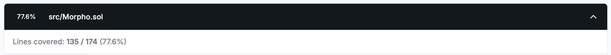
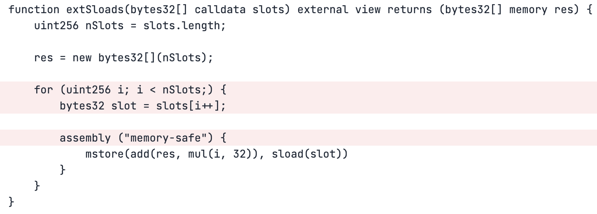

# Adding Multi-dimensionality to Invariant Tests

## Introduction and Goals

In [part 1](./bootcamp/bootcamp_day_1.md) we looked at how to create the setup and get high coverage, we're now going to look at how to get 100% coverage using the fuzzing run from part 1.

You can pickup using the repo with the changes from part 1 [here](https://github.com/Recon-Fuzz/morpho-blue/tree/day-1).

Today our goals are going to be to get one hundred percent coverage on the Morpho repo and look at some ways to make our test suite cover more interesting cases.

## Bug Fix and Setup

From part 1, our `MorphoTargets` contract should have two clamped handlers (for `morpho_supply_clamped` and `morpho_supplyCollateral_clamped`) and the remaining functions should be unclamped. 

After having run Medusa with these functions implemented we should now see an increase in the coverage show in our report and Medusa will be able to save these to the corpus which it can reuse for future runs, increasing its efficiency by not causing it to explore paths that are uninteresting. 

## How to Evaluate Coverage Reports

As we mentioned in part 1, the coverage report simply shows us which lines were successfully reached by highlighting them in green and shows which lines weren't reached by highlighting them in red:

**TODO: insert snapshot of latest coverage report**

And so barring any weird issue with coverage, we basically will just trace a bunch of lines that are green, and then eventually we'll find a red line. And that red line means that the fuzzer was reverting there. Once we find where a line is reverting we can then follow the steps from part 1 of creating a unit test in the `CryticToFoundry` contract to determine why a line may always be reverting and introduce clamping or changes to the setup to allow us to reach the given line.

## Coverage Analysis - Initial Results

After having run the fuzzer for a few minutes we can see that the coverage on the `Morpho` contract is at 77%:



It's important to note that when we're talking about 100% coverage, this shouldn't be an indication to try and blindly reach 100% coverage over all of a contract's lines because there are almost always certain functions whose behavior won't be of interesting in an invariant testing scenario, like the `extSloads` from the latest run:



Since this is a view function which doesn't change state we can safely say that covering it is unnecessary for our case. You should therefore use your knowledge of the system to make a judgement call about which functions in the system you can safely ignore coverage on. The remaining functions should be those that test meaningful interactions including public/external functions, as well as the internal functions they call in their control flow.

So in our case for `Morpho` we can say we need to have one hundred percent coverage of the meaningful interactions. And so that includes borrowing, liquidating, et cetera.

When we look at coverage over the `liquidate` function, we can see that it appears to be reverting at the line that checks if the position is healthy: 

**TODO: add image of missing coverage in liquidate**


Meaning we need to investigate this because this is a key functionality we want to test in the system. To understand why the is always reverting at the line above we'll use a Foundry unit test to determine what causes it to always revert. 

We can also see that the `repay` function similarly has only red lines after line 288, indicating that something may be causing it to always underflow: 

**TODO: add image of missing coverage in repay**
 

However we can also note that the return value isn't highlighted at all, potentially indicating that this is an issue with the coverage displaying mechanism, so our approach to debugging this will be different, using canaries instead.

## Debugging With Canaries

To create a canary for the `repay` function, we can create a simple boolean `hasRepaid` which we add to our `Setup` contract and set in our `morpho_repay` handler function:

```javascript
abstract contract MorphoTargets is
    BaseTargetFunctions,
    Properties
{
    function morpho_repay(uint256 assets, uint256 shares, address onBehalf, bytes memory data) public asActor {
        morpho.repay(marketParams, assets, shares, onBehalf, data);
        hasRepaid = true;
    }
}
```

Then we can define a simple canary property in our `Properties` contract:

```javascript
abstract contract Properties is BeforeAfter, Asserts {

    function canary_hasRepaid() public returns (bool) {
        t(!hasRepaid, "hasRepaid");
    }
    
}
```

this uses the `t` (true) assertion from the [`Asserts`](./writing_invariant_tests/chimera_framework.md) contract to let us know if the call to `morpho.repay` successfully completes by forcing an assertion failure (remember that only assertion failures are picked up by Echidna and Medusa). This function will randomly be called by the the fuzzer like the functions in `TargetFunctions`, allowing it to check if repay is called successfully after any of the target function calls.

> NOTE: while you're doing the above you can run the fuzzer in the background to confirm that you're not simply missing coverage because of a lack of sufficient tests. It's always beneficial to have the fuzzer running in the background because it'll be building up a corpus that will make subsequent runs more efficient. 

As a general rule, we put an underscore to separate what we are aiming to do, such as canary, invariant, property, or target contracts, such as Morpho, then use camel case on the rest of the function name. 

> See [this section](../writing_invariant_tests/implementing_properties.md#testing-mode) to better understand why we prefer to express properties using assertions rather than with boolean properties.

We can then run Medusa again to determine if we're actually reaching coverage over the `repay` function. 

## Investigating Liquidation Handler with Foundry

Now we can switch to using Foundry to investigate why the `liquidate` function isn't being fully covered. We can do this by expanding upon the `test_crytic` function which we used in part 1 to run sanity tests with.

So to test if we can liquidate a user we'll just keep the existing test where they open a borrow position and we'll set the price to a really low value to make the user liquidatable: 

```javascript
    function test_crytic() public {
        morpho_supply_clamped(1e18);
        morpho_supplyCollateral_clamped(1e18);

        oracle_setPrice(1e30);

        morpho_borrow(1e6, 0, address(this), address(this));

        oracle_setPrice(0);

        // Note: we liquidate ourselves and pass in the amount of assets borrowed as the seizedAssets and 0 for the repaidShares for simplicity
        morpho_liquidate(address(this), 1e6, 0, "");
    }
```

After running the test we get the following output:

```bash
    ├─ [22995] Morpho::liquidate(MarketParams({ loanToken: 0xc7183455a4C133Ae270771860664b6B7ec320bB1, collateralToken: 0x5991A2dF15A8F6A256D3Ec51E99254Cd3fb576A9, oracle: 0xF62849F9A0B5Bf2913b396098F7c7019b51A820a, irm: 0x2e234DAe75C793f67A35089C9d99245E1C58470b, lltv: 800000000000000000 [8e17] }), CryticToFoundry: [0x7FA9385bE102ac3EAc297483Dd6233D62b3e1496], 1000000 [1e6], 0, 0x)
    │   ├─ [330] Morpho::_accrueInterest(<unknown>, <unknown>)
    │   │   └─ ← 
    │   ├─ [266] OracleMock::price() [staticcall]
    │   │   └─ ← [Return] 0
    │   ├─ [2585] Morpho::_isHealthy(<unknown>, <unknown>, 0x1B4D54357a97De46Aae0FBDfD649dD8190EF99Eb, 128)
    │   │   ├─ [356] SharesMathLib::toAssetsUp(1000000000000 [1e12], 1000000 [1e6], 1000000000000 [1e12])
    │   │   │   └─ ← 1000000 [1e6]
    │   │   ├─ [0] console::log("isHealthy", false) [staticcall]
    │   │   │   └─ ← [Stop]
    │   │   ├─ [0] console::log("collateralPrice", 0) [staticcall]
    │   │   │   └─ ← [Stop]
    │   │   └─ ← false
    │   ├─ [353] SharesMathLib::toSharesUp(1000000000000 [1e12], 1000000 [1e6], 0)
    │   │   └─ ← 0
    │   ├─ [356] SharesMathLib::toAssetsUp(1000000000000 [1e12], 1000000 [1e6], 0)
    │   │   └─ ← 0
    │   ├─ [198] UtilsLib::toUint128(0)
    │   │   └─ ← 0
    │   ├─ [198] UtilsLib::toUint128(0)
    │   │   └─ ← 0
    │   ├─ [198] UtilsLib::toUint128(1000000 [1e6])
    │   │   └─ ← 1000000 [1e6]
    │   ├─ [199] UtilsLib::toUint128(1000000 [1e6])
    │   │   └─ ← 1000000 [1e6]
    │   ├─ emit Liquidate(id: 0x5914fb876807b8cd7b8bc0c11b4d54357a97de46aae0fbdfd649dd8190ef99eb, caller: CryticToFoundry: [0x7FA9385bE102ac3EAc297483Dd6233D62b3e1496], borrower: CryticToFoundry: [0x7FA9385bE102ac3EAc297483Dd6233D62b3e1496], repaidAssets: 0, repaidShares: 0, seizedAssets: 1000000 [1e6], badDebtAssets: 0, badDebtShares: 0)
```

which indicates that we were able to successfully liquidate the user. This means that the fuzzer is theoretically able to reach coverage over the entire `liquidate` function, it just hasn't yet because it hasn't found the right call sequence that allows it to reach the lines of interest yet.

All right, so this was successful, meaning that the liquidation went through. We can inspect the logs via decode internal. I believe there should be an event for liquidations. We see that the liquidation was successful. So what this means is that the tool is theoretically able to reach coverage.

## Tool Sophistication Limitations

After having run Medusa with the canary property enabled for the `morpho_repay` function we can see that it also doesn't break the property, meaning that the repay function is never fully covered:

```bash
⇾ [PASSED] Assertion Test: CryticTester.add_new_asset(uint8)
⇾ [PASSED] Assertion Test: CryticTester.asset_approve(address,uint128)
⇾ [PASSED] Assertion Test: CryticTester.asset_mint(address,uint128)
⇾ [PASSED] Assertion Test: CryticTester.canary_hasRepaid() /// @audit this should have failed
⇾ [PASSED] Assertion Test: CryticTester.morpho_accrueInterest()
⇾ [PASSED] Assertion Test: CryticTester.morpho_borrow(uint256,uint256,address,address)
⇾ [PASSED] Assertion Test: CryticTester.morpho_createMarket()
⇾ [PASSED] Assertion Test: CryticTester.morpho_enableIrm(address)
⇾ [PASSED] Assertion Test: CryticTester.morpho_enableLltv(uint256)
⇾ [PASSED] Assertion Test: CryticTester.morpho_flashLoan(address,uint256,bytes)
⇾ [PASSED] Assertion Test: CryticTester.morpho_liquidate(address,uint256,uint256,bytes)
⇾ [PASSED] Assertion Test: CryticTester.morpho_repay(uint256,uint256,address,bytes)
⇾ [PASSED] Assertion Test: CryticTester.morpho_setAuthorization(address,bool)
⇾ [PASSED] Assertion Test: CryticTester.morpho_setAuthorizationWithSig((address,address,bool,uint256,uint256),(uint8,bytes32,bytes32))
⇾ [PASSED] Assertion Test: CryticTester.morpho_setFee(uint256)
⇾ [PASSED] Assertion Test: CryticTester.morpho_setFeeRecipient(address)
⇾ [PASSED] Assertion Test: CryticTester.morpho_setOwner(address)
⇾ [PASSED] Assertion Test: CryticTester.morpho_supply(uint256,uint256,address,bytes)
⇾ [PASSED] Assertion Test: CryticTester.morpho_supply_clamped(uint256)
⇾ [PASSED] Assertion Test: CryticTester.morpho_supplyCollateral(uint256,address,bytes)
⇾ [PASSED] Assertion Test: CryticTester.morpho_supplyCollateral_clamped(uint256)
⇾ [PASSED] Assertion Test: CryticTester.morpho_withdraw(uint256,uint256,address,address)
⇾ [PASSED] Assertion Test: CryticTester.morpho_withdrawCollateral(uint256,address,address)
⇾ [PASSED] Assertion Test: CryticTester.oracle_setPrice(uint256)
⇾ [PASSED] Assertion Test: CryticTester.switch_asset(uint256)
⇾ [PASSED] Assertion Test: CryticTester.switchActor(uint256)
⇾ Test summary: 26 test(s) passed, 0 test(s) failed
⇾ html report(s) saved to: medusa/coverage/coverage_report.html
⇾ lcov report(s) saved to: medusa/coverage/lcov.info
```

We can then similarly test this with our sanity test to see if the fuzzer can ever reach this state: 

```javascript
    function test_crytic() public {
        morpho_supply_clamped(1e18);
        morpho_supplyCollateral_clamped(1e18);

        oracle_setPrice(1e30);

        morpho_borrow(1e6, 0, address(this), address(this));

        morpho_repay(1e6, 0, address(this), "");
    }
```

And when we run it we see that this also passes: 

```bash
[PASS] test_crytic() (gas: 261997)
Suite result: ok. 1 passed; 0 failed; 0 skipped; finished in 7.43ms (1.18ms CPU time)

Ran 1 test suite in 149.79ms (7.43ms CPU time): 1 tests passed, 0 failed, 0 skipped (1 total tests)
```

So fundamentally the issue we're experiencing is because the fuzzer is fairly unsophisticated in finding the needed paths to reach these lines.

At this point we have two options since we know that these two functions can theoretically be covered with our current setup: we can either let the fuzzer run for an extended period of time and hope that it's long enough to reach these lines, or we can create clamped handlers which increase the likelihood that the fuzzer will cover these functions. 

## Creating Clamped Handlers

As noted above it could simply be the case that for Medusa to reach full coverage on these functions takes an extended period of time (1, 2 or more hours of continuously running). But often if you're just trying to get to full coverage and don't want to have to worry about having a corpus that needs to be delicately preserved in order to ensure you're always effectively testing, introducing clamp handlers can be a simple way to speed up the time to reaching full coverage while ensuring the test suite still explores all possible states.

So given that we know from our tests above that `liquidate` and `repay` aren't fully covered we can create simple clamped handlers for them:

```javascript
abstract contract MorphoTargets is
    BaseTargetFunctions,
    Properties
{
    function morpho_liquidate_clamped(uint256 seizedAssets, bytes memory data) public {
        morpho_liquidate(address(this), seizedAssets, 0, data);
    }

    function morpho_repay_clamped(uint256 assets) public {
        morpho_repay(assets, 0, address(this), hex"");
    }
}
```

this again ensures that the clamped handler always calls the unclamped handle, simplifying things when we add tracking variables to our target functions while still allowing the unclamped handler to explore interesting states.

## Echidna Results and Workflow

After having run the suite a few times before creating this demo we found a few lines of morph that are really difficult to hit even after applying clamping and so will require a long duration run to ensure they get covered. More specifically the following line in `Morpho` is difficult to reach because it requires a liquidation to occur on a user with 0 collateral value: 

```javascript
    function liquidate( ... ) external returns (uint256, uint256) {
        ... 

        /// @audit requires liquidating a position whose collateral is exactly 0
        if (position[id][borrower].collateral == 0) {
            badDebtShares = position[id][borrower].borrowShares;
            badDebtAssets = UtilsLib.min(
                market[id].totalBorrowAssets,
                badDebtShares.toAssetsUp(market[id].totalBorrowAssets, market[id].totalBorrowShares)
            );

            market[id].totalBorrowAssets -= badDebtAssets.toUint128();
            market[id].totalSupplyAssets -= badDebtAssets.toUint128();
            market[id].totalBorrowShares -= badDebtShares.toUint128();
            position[id][borrower].borrowShares = 0;
        }

        ...
    }
```

So with that in mind we'll not consider coverage over these lines for this example. 

If we now add an additional canary to the `morpho_liquidate` function and run the fuzzer (Echidna this time to make sure it's not dependent on the existing Medusa corpus) we can see that pretty quickly both of our canaries break:

**TODO: add breaking echidna call sequence**

Then with the breaking call sequence in hand we can stop the fuzzer (`crtl + c`) which will allow Echidna to take the very large call sequence and reduce it to the minimum calls require to break the property:

**TODO: add logs of shrunken call sequence**

And once again if we've run Echidna using the Recon extension it will automatically generate Foundry reproducer unit tests for the breaking call sequences which get added to the `CryticToFoundry` contract.

## Remaining Coverage Issues

Now that we've confirmed that we have coverage over the two functions of interest that weren't previously getting covered, we can check the coverage report to see what remains uncovered: 

**TODO: insert screenshot of missed lines by echidna even after clamping**

This shows that even though we're getting coverage in the sense that we successfully call the function, we aren't getting full branch coverage for all the possible paths that can be taken within the function calls themselves. 

This means that we can either add additional clamped handlers that increase the likelihood that we reach these branches or we can let the suite run for 24+ hours and there will be a higher likelihood that we reach coverage over these branches.

The unclamped handlers at the bottom of the `MorphoTargets` ensures we can still reach these states since our **clamped handlers are only a subset of these**, a key idea when using the Chimera Framework.

## Creating Additional Handlers

Continuing with our clamping approach, we'll add a clamped handler for liquidating shares and one for increasing the likelihood of liquidating a user with 0 collateral value:

```javascript
abstract contract MorphoTargets is
    BaseTargetFunctions,
    Properties
{
    ...

    function morpho_liquidate_assets(uint256 seizedAssets, bytes memory data) public {
        morpho_liquidate(address(this), seizedAssets, 0, data);
    }

    function morpho_liquidate_shares(uint256 shares, bytes memory data) public {
        morpho_liquidate(address(this), 0, seizedShares, data);
    }
}
```

Next we can create a shortcut handler which will peform more specific actions to liquidate an entire position:

```javascript
   function morpho_shortcut_liquidate_full() public {
        (, uint256 borrowedShares, ) = morpho.position(MarketParamsLib.id(marketParams), address(this));
        morpho_liquidate(address(this), 0, borrowedShares, hex"");
    }
```

this makes it more likely that we will be able to reach a state where the user's collateral value will be 0, reaching the branch highlighted above.

We can then run echidna again with a much higher likelihood of reaching the previously uncovered lines.

**TODO: add screenshot of echidna output after adding this**

## Multi-Dimensionality with Create Chimera App V2

Specifically, with our open sourcing of our Create Chimaer App tool, we're going to open source the Actor Manager and the Asset Manager, which are basically these two contracts that completely abstract the need for you to handle multiple actors and for you to handle multiple tokens.

And the reason why we want to do that is because ninety nine percent of our customers they end up having some sort of a system where many addresses can perform calls and they end up having a token or some tokens. And so having a simplified way to manage that ensures that you don't have to waste time repeating the same basic configuration, which at the end of the day always boils down to having some sort of a variable and then having some sort of a function to switch it.

That was basically it in terms of coverage. I think we're going to get to one hundred percent very shortly. And from here, what we're really missing will be adding the multidimensionality, which comes from the work we've done with the second version of Chimera, which is the current version available at the reconfuzz slash create Chimera app.

And so the changes to our template are going to be not that many, but we're fundamentally adding these managers. We're adding managers which we import from a helper setup, and then these managers work in the following way. Whenever you want to add a new color, you will simply add actor. Whenever you want to add a new token, you will simply call new asset. You then have a hook for finalizing deployment, and then you will simply use these modifiers that allow you to prank as admin or prank as actor.

## Extension Demo

To show you a quick demo, I'm actually going to use the extension, which is how we work now. We're going to let our customer use the extension for now, and then eventually we'll open source it to everybody. But basically, I'm just going to delete everything. Literally, I'm starting from scratch. There should be zero tests here.

And so I'm going to just go on the recon cockpit. Basically, I'll click on Morpho, which is one of the contracts we want to test for. Basically, I'll just click on Scaffold. If you don't have all the stuff installed, it's going to install it. It's going to then generate a recon.json that allows us to handle the different modes that we want to support with the extension.

Then it's going to install a bunch of stuff such as the managers, the helpers, a mock token, Your targets are going to be automatically generated. You can see literally all of the stuff we already built has been automatically generated for us.

## Manager Targets and Multi-Actor Setup

And then we're going to also have these manager targets, which introduce functions that allows us to switch between different actors, which is handled by the actor manager and assets, which is handled by the asset manager.

So this basically means that when you register a new token, right or register a new actor and then you add these boilerplate you basically now have a multi-token multi-asset multi-actor setup that works out of the box.

To quickly scaffold this I'm gonna set up the admin as this. I'll then add a new actor so I'll just call it address wax A one C three and then we'll add Bob. And in terms of assets, we can just do new asset. The. Eighteen and then a second you asked the dating and basically will have the implicit understanding that one of them is the collateral and the other one is the debt.

## Modifier Usage and Clamped Handlers

We then need to grab the modifiers. And basically, we're going to be able to set our targets. I believe the extension automatically does it. You can see here and the extension also enables all these toggles. You have as admin, you have as actor, and you also have the modes that we showed you the other day, the catch mode, the fail mode, the normal mode.

The only piece missing would be that you would want to use, basically you would want to have some logic to set a new market. So probably we would add a handler and the generic handles we typically put in the target function. 

And so if we wanted to kind of close this idea, we will probably do function, create new market and you basically will just create a new market with the assumption that the active token is a collateral and the other tokens is or other token is that.

## Mock Generation Feature

Another cool thing that the extension does is it allows us to mock stuff. So yesterday when I showed you how to mock, I had to grab an ABI. But the way we can mock with the extension is we can literally right-click, Generate Solidity Mock.

And it's going to use an idea that we want to explore further with the Chimera framework, which is going to be inductive proving, where we basically mock everything except one contract at a time. But these mocks allow us to do this. Basically, this will allow you to have a handler to set that will be returned by the functions that will be instead returned by the contract, meaning that we basically figure out all the view functions and that we give you sectors for all of them, one hundred percent automatically.

## Advanced Multi-Asset Features

Once we have scaffolded the project now given the create chimera version two we also have the ability of having these multiple actors and the multiple tokens and anytime we need to create a clamp so let's say we want to create a clamp like we did for liquidation we will still be able to grab it we have a separate section here to add the clamp handlers.

And so we will remove the borrower and instead we will, for example, just get the actor. And this will mean that we are trying to liquidate the current actor that is live. Technically speaking, you basically would only perform self liquidations in this way. But if you wanted to instead grab a specific actor and a specific index, you would simply do get actors and then pass whatever index you want.

There's also, I believe, a way to get a random actor. which you will be able to do by, you would basically just pass actors entropy. And so you probably just wanna add a utility function to do that and then you will still be able to clamp in a similar way to how we did where you would only pass some values and then you would use everything else as our code.

## Dynamic Market Creation

And if you wanted it to be further simplified we would simply do a module get assets dot length plus one so that you always get some value that is going to be within those limits. And so from here, you would basically keep the function open. Obviously we would add the code we had the other day to create a market.

Basically you will do something like this and now anytime the fuzzer calls this function it will actually deploy a new market with these tokens and obviously if you wanna make this even more chaotic even more advanced you would actually go in the asset manager or sorry in the manager targets and you would actually enable this function called add a new asset which allows the fuzzer to literally deploy a new token meaning it literally continues to possibly register new tokens and try new decimal combination which could be interesting.

## Conclusion and Next Steps

On thursday we're gonna have another live with some of our customers hopefully we'll talk about this technique more in detail but generally speaking for basic testing you would comment this out because having the multiple assets here plus the actors should be sufficient to help explore the vast majority of interesting states.

If you're interested in giving this a shot go on GitHub recon-puzz create Chimera app and coming soon with open source more stuff. That was it from my end. If you wanna look for more resources, there's a bunch of YouTube videos and podcasts that I did. This one is with Shafu, scaffolding MicroStable. We also scaffold a mock landing protocol with Austin. I gave you a demo of the extension.

Join me tomorrow at the same time where we're going to instead write new properties for a contract called the rewards manager, which is an audited contract that I wrote that was never deployed. So there's a no zero chance we'll find something. And I'm also going to show you how by using these techniques and this template we were able to turn a low severity truncation bug right one way or ten ways of error into a critical that impacted hundreds of millions of dollars of forced votes.

That said thank you for watching and I'll see you tomorrow you have an amazing rest of your day.