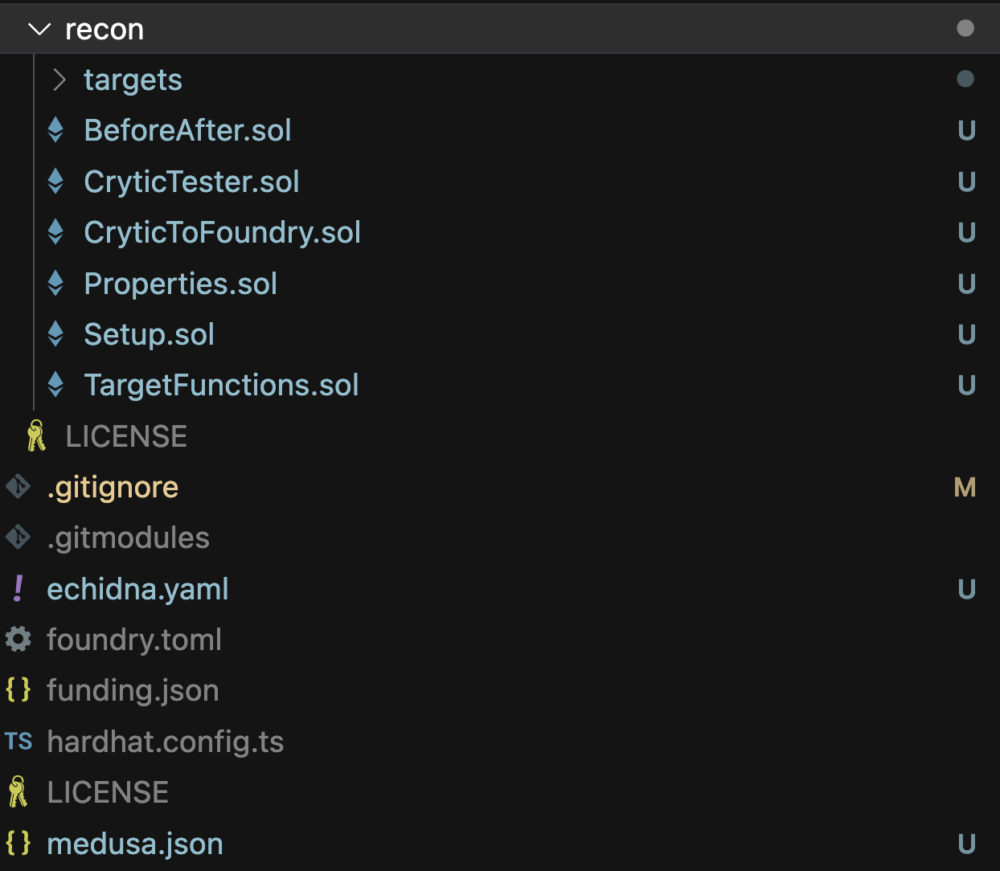
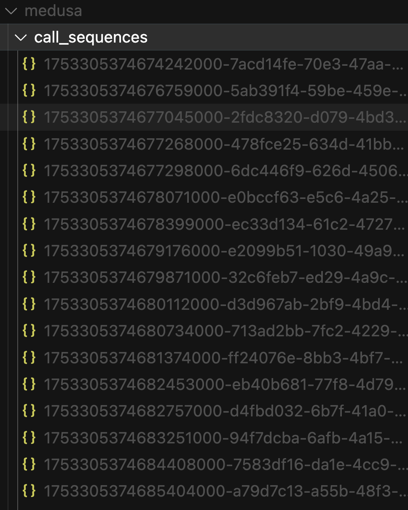
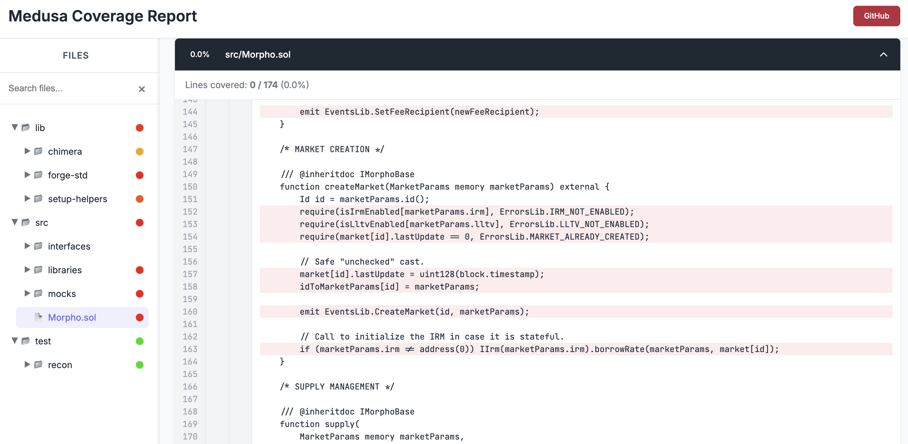

# Part 1 - Invariant Testing with Chimera Framework

> For the recorded stream of this part of the bootcamp see [here](https://x.com/i/broadcasts/1yoKMogdmLlJQ).

In this first part we're going to look at the Chimera Framework, what it is, why it exists and how we can use it to test a smart contract system using multiple different tools. By the end of part 1 you should be comfortable scaffolding a system and ensuring it has full coverage. 

> This bootcamp is roughly based on the first three parts of the bootcamp streamed by [Alex The Entreprenerd](https://x.com/GalloDaSballo) [here](https://getrecon.xyz/bootcamp) though some of the implementation details have changed, however you can still use it to follow along if you prefer consuming content in a video format. 

## The Chimera Framework Contracts

The key idea behind the Chimera framework is to use the following contracts as a scaffolding for your test suite:

- `Setup` - where deployment configurations are located
- `TargetFunctions` - explicitly define all functions that should be called by the tool as part of state exploration
- `Properties` - used to explicitly define the properties to be tested
- `BeforeAfter` - used to track variables over time to define more complex properties
- `CryticTester` - the entrypoint from which a given tool will execute tests
- `CryticToFoundry` - used for debugging broken properties with Foundry

This scaffolding reduces the decisions you have to make about your test suite configuration so you can get to writing and breaking properties faster. 

> For more details on how to use the above contracts checkout the [Chimera Framework](../writing_invariant_tests/chimera_framework.md#the-contracts) page.

The primary contracts we'll be looking at in this lesson are `Setup` and `TargetFunctions`.

In the `Setup` contract we're going to locate all of our deployment configuration. This can become very complex but for now all you need to think about is specifying how to deploy all the contracts of interest for our tool.

The `TargetFunctions` contract allows you to explicitly state all the functions that should be called as part of state exploration. For more complex codebases you'll generally have multiple sub-contracts which specify target functions for each of the contracts of interest in the system which you can inherit into `TargetFunctions`. Fundamentally, any time you're thinking about exploring state the handler for the state changing call should be located in `TargetFunctions`.

--- 

## Getting Started
To follow along, you can clone this fork of the [Morpho repository](https://github.com/Recon-Fuzz/morpho-blue). We'll then see how to use the [Recon Builder](../free_recon_tools/builder.md) to add all the Chimera scaffolding for our contract of interest. 

Our primary goals for this section are: 
1. **setup** - create the simplest setup possible that allows you to test all interesting state combinations
2. **coverage** - understand how to read a coverage report and resolve coverage issues 

## Practical Implementation - Setting Up Morpho

Once you've cloned the Morpho repo locally you can make the following small changes to speed up compilation and test run time: 
- disable `via-ir` in the `foundry.toml` configuration 
- remove the `bytecode_hash = "none"` from the `foundry.toml` configuration (this interferes with coverage report generation in the fuzzer)
- delete the entire existing `test` folder


Our next step is going to be getting all the Chimera scaffolding added to our repo which we'll do using the [Recon Extension](../free_recon_tools/recon_extension.md) because it's the fastest and simplest way. 

> You can also generate your Chimera scaffolding without downloading the extension using the [Recon Builder](../free_recon_tools/builder.md) instead

After having downloaded the extension you'll need to build the project so it can recognize the contract ABIs that we want to scaffold:


We can then select the contract for which we want to generate target functions for, in our case this will be the `Morpho` contract: 


The UI additionally gives us the option to select which state-changing functions we'd like to scaffold by clicking the checkmark next to each. For our case we'll keep all the default selected target functions.

After scaffolding, all the Chimera Framework contracts will be added to a new `test` folder and fuzzer configuration files will be added to the root directory:



### Fail Mode and Catch Mode

The extension offers additional "modes" for target functions: **fail mode** and **catch mode**:


**Fail mode** will force an assertion failure after a call is successful. We use this for defining what we call canaries (tests that confirm if certain functions are not always reverting) because the assertion will only fail if the call to the target function completes successfully.

**Catch mode** is useful to add a test to the catch block with an assertion to determine when it reverts. This is a key mindset shift of invariant testing with Echidna and Medusa because they don't register a revert as a test failure and instead skip reverting calls. Test failures in these fuzzers therefore only occur via an assertion failure (unlike Foundry where a reverting call automatically causes the test to fail).

This is important to note because without it you could end up excluding reverting cases which can reveal interesting states that could help find edge cases. 

> If you're ever using Foundry to fuzz instead of Echidna or Medusa, you should disable the `fail_on_revert` parameter in your Foundry config to have similar behavior to the other fuzzers and allow tests written for them to be checked in the same way.

## Setup

Generally you should aim to make the `Setup` contract as simple as possible, this helps reduce the number of assumptions made and also makes it simpler for collaborators to understand the initial state that the fuzzer starts from. 

> If you used the Recon Builder for scaffolding you'll most likely have to spend some time resolving compilation errors due to incorrect imports because it isn't capable of automatically resolving these in the same way that the extension does.

In our case, because of the relative simplicity of the contract that we're deploying in our test suite we can just check the constructor arguments of the `Morpho` contract to determine what we need to deploy it:

```javascript
contract Morpho is IMorphoStaticTyping {
    ...

    /// @param newOwner The new owner of the contract.
    constructor(address newOwner) {
        require(newOwner != address(0), ErrorsLib.ZERO_ADDRESS);

        DOMAIN_SEPARATOR = keccak256(abi.encode(DOMAIN_TYPEHASH, block.chainid, address(this)));
        owner = newOwner;

        emit EventsLib.SetOwner(newOwner);
    }

    ...
}
```

from which we can see that we simply need to pass in an owner for the deployed contract. 

We can therefore modify our `Setup` contract accordingly so that it deploys the `Morpho` contract with `address(this)` (the default [actor](../glossary.md#actor) that we use as our admin) set as the owner of the contract: 

```javascript
abstract contract Setup is BaseSetup, ActorManager, AssetManager, Utils {
    Morpho morpho;
    
    function setup() internal virtual override {
        morpho = new Morpho(_getActor()); 
    }

    ...
}
```

We now have the contract which we can call target functions on deployed and we can now run the fuzzer!

### Aside: How We Can Reuse Tests

Because we only implemented our deployments in a single `setup` function this can be inherited and called in the `CryticTester` contract:

```javascript
contract CryticTester is TargetFunctions, CryticAsserts {
    constructor() payable {
        setup();
    }
}
```

to allow us to test with Echidna or Medusa and also inherited in the `CryticToFoundry` contract to be tested with Foundry, Halmos and Kontrol:

```javascript
contract CryticToFoundry is Test, TargetFunctions, FoundryAsserts {
    function setUp() public {
        setup();
    }
}
```

This gives us one of the primary benefits of using the Chimera Framework: if your project compiles in Foundry, it will work in any of the above mentioned tools automatically. 


## Running Your First Fuzzing Campaign

At this point, we've achieved compilation and our next step will simply be to figure out how far this allows the fuzzer to get in terms of line coverage over our contract of interest.

Before running you'll need to make sure you have [Medusa](https://github.com/crytic/medusa) downloaded on your local machine.

With Medusa downloaded you can use the _Fuzz with Medusa_ button from the Recon Cockpit section of the Recon extension to start your fuzzing campaign:


> You can also run Medusa using `medusa fuzz` from the root of your project directory

We'll run the fuzzer for 10-15 minutes then stop the execution (using the _cancel_ button from the Recon Cockpit or `ctrl + c` from the CLI) to analyze the results.

## Understanding Fuzzer Output

From the output logs from Medusa we can see that its entrypoint into our created test scaffolding is the `CryticTester` contract:

```bash
⇾ [PASSED] Assertion Test: CryticTester.add_new_asset(uint8)
⇾ [PASSED] Assertion Test: CryticTester.asset_approve(address,uint128)
⇾ [PASSED] Assertion Test: CryticTester.asset_mint(address,uint128)
⇾ [PASSED] Assertion Test: CryticTester.morpho_accrueInterest((address,address,address,address,uint256))
⇾ [PASSED] Assertion Test: CryticTester.morpho_borrow((address,address,address,address,uint256),uint256,uint256,address,address)
⇾ [PASSED] Assertion Test: CryticTester.morpho_createMarket((address,address,address,address,uint256))
⇾ [PASSED] Assertion Test: CryticTester.morpho_enableIrm(address)
⇾ [PASSED] Assertion Test: CryticTester.morpho_enableLltv(uint256)
⇾ [PASSED] Assertion Test: CryticTester.morpho_flashLoan(address,uint256,bytes)
⇾ [PASSED] Assertion Test: CryticTester.morpho_liquidate((address,address,address,address,uint256),address,uint256,uint256,bytes)
⇾ [PASSED] Assertion Test: CryticTester.morpho_repay((address,address,address,address,uint256),uint256,uint256,address,bytes)
⇾ [PASSED] Assertion Test: CryticTester.morpho_setAuthorization(address,bool)
⇾ [PASSED] Assertion Test: CryticTester.morpho_setAuthorizationWithSig((address,address,bool,uint256,uint256),(uint8,bytes32,bytes32))
⇾ [PASSED] Assertion Test: CryticTester.morpho_setFee((address,address,address,address,uint256),uint256)
⇾ [PASSED] Assertion Test: CryticTester.morpho_setFeeRecipient(address)
⇾ [PASSED] Assertion Test: CryticTester.morpho_setOwner(address)
⇾ [PASSED] Assertion Test: CryticTester.morpho_supply((address,address,address,address,uint256),uint256,uint256,address,bytes)
⇾ [PASSED] Assertion Test: CryticTester.morpho_supplyCollateral((address,address,address,address,uint256),uint256,address,bytes)
⇾ [PASSED] Assertion Test: CryticTester.morpho_withdraw((address,address,address,address,uint256),uint256,uint256,address,address)
⇾ [PASSED] Assertion Test: CryticTester.morpho_withdrawCollateral((address,address,address,address,uint256),uint256,address,address)
⇾ [PASSED] Assertion Test: CryticTester.switch_asset(uint256)
⇾ [PASSED] Assertion Test: CryticTester.switchActor(uint256)
```

Which allows it to call all of the functions defined on our `TargetFunctions` contract (which in this case it inherits from `MorphoTargets`) **in a random order with random values passed in**. 

> The additional functions called in the above logs are defined on the `ManagersTargets` which provide utilities for modifying the currently used actor (via the [`ActorManager`](../oss/setup_helpers.md#actormanager)) and admin (via the [`AssetManager`](../oss/setup_helpers.md#assetmanager)) in the setup.

After running the fuzzer, it also generates a corpus which is a set of call sequences that allowed the fuzzer to expand line coverage:



This will make it so that previous runs don't need to only explore random inputs each time and the fuzzer will be able to use inputs and call sequences that it found that expand coverage to guide its fuzzing process and add mutations (modifications) to them to attempt to unlock new coverage or break a property. You can think of the corpus as the fuzzer's memory which allows it to retrace its previous steps when it starts again.

> If you modify the interface of your target function handlers you should delete your existing corpus and allow the fuzzer to generate a new one, otherwise it will make calls using the previous sequences which may no longer be valid and prevent proper state space exploration. 

## Understanding Coverage Reports

After stopping Medusa it will also generate a coverage report (Chimera comes preconfigured to ensure that Medusa and Echidna always generate a coverage report) which is an HTML file that displays all the code from your project highlighting in green: lines which the fuzzer reached and in red: lines that the fuzzer didn't reach during testing. 



The coverage report is one of the most vital insights in stateful fuzzing because without it, you're blind to what the fuzzer is actually doing. 

## Debugging Failed Properties

Now we'll add a simple assertion that always evaluates to false (canary property) to one of our target function handlers to see how the fuzzer outputs breaking call sequences for us: 

```javascript
    function morpho_setOwner(address newOwner) public asActor {
        morpho.setOwner(newOwner);
        t(false, "forced failure");
    }
```

Using this we can then run Medusa again and see that it generates a broken property reproducer call sequence for us: 

```bash
⇾ [FAILED] Assertion Test: CryticTester.morpho_setOwner(address)
Test for method "CryticTester.morpho_setOwner(address)" resulted in an assertion failure after the following call sequence:
[Call Sequence]
1) CryticTester.morpho_setOwner(address)(0x7109709ECfa91a80626fF3989D68f67F5b1DD12D) (block=29062, time=319825, gas=12500000, gasprice=1, value=0, sender=0x30000)
[Execution Trace]
 => [call] CryticTester.morpho_setOwner(address)(0x7109709ECfa91a80626fF3989D68f67F5b1DD12D) (addr=0x7D8CB8F412B3ee9AC79558791333F41d2b1ccDAC, value=0, sender=0x30000)
         => [call] StdCheats.prank(address)(0x7D8CB8F412B3ee9AC79558791333F41d2b1ccDAC) (addr=0x7109709ECfa91a80626fF3989D68f67F5b1DD12D, value=0, sender=0x7D8CB8F412B3ee9AC79558791333F41d2b1ccDAC)
                 => [return ()]
         => [call] <unresolved contract>.<unresolved method>(msg_data=13af40350000000000000000000000007109709ecfa91a80626ff3989d68f67f5b1dd12d) (addr=0xA5668d1a670C8e192B4ef3F2d47232bAf287E2cF, value=0, sender=0x7D8CB8F412B3ee9AC79558791333F41d2b1ccDAC)
                 => [event] SetOwner(0x7109709ECfa91a80626fF3989D68f67F5b1DD12D)
                 => [return]
         => [event] Log("forced failure")
         => [panic: assertion failed]
```

If you ran the fuzzer with the extension, it will give you the option to automatically add the generated reproducer unit test for this broken property to the `CryticToFoundry` contract:

```javascript
    // forge test --match-test test_morpho_setOwner_uzpq -vvv
    function test_morpho_setOwner_uzpq() public {
       vm.roll(2);
       vm.warp(2);
       morpho_setOwner(0x0000000000000000000000000000000000000000);
    }
```

> If you ran the fuzzer via the CLI you can copy and paste the logs into [this](https://getrecon.xyz/tools/medusa) tool to generate a Foundry unit test

This will be key once we start to break nontrivial properties because it gives us a much faster feedback loop to debug them.

## Initital Coverage Analysis

If we look more closely at the `Morpho` contract which we're targeting with our `TargetFunctions` we can see from the 28% in our coverage report that our target functions are only allowing us to reach minimal exploration of possible states: 


If we look at the coverage on our `TargetFunctions` directly however we see that we have 100% coverage and all the lines show up highlighted in green: 


This is an indication to us that the calls to the target function handlers themselves are initially successful but once it reaches the actual function in the `Morpho` contract it reverts. 

## Understanding Morpho

Before we move on to looking at techniques that will allow us to increase coverage on the `Morpho` contract it'll help to have a bit of background on what `Morpho` is and how it works.

Morpho is a noncustodial lending protocol that functions as a lending marketplace where users can supply assets to earn interest and borrow against collateral. 

The protocol uses a singleton architecture where all lending markets exist within a single contract, with each market defined by five parameters: loan token, collateral token, oracle, interest rate model, and loan-to-value ratio. It implements share-based accounting, supports permissionless market creation and includes liquidation mechanisms to maintain solvency.

## Creating Mock Contracts

Now with a better understanding of Morpho we can see that for it to allow any user operations such as borrowing and lending it first needs a market to be created and for this we need an Interest Rate Model (IRM) contract which calculates dynamic borrow rates for Morpho markets based on utilization and can be set by an admin using the `enableIrm` function:

```javascript
    function enableIrm(address irm) external onlyOwner {
        require(!isIrmEnabled[irm], ErrorsLib.ALREADY_SET);

        isIrmEnabled[irm] = true;

        emit EventsLib.EnableIrm(irm);
    }
```

Since the IRM can be any contract that implements the `IIRM` interface and there's none in the existing Morpho repo, we'll need to create a mock so that we can simulate its behavior which will allow us to achieve our short-term goal of coverage for now. If we find that the actual behavior of the IRM is interesting for any of the properties we want to test, we can later replace this with a more realistic implementation. 

The Recon Extension allows automatically generating mocks for a contract by right-clicking it and selecting the _Generate Solidity Mock_ option, but in our case since there's no existing instance of the IRM contract, we'll have to manually create our own as follows: 

```javascript
import {MarketParams, Market} from "src/interfaces/IMorpho.sol";

contract IrmMock {
    uint256 internal _borrowRate;

    function setBorrowRate(uint256 borrowRate) external {
        _borrowRate = borrowRate;
    }

    function borrowRateView(MarketParams memory marketParams, Market memory market) external view returns (uint256) {
        return _borrowRate;
    }
}
```

Our mock simply exposes a function for setting and getting the `_borrowRate` because these are the functions required in the `IIRM` interface. We'll then expose a target function that calls the `setBorrowRate` function which allows the fuzzer to modify the borrow rate randomly. 

Now the next contract we'll need for creating a market is the oracle for setting the price of the underlying asset. Looking at the existing `OracleMock` in the Morpho repo we can see that it's sufficient for our case: 

```javascript
contract OracleMock is IOracle {
    uint256 public price;

    function setPrice(uint256 newPrice) external {
        price = newPrice;
    }
}
```

Now we just need to deploy all of these mocks in our setup: 

```javascript
abstract contract Setup is BaseSetup, ActorManager, AssetManager, Utils {
    Morpho morpho;

    // Mocks
    MockIRM irm;
    OracleMock oracle;
    
    /// === Setup === ///
    function setup() internal virtual override {
        // Deploy Morpho
        morpho = new Morpho(_getActor()); 

        // Deploy Mocks
        irm = new MockIRM();
        oracle = new OracleMock();

        // Deploy assets
        _newAsset(18); // asset
        _newAsset(18); // liability
    }
}
```

In the above we use the `_newAsset` function exposed by the [`AssetManager`](../oss/setup_helpers.md#assetmanager) to deploy a new asset which we can fetch using the `_getAsset()` function.

> We introduced the `AssetManager` and `ActorManager` in V2 of Create Chimera App because the majority of setups will require multiple addresses to perform calls and use tokens in some way. Since our framework implicitly overrides the use of different senders via the fuzzer, the `ActorManager` allows us to replicate the normal behavior of having multiple senders using the `asActor` modifier. Similarly, tracking deployed tokens for checking properties or clamping previously required implementing unique configurations in the `Setup` contract, so we've abstracted this into the `AssetManager` to standardize the process and prevent needing to reimplement it each time.


## Market Creation and Handler Implementation

Now to continue the fixes to our setup we'll need to register a market in the `Morpho` contract which we can do by adding the following to our setup: 

```javascript
    function setup() internal virtual override {
        // Deploy Morpho
        morpho = new Morpho(_getActor()); 

        // Deploy Mocks
        irm = new MockIRM();
        oracle = new OracleMock();

        // Deploy assets
        _newAsset(18); // asset
        _newAsset(18); // liability

        // Create the market 
        morpho.enableIrm(address(irm));
        morpho.enableLltv(8e17); 

        address[] memory assets = _getAssets();
        MarketParams memory marketParams = MarketParams({
            loanToken: assets[1],
            collateralToken: assets[0],
            oracle: address(oracle),
            irm: address(irm),
            lltv: 8e17
        });
        morpho.createMarket(marketParams);
    }
```

It's important to note that this setup only allows us to test one market with the configurations we've added above, whereas if we want to truly be sure that we're testing all possibilities, we could use what we've termed as _dynamic deployment_ to allow the fuzzer to deploy multiple markets with different configurations (we cover this in [part 2](../bootcamp/bootcamp_part_2.md#dynamic-market-creation)).

We can then make a further simplifying assumption that will work as a form of [clamping](../glossary.md#clamping) to allow us to get line coverage faster by storing the `marketParams` variable as a storage variable:

```javascript
abstract contract Setup is BaseSetup, ActorManager, AssetManager, Utils {
    ...

    MarketParams marketParams;
    
    /// === Setup === ///
    /// This contains all calls to be performed in the tester constructor, both for Echidna and Foundry
    function setup() internal virtual override {
        ...

        address[] memory assets = _getAssets();
        marketParams = MarketParams({
            loanToken: assets[1],
            collateralToken: assets[0],
            oracle: address(oracle),
            irm: address(irm),
            lltv: 8e17
        });
        morpho.createMarket(marketParams);
    }
```

which then allows us to pass it directly into our target functions by deleting the input parameter for `marketParams` and using the storage variable from the setup instead: 

```javascript
abstract contract MorphoTargets is
    BaseTargetFunctions,
    Properties
{
    function morpho_accrueInterest() public asActor {
        morpho.accrueInterest(marketParams);
    }

    function morpho_borrow(uint256 assets, uint256 shares, address onBehalf, address receiver) public asActor {
        morpho.borrow(marketParams, assets, shares, onBehalf, receiver);
    }

    function morpho_createMarket() public asActor {
        morpho.createMarket(marketParams);
    }
    
    ...
}
```

> The `asActor` modifier explicitly uses the currently set actor returned by `_getActor()` to call the handler functions, whereas the `asAdmin` modifier uses the default admin actor (`address(this)`). In the above setup we only have the admin actor added to the actor tracking array but we use the `asActor` address to indicate that these are functions that are expected to be called by any normal user. Only target functions expected to be called by privileged users should use the `asAdmin` modifier.

This helps us get to coverage over the lines of interest faster because instead of the fuzzer trying all possible inputs for the `MarketParams` struct, it uses the `marketParams` from the setup to ensure it always targets the correct market.

## Asset and Token Setup

At this point we also need to mint the tokens we're using in the system to our actors and approve the `Morpho` contract to spend them: 

```javascript
abstract contract Setup is BaseSetup, ActorManager, AssetManager, Utils {
    ...
    
    function setup() internal virtual override {
        ...

        _setupAssetsAndApprovals();

        address[] memory assets = _getAssets();
        marketParams = MarketParams({
            loanToken: assets[1],
            collateralToken: assets[0],
            oracle: address(oracle),
            irm: address(irm),
            lltv: 8e17
        });
        morpho.createMarket(marketParams);
    }

    function _setupAssetsAndApprovals() internal {
        address[] memory actors = _getActors();
        uint256 amount = type(uint88).max;
        
        // Process each asset separately to reduce stack depth
        for (uint256 assetIndex = 0; assetIndex < _getAssets().length; assetIndex++) {
            address asset = _getAssets()[assetIndex];
            
            // Mint to actors
            for (uint256 i = 0; i < actors.length; i++) {
                vm.prank(actors[i]);
                MockERC20(asset).mint(actors[i], amount);
            }
            
            // Approve to morpho
            for (uint256 i = 0; i < actors.length; i++) {
                vm.prank(actors[i]);
                MockERC20(asset).approve(address(morpho), type(uint88).max);
            }
        }
    }
```

The `_setupAssetsAndApprovals` function allows us to mint the deployed assets to the actors (handled by the [`ActorManager`](../oss/setup_helpers.md#actormanager)) and approves it to the deployed `Morpho` contract. Note that we mint `type(uint88).max` to each user because it's a sufficiently large amount that allows us to realistically test for overflow scenarios.

## Testing Your Setup

Now to ensure that our setup doesn't cause the fuzzer to revert before executing any tests we can run the default `test_crytic` function in `CryticToFoundry` which is an empty test that will just call the `setup` function, this will confirm that our next run of the fuzzer will actually be able to start state exploration: 

```bash
Ran 1 test for test/recon/CryticToFoundry.sol:CryticToFoundry
[PASS] test_crytic() (gas: 238)
Suite result: ok. 1 passed; 0 failed; 0 skipped; finished in 6.46ms (557.00µs CPU time)
```

### Testing Token Interactions

We can also create a simple unit test to confirm that we can successfully supply the tokens minted above to the system as a user: 

```javascript
    function test_crytic() public {
        // testing supplying assets to a market as the default actor (address(this))
        morpho_supply(1e18, 0, _getActor(), hex"");
    }
```

which, if we run with `forge test --match-test test_crytic -vvvv --decode-internal`, will allow us to see how many shares we get minted: 

```bash
    │   ├─ emit Supply(id: 0x5914fb876807b8cd7b8bc0c11b4d54357a97de46aae0fbdfd649dd8190ef99eb, caller: CryticToFoundry: [0x7FA9385bE102ac3EAc297483Dd6233D62b3e1496], onBehalf: CryticToFoundry: [0x7FA9385bE102ac3EAc297483Dd6233D62b3e1496], assets: 1000000000000000000 [1e18], shares: 1000000000000000000000000 [1e24])
    │   ├─ [38795] SafeTransferLib::safeTransferFrom(<unknown>, 0x5615dEB798BB3E4dFa0139dFa1b3D433Cc23b72f, 0x7FA9385bE102ac3EAc297483Dd6233D62b3e1496, 1136628940260574992893479910319181283093952727985 [1.136e48])
    │   │   ├─ [34954] MockERC20::transferFrom(CryticToFoundry: [0x7FA9385bE102ac3EAc297483Dd6233D62b3e1496], Morpho: [0x5615dEB798BB3E4dFa0139dFa1b3D433Cc23b72f], 1000000000000000000 [1e18])
    │   │   │   ├─ emit Transfer(from: CryticToFoundry: [0x7FA9385bE102ac3EAc297483Dd6233D62b3e1496], to: Morpho: [0x5615dEB798BB3E4dFa0139dFa1b3D433Cc23b72f], value: 1000000000000000000 [1e18])
    │   │   │   └─ ← [Return] true
    │   │   └─ ← 
    │   └─ ← [Return] 1000000000000000000 [1e18], 1000000000000000000000000 [1e24]
    └─ ← [Return]
```

showing that we received 1e24 shares for the 1e18 assets deposited. 

If we then expand our test to see if we can supply collateral against which a user can borrow:

```javascript
    function test_crytic() public {
        morpho_supply(1e18, 0, _getActor(), hex"");// testing supplying assets to a market as the default actor (address(this))
        morpho_supplyCollateral(1e18, _getActor(), hex"");
    }
```

we see that it also succeeds, so we have confirmed that the fuzzer is also able to execute these basic user interactions.

## Advanced Handler Patterns

At this point we know that we can get coverage over certain lines but we know that certain parameters still have a very large set of possible input values which may not allow them to be successfully covered by the fuzzer in a reasonable amount of time, so we can start to apply some simple [clamping](../glossary.md#clamping).

### Clamped Handlers

We'll start with the `morpho_supply` function we tested above:

```javascript
contract Morpho is IMorphoStaticTyping {

    function supply(
        MarketParams memory marketParams,
        uint256 assets,
        uint256 shares,
        address onBehalf,
        bytes calldata data
    ) external returns (uint256, uint256) {
        ...
    }

}
```

Since we only want one of our actors (see [`ActorManager`](../oss/setup_helpers.md#actormanager) for more details on the actor setup) in the system to receive shares and the `data` parameter can be any arbitrary bytes value we can clamp all the values except `assets`. We can follow a similar approach for the `supplyCollateral` function:

```javascript
abstract contract MorphoTargets is
    BaseTargetFunctions,
    Properties
{
    function morpho_supply_clamped(uint256 assets) public {
        morpho_supply(assets, 0, _getActor(), hex"");
    }

    function morpho_supplyCollateral_clamped(uint256 assets) public {
        morpho_supplyCollateral(assets, _getActor(), hex"");
    }
}
```

Note that **clamped handlers should always call the unclamped handlers**; this ensures that you don't overly restrict the fuzzer from exploring all possible states because it can still explore unclamped values as well. Additionally, this ensures that when you add inlined tests or variable tracking to the unclamped handlers, the assertions are always checked and variable tracking is updated for either function call.

Now that we have clamped handlers, we can significantly increase the speed with which we can cover otherwise hard to reach lines.

We can then replace our existing calls in the `test_crytic` test with the clamped handlers and add an additional call to `morpho_borrow` to check if we can successfully borrow assets from the `Morpho` contract: 

```javascript
    function test_crytic() public {
        morpho_supply_clamped(1e18);
        morpho_supplyCollateral(1e18, _getActor(), hex"");

        morpho_borrow(1e18, 0, _getActor(), _getActor());
    }
```

## Troubleshooting Coverage Issues

After running the test we see that the call to `morpho_borrow` fails because of insufficient collateral: 

```bash
[FAIL: insufficient collateral] test_crytic() (gas: 215689)
Suite result: FAILED. 0 passed; 1 failed; 0 skipped; finished in 6.57ms (761.17µs CPU time)
```

Looking at the `Morpho` implementation we see this error originates in the `_isHealthy` check in `Morpho`: 

```javascript
    function _isHealthy(MarketParams memory marketParams, Id id, address borrower, uint256 collateralPrice)
        internal
        view
        returns (bool)
    {
        uint256 borrowed = uint256(position[id][borrower].borrowShares).toAssetsUp(
            market[id].totalBorrowAssets, market[id].totalBorrowShares
        );
        uint256 maxBorrow = uint256(position[id][borrower].collateral).mulDivDown(collateralPrice, ORACLE_PRICE_SCALE)
            .wMulDown(marketParams.lltv);
        
        return maxBorrow >= borrowed;
    }
```

which causes the `borrow` function to revert with the `INSUFFICIENT_COLLATERAL` error at the following line: 

```javascript
    function borrow(
        MarketParams memory marketParams,
        uint256 assets,
        uint256 shares,
        address onBehalf,
        address receiver
    ) external returns (uint256, uint256) {
        ...

        require(_isHealthy(marketParams, id, onBehalf), ErrorsLib.INSUFFICIENT_COLLATERAL);
        ...
    }
```

We can infer that the `_isHealthy` check is always returning `false` because the `collateralPrice` is set to its default 0 value since we never call the `setPrice` function to set it in our `OracleMock`.

So we can add a target function to allow the fuzzer to set the `collateralPrice`: 

```javascript
abstract contract TargetFunctions is
    AdminTargets,
    DoomsdayTargets,
    ManagersTargets,
    MorphoTargets
{
    function oracle_setPrice(uint256 price) public {
        oracle.setPrice(price);
    }
}
```

Note that since we only needed a single handler we just added it to the `TargetFunctions` contract directly but if you're adding more than one handler it's generally a good practice to create a separate contract to inherit into `TargetFunctions` to keep things cleaner.

Now we can add our `oracle_setPrice` function to our sanity test to confirm that it works correctly and resolves the previous revert due to insufficient collateral: 

```javascript
    function test_crytic() public {
        morpho_supply_clamped(1e18);;
        morpho_supplyCollateral_clamped(1e18);

        oracle_setPrice(1e30);

        morpho_borrow(1e6, 0, _getActor(), _getActor());
    }
```

which successfully passes: 

```bash
[PASS] test_crytic() (gas: 249766)
Suite result: ok. 1 passed; 0 failed; 0 skipped; finished in 1.54ms (142.25µs CPU time)
```

With this test passing we can confirm that we have coverage over the primary functions in the `Morpho` contract that will allow us to explore the contract's state. Writing the type of sanity test like we did in the `test_crytic` function allows us to quickly debug simple issues that will prevent the fuzzer from reaching coverage before running it so that we're not stuck in a constant cycle of running and debugging only using the coverage report.

Now with this simple clamping in place we can let the fuzzer run for anywhere from 15 minutes to 2 hours to start building up a corpus and determine if there are any functions where coverage is being blocked.

## Conclusion and Next Steps

We've seen above how we can set up and ensure coverage in invariant testing. Coverage is key because without it we can run the fuzzer indefintely but won't necessarily be testing meaningful states so it's always the most vital step that needs to be completed before implementing and testing properties.

In [part 2](../bootcamp/bootcamp_part_2.md), we'll look at how we can get to full meaningful coverage and some techniques we can implement to ensure better logical coverage so that we have a higher likelihood of reaching all lines of interest more frequently. 

If you have any questions feel free to reach out to us in the [Recon Discord channel](https://discord.gg/aCZrCBZdFd)
