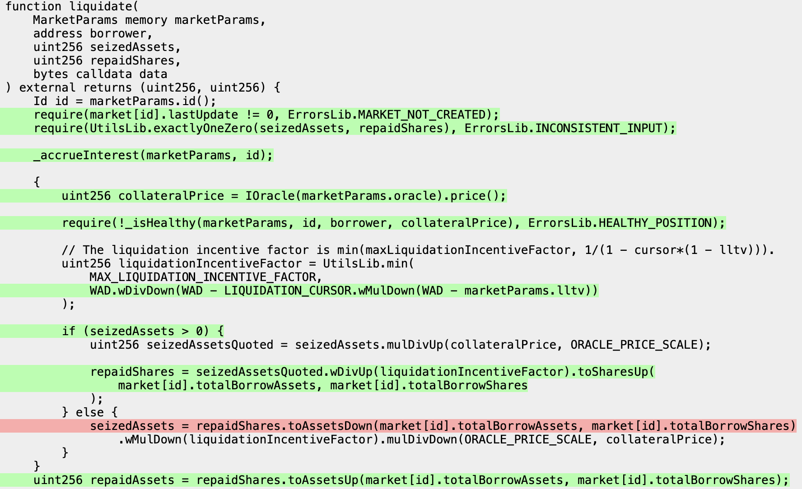

# Multidimensional Invariant Tests

## Introduction and Goals

In [part 1](./bootcamp/bootcamp_day_1.md) we looked at how to create setup Morpho and get high coverage, in part 2 we'll look at how to achieve line coverage of the missing lines from the end of part 1.

> You can follow along using the repo with the scaffolding created in part 1 [here](https://github.com/Recon-Fuzz/morpho-blue/tree/day-1).

Our goals for this section are: to reach 100% line coverage on the Morpho repo and exploring ways to make our test suite capable of testing more possible setup configurations.

## How to Evaluate Coverage Reports

From part 1 our `MorphoTargets` contract should have two clamped handlers (`morpho_supply_clamped` and `morpho_supplyCollateral_clamped`) and the remaining functions should be unclamped. 

Having run Medusa with these functions implemented we should now see an increase in the coverage shown in our report:
  <div style="display: flex; gap: 10px;">
    
    
  </div>

We can see from the above that after adding our clamped handlers our coverage on `Morpho` increased from 28% to 77%. Medusa will then save these coverage increasing calls to the corpus for reuse in future runs, increasing its efficiency by not causing it to explore paths that always revert. 

As we mentioned in part 1, the coverage report simply shows us which lines were successfully reached by highlighting them in green and shows which lines weren't reached by highlighting them in red.

Our approach for fixing coverage using the report will therefore consist of tracing lines that are green until we find a red line. The red line will then be an indicator of where the fuzzer was reverting. Once we find where a line is reverting we can then follow the steps outlined in part 1 where we create a unit test in the `CryticToFoundry` contract to determine why a line may always be reverting and introduce clamping or changes to the setup to allow us to reach the given line.

## Coverage Analysis - Initial Results

After having run Medusa for 10-15 minutes after adding the final changes from part 1 we can see that the coverage report shows coverage on the `Morpho` contract of 77%:


It's important to note that although we mentioned above that our goal is to reach 100% coverage, this doesn't mean we'll try to blindly reach 100% coverage over all of a contract's lines because there are almost always certain functions whose behavior won't be of interest in an invariant testing scenario, like the `extSloads` function from the latest run:


Since this is a view function which doesn't change state we can safely say that covering it is unnecessary for our case. 

> You should always use your knowledge of the system to make a judgement call about which functions in the system you can safely ignore coverage on. The functions that you choose to include should be those that test meaningful interactions including public/external functions, as well as the internal functions they call in their control flow.

In our case for `Morpho` we can say that for us to have 100% coverage we need to have covered the meaningful interactions a user could have with the contract which include borrowing, liquidating, etc..

When we look at coverage over the `liquidate` function, we can see that it appears to be reverting at the line that checks if the position is healthy: 


Meaning we need to investigate this with a Foundry unit test to understand what's causing it to always revert. 

We can also see that the `repay` function similarly has only red lines after line 288, indicating that something may be causing it to always underflow: 

 

However, note that the return value isn't highlighted at all, potentially indicating that there might also be an issue with the coverage displaying mechanism, so our approach to debugging this will be different, using a canary property instead.

## Debugging With Canaries

We'll start with debugging the `repay` function using a canary because it's relatively simple. To do so we can create a simple boolean variable `hasRepaid` which we add to our `Setup` contract and set in our `morpho_repay` handler function:

```javascript
abstract contract MorphoTargets is
    BaseTargetFunctions,
    Properties
{
    function morpho_repay(uint256 assets, uint256 shares, address onBehalf, bytes memory data) public asActor {
        morpho.repay(marketParams, assets, shares, onBehalf, data);
        hasRepaid = true;
    }
}
```

which will only set `hasRepaid` to true if the call to `Morpho::repay` completes successfully.

Then we can define a simple canary property in our `Properties` contract:

```javascript
abstract contract Properties is BeforeAfter, Asserts {

    function canary_hasRepaid() public returns (bool) {
        t(!hasRepaid, "hasRepaid");
    }
    
}
```

this uses the `t` (true) assertion wrapper from the [`Asserts`](./writing_invariant_tests/chimera_framework.md) contract to let us know if the call to `morpho.repay` successfully completes by forcing an assertion failure if `hasRepaid == true` (remember that only assertion failures are picked up by Echidna and Medusa). 

> See [this section](../writing_invariant_tests/implementing_properties.md#testing-mode) to better understand why we prefer to express properties using assertions rather than as boolean properties.

This function will randomly be called by the the fuzzer in the same way that the handler functions in `TargetFunctions` are called, allowing it to check if repay is called successfully after any of the state changing target function calls.

> Note: While you're implementing the canary above you can run the fuzzer in the background to confirm that we're not simply missing coverage because of a lack of sufficient tests. It's always beneficial to have the fuzzer running in the background because it'll build up a corpus that will make subsequent runs more efficient. 

As a general naming convention for functions in our suites we use an underscore as a prefix to define what the function does, such as `canary_`, `invariant_`, `property_` or target contracts (`morpho_` in our case) then use camel case for the function name itself. 

We can now run Medusa in the background to determine if we're actually reaching coverage over the `repay` function using the canary we've implemented while implementing our Foundry test to investigate the coverage issue with the `liquidate` function. 

## Investigating Liquidation Handler with Foundry

Now we'll use Foundry to investigate why the `liquidate` function isn't being fully covered. We can do this by expanding upon the `test_crytic` function we used in part 1 for our sanity tests.

To test if we can liquidate a user we'll just expand the existing test by setting the price to a very low value that should make the user liquidatable: 

```javascript
    function test_crytic() public {
        morpho_supply_clamped(1e18);
        morpho_supplyCollateral_clamped(1e18);

        oracle_setPrice(1e30);

        morpho_borrow(1e6, 0, _getActor(), _getActor());

        oracle_setPrice(0);

        // Note: we liquidate ourselves and pass in the amount of assets borrowed as the seizedAssets and 0 for the repaidShares for simplicity
        morpho_liquidate(_getActor(), 1e6, 0, "");
    }
```

After running the test we get the following output:

```bash
    ├─ [22995] Morpho::liquidate(MarketParams({ loanToken: 0xc7183455a4C133Ae270771860664b6B7ec320bB1, collateralToken: 0x5991A2dF15A8F6A256D3Ec51E99254Cd3fb576A9, oracle: 0xF62849F9A0B5Bf2913b396098F7c7019b51A820a, irm: 0x2e234DAe75C793f67A35089C9d99245E1C58470b, lltv: 800000000000000000 [8e17] }), CryticToFoundry: [0x7FA9385bE102ac3EAc297483Dd6233D62b3e1496], 1000000 [1e6], 0, 0x)
    │   ├─ [330] Morpho::_accrueInterest(<unknown>, <unknown>)
    │   │   └─ ← 
    │   ├─ [266] OracleMock::price() [staticcall]
    │   │   └─ ← [Return] 0
    │   ├─ [2585] Morpho::_isHealthy(<unknown>, <unknown>, 0x1B4D54357a97De46Aae0FBDfD649dD8190EF99Eb, 128)
    │   │   ├─ [356] SharesMathLib::toAssetsUp(1000000000000 [1e12], 1000000 [1e6], 1000000000000 [1e12])
    │   │   │   └─ ← 1000000 [1e6]
    │   │   ├─ [0] console::log("isHealthy", false) [staticcall]
    │   │   │   └─ ← [Stop]
    │   │   ├─ [0] console::log("collateralPrice", 0) [staticcall]
    │   │   │   └─ ← [Stop]
    │   │   └─ ← false
    │   ├─ [353] SharesMathLib::toSharesUp(1000000000000 [1e12], 1000000 [1e6], 0)
    │   │   └─ ← 0
    │   ├─ [356] SharesMathLib::toAssetsUp(1000000000000 [1e12], 1000000 [1e6], 0)
    │   │   └─ ← 0
    │   ├─ [198] UtilsLib::toUint128(0)
    │   │   └─ ← 0
    │   ├─ [198] UtilsLib::toUint128(0)
    │   │   └─ ← 0
    │   ├─ [198] UtilsLib::toUint128(1000000 [1e6])
    │   │   └─ ← 1000000 [1e6]
    │   ├─ [199] UtilsLib::toUint128(1000000 [1e6])
    │   │   └─ ← 1000000 [1e6]
    │   ├─ emit Liquidate(id: 0x5914fb876807b8cd7b8bc0c11b4d54357a97de46aae0fbdfd649dd8190ef99eb, caller: CryticToFoundry: [0x7FA9385bE102ac3EAc297483Dd6233D62b3e1496], borrower: CryticToFoundry: [0x7FA9385bE102ac3EAc297483Dd6233D62b3e1496], repaidAssets: 0, repaidShares: 0, seizedAssets: 1000000 [1e6], badDebtAssets: 0, badDebtShares: 0)
```

which indicates that we were able to successfully liquidate the user. This means that the fuzzer is theoretically able to achieve coverage over the entire `liquidate` function, it just hasn't yet because it hasn't found the right call sequence that allows it to pass the health check which verifies if a position is liquidatable which we saw from the coverage report above.

## Tool Sophistication Limitations

After having run Medusa with the canary property created for the `morpho_repay` function we can see that it also doesn't break the property, confirming that the `repay` function is never fully covered:

```bash
⇾ [PASSED] Assertion Test: CryticTester.add_new_asset(uint8)
⇾ [PASSED] Assertion Test: CryticTester.asset_approve(address,uint128)
⇾ [PASSED] Assertion Test: CryticTester.asset_mint(address,uint128)
⇾ [PASSED] Assertion Test: CryticTester.canary_hasRepaid() /// @audit this should have failed
⇾ [PASSED] Assertion Test: CryticTester.morpho_accrueInterest()
⇾ [PASSED] Assertion Test: CryticTester.morpho_borrow(uint256,uint256,address,address)
⇾ [PASSED] Assertion Test: CryticTester.morpho_createMarket()
⇾ [PASSED] Assertion Test: CryticTester.morpho_enableIrm(address)
⇾ [PASSED] Assertion Test: CryticTester.morpho_enableLltv(uint256)
⇾ [PASSED] Assertion Test: CryticTester.morpho_flashLoan(address,uint256,bytes)
⇾ [PASSED] Assertion Test: CryticTester.morpho_liquidate(address,uint256,uint256,bytes)
⇾ [PASSED] Assertion Test: CryticTester.morpho_repay(uint256,uint256,address,bytes)
⇾ [PASSED] Assertion Test: CryticTester.morpho_setAuthorization(address,bool)
⇾ [PASSED] Assertion Test: CryticTester.morpho_setAuthorizationWithSig((address,address,bool,uint256,uint256),(uint8,bytes32,bytes32))
⇾ [PASSED] Assertion Test: CryticTester.morpho_setFee(uint256)
⇾ [PASSED] Assertion Test: CryticTester.morpho_setFeeRecipient(address)
⇾ [PASSED] Assertion Test: CryticTester.morpho_setOwner(address)
⇾ [PASSED] Assertion Test: CryticTester.morpho_supply(uint256,uint256,address,bytes)
⇾ [PASSED] Assertion Test: CryticTester.morpho_supply_clamped(uint256)
⇾ [PASSED] Assertion Test: CryticTester.morpho_supplyCollateral(uint256,address,bytes)
⇾ [PASSED] Assertion Test: CryticTester.morpho_supplyCollateral_clamped(uint256)
⇾ [PASSED] Assertion Test: CryticTester.morpho_withdraw(uint256,uint256,address,address)
⇾ [PASSED] Assertion Test: CryticTester.morpho_withdrawCollateral(uint256,address,address)
⇾ [PASSED] Assertion Test: CryticTester.oracle_setPrice(uint256)
⇾ [PASSED] Assertion Test: CryticTester.switch_asset(uint256)
⇾ [PASSED] Assertion Test: CryticTester.switchActor(uint256)
⇾ Test summary: 26 test(s) passed, 0 test(s) failed
⇾ html report(s) saved to: medusa/coverage/coverage_report.html
⇾ lcov report(s) saved to: medusa/coverage/lcov.info
```

The coverage report indicated this to us but sometimes the coverage report may show red lines followed by sequential green lines indicating there is an issue with the coverage report display so in those cases it's best to implement a canary property to determine if the fuzzer ever actually reaches the end of the function call. 

We can then similarly test this with our sanity test to see if the fuzzer can ever theoretically reach this state: 

```javascript
    function test_crytic() public {
        morpho_supply_clamped(1e18);
        morpho_supplyCollateral_clamped(1e18);

        oracle_setPrice(1e30);

        morpho_borrow(1e6, 0, _getActor(), _getActor());

        morpho_repay(1e6, 0, _getActor(), "");
    }
```

When we run the above test we see that this also passes: 

```bash
[PASS] test_crytic() (gas: 261997)
Suite result: ok. 1 passed; 0 failed; 0 skipped; finished in 7.43ms (1.18ms CPU time)

Ran 1 test suite in 149.79ms (7.43ms CPU time): 1 tests passed, 0 failed, 0 skipped (1 total tests)
```

which again indicates that the fuzzer just hasn't run sufficiently long to find the right call sequence to allow the function to be fully covered.

The issue we're experiencing with missing coverage for short duration runs is because the fuzzer is fairly unsophisticated in its approach to finding the needed paths to reach the lines we're interested in so it often requires a significant amount of run time to achieve what to a human may be trivial to solve.

At this point we have two options since we know that these two functions can theoretically be covered with our current setup: we can either let the fuzzer run for an extended period of time and hope that it's long enough to reach these lines, or we can create clamped handlers which increase the likelihood that the fuzzer will cover these functions, we'll do the latter.

## Creating Clamped Handlers

As noted above, for Medusa to reach full coverage on these functions it will just take an extended period of time (perhaps 12-24 or more hours of continuously running). But often if you're just trying to get full coverage and don't want to have to worry about 
needing a large corpus to ensure you're always effectively testing, introducing clamped handlers can be a simple way to speed up the time to reach full coverage while ensuring the test suite still explores all possible states.

So using the approach from part 1 we can create simple clamped handlers for the `liquidate` and `repay` functions:

```javascript
abstract contract MorphoTargets is
    BaseTargetFunctions,
    Properties
{
    function morpho_liquidate_clamped(uint256 seizedAssets, bytes memory data) public {
        morpho_liquidate(_getActor(), seizedAssets, 0, data);
    }

    function morpho_repay_clamped(uint256 assets) public {
        morpho_repay(assets, 0, _getActor(), hex"");
    }
}
```

this again ensures that the **clamped handler always calls the unclamped handler**, simplifying things when we add tracking variables to our unclamped handler and also still allowing the unclamped handler to explore states not reachable by the clamped handler. 

The utility `_getActor()` function lets us pass its return value directly to our clamped handler to restrict it to be called for actors in the set managed by `ActorManager`. Calls for addresses other than these are not interesting to us because they wouldn't have been able to successfully deposit into the system since only the actors in the `ActorManager` are minted tokens in our setup.

> Note: Clamping using the `_getActor()` function above in the call to `morpho_liquidate` would only result in self liquidations because the `asActor` modifier on the `morpho_liquidate` function would be called by the same actor. To allow liquidations by a different actor than the one being liquidated you could simply pass an entropy value to the clamped handler and use it to grab an actor from the array returned by `_getActors()`.

## Echidna Results

<!-- After having run the suite a few times before creating this demo we found a few lines of `Morpho` that are particularly difficult to reach even after applying the clamping above and so would typically require a long duration run to ensure they get covered. 

More specifically, the following line in `Morpho` is difficult to reach because it requires a liquidation to occur on a user with 0 collateral value: 

```javascript
    function liquidate( ... ) external returns (uint256, uint256) {
        ... 

        /// @audit requires liquidating a position whose collateral is exactly 0
        if (position[id][borrower].collateral == 0) {
            badDebtShares = position[id][borrower].borrowShares;
            badDebtAssets = UtilsLib.min(
                market[id].totalBorrowAssets,
                badDebtShares.toAssetsUp(market[id].totalBorrowAssets, market[id].totalBorrowShares)
            );

            market[id].totalBorrowAssets -= badDebtAssets.toUint128();
            market[id].totalSupplyAssets -= badDebtAssets.toUint128();
            market[id].totalBorrowShares -= badDebtShares.toUint128();
            position[id][borrower].borrowShares = 0;
        }

        ...
    }
``` -->

We can now add an additional canary to the `morpho_liquidate` function and run the fuzzer (Echidna this time to make sure it's not dependent on the existing Medusa corpus and to get accustomed to a different log output format). Pretty quickly our canaries break due to the clamping we added above, but our output is in the form of an unshrunken call sequence:

```bash
[2025-07-31 14:58:51.13] [Worker 6] Test canary_hasRepaid() falsified!
  Call sequence:
0x7FA9385bE102ac3EAc297483Dd6233D62b3e1496.morpho_withdrawCollateral(139165349852439003938912609244,0xffffffff,0x20000) from: 0x0000000000000000000000000000000000010000 Time delay: 166184 seconds Block delay: 31232
0x7FA9385bE102ac3EAc297483Dd6233D62b3e1496.switch_asset(52340330059596290653834913136081606912886606264842484079177445013009074303725) from: 0x0000000000000000000000000000000000020000 Time delay: 4177 seconds Block delay: 11942
0x7FA9385bE102ac3EAc297483Dd6233D62b3e1496.morpho_setAuthorizationWithSig((0x1fffffffe, 0x2fffffffd, true, 2775883296381999636091875822520187953009296316518444142656228595165590339200, 84482743146605699262959509108986712558496212374847359617652247712552817589506),(151, "`k\151:qC\129FT\EOT\186\172\193\140\216\DC2\167\138\ESCJk\247\237\ESC\242u\NAK\142\141\FS\188\156", "P]\SOW\n\243zE_Z\EOT\254q8\161\165X9vs\157;}Q\231\156\134{\166\EM\166\185")) from: 0x0000000000000000000000000000000000010000 Time delay: 338920 seconds Block delay: 5237
0x7FA9385bE102ac3EAc297483Dd6233D62b3e1496.morpho_createMarket_clamped(84,115792089237316195423570985008687907853269984665640564039457584007913129639931) from: 0x0000000000000000000000000000000000030000 Time delay: 379552 seconds Block delay: 9920
0x7FA9385bE102ac3EAc297483Dd6233D62b3e1496.oracle_setPrice(40643094521925341163734482709707831340694913045806747257803475845392378675425) from: 0x0000000000000000000000000000000000030000 Time delay: 169776 seconds Block delay: 23978
0x7FA9385bE102ac3EAc297483Dd6233D62b3e1496.morpho_accrueInterest() from: 0x0000000000000000000000000000000000010000 Time delay: 400981 seconds Block delay: 36859
0x7FA9385bE102ac3EAc297483Dd6233D62b3e1496.morpho_borrow(4717137,1524785992,0x1fffffffe,0xd6bbde9174b1cdaa358d2cf4d57d1a9f7178fbff) from: 0x0000000000000000000000000000000000030000 Time delay: 112444 seconds Block delay: 59981
0x7FA9385bE102ac3EAc297483Dd6233D62b3e1496.morpho_withdraw(1524785993,4370000,0x1fffffffe,0xd6bbde9174b1cdaa358d2cf4d57d1a9f7178fbff) from: 0x0000000000000000000000000000000000030000 Time delay: 24867 seconds Block delay: 36065
0x7FA9385bE102ac3EAc297483Dd6233D62b3e1496.morpho_createMarket((0x20000, 0x1fffffffe, 0x0, 0x5615deb798bb3e4dfa0139dfa1b3d433cc23b72f, 2433501840534670638401877306933677925857482666649888441902487977779561405338)) from: 0x0000000000000000000000000000000000030000 Time delay: 569114 seconds Block delay: 22909
0x7FA9385bE102ac3EAc297483Dd6233D62b3e1496.morpho_enableIrm(0x2e234dae75c793f67a35089c9d99245e1c58470b) from: 0x0000000000000000000000000000000000010000 Time delay: 419861 seconds Block delay: 53451
0x7FA9385bE102ac3EAc297483Dd6233D62b3e1496.morpho_supply_clamped(1356) from: 0x0000000000000000000000000000000000010000 Time delay: 31594 seconds Block delay: 2761
0x7FA9385bE102ac3EAc297483Dd6233D62b3e1496.morpho_createMarket_clamped(255,20056265597397357382471408076278377684564781686653282536887372269507121043006) from: 0x0000000000000000000000000000000000010000 Time delay: 322247 seconds Block delay: 2497
0x7FA9385bE102ac3EAc297483Dd6233D62b3e1496.switch_asset(4369999) from: 0x0000000000000000000000000000000000030000 Time delay: 127 seconds Block delay: 23275
0x7FA9385bE102ac3EAc297483Dd6233D62b3e1496.morpho_setFeeRecipient(0x20000) from: 0x0000000000000000000000000000000000030000 Time delay: 447588 seconds Block delay: 2497
0x7FA9385bE102ac3EAc297483Dd6233D62b3e1496.switchActor(72588008080124735701161091986774009961001474157663624256168037189703653544743) from: 0x0000000000000000000000000000000000020000 Time delay: 15393 seconds Block delay: 48339
0x7FA9385bE102ac3EAc297483Dd6233D62b3e1496.morpho_borrow(16613105090390601515239090669577198268868248614865818172825450329577079163584,21154678515745375889100650646505101526701555390905808907145126232472844598646,0x1fffffffe,0x1fffffffe) from: 0x0000000000000000000000000000000000020000 Time delay: 33605 seconds Block delay: 30042
0x7FA9385bE102ac3EAc297483Dd6233D62b3e1496.morpho_enableIrm(0x3a6a84cd762d9707a21605b548aaab891562aab) from: 0x0000000000000000000000000000000000020000 Time delay: 82671 seconds Block delay: 60248
0x7FA9385bE102ac3EAc297483Dd6233D62b3e1496.morpho_withdraw(62941804010087489725830203321595685812222552316557965638239257365793972413216,1524785991,0x1d1499e622d69689cdf9004d05ec547d650ff211,0xa0cb889707d426a7a386870a03bc70d1b0697598) from: 0x0000000000000000000000000000000000030000 Time delay: 276448 seconds Block delay: 2512
0x7FA9385bE102ac3EAc297483Dd6233D62b3e1496.morpho_borrow(4370000,2768573972053683659826,0xffffffff,0x2e234dae75c793f67a35089c9d99245e1c58470b) from: 0x0000000000000000000000000000000000020000 Time delay: 19029 seconds Block delay: 12338
0x7FA9385bE102ac3EAc297483Dd6233D62b3e1496.morpho_liquidate(0x2fffffffd,11460800875078169477147194839287647492117265203788714788708925236145309358714,10280738335691948395410926034882702684090815157987843691118830727301370669381,"\197c\216\197\&8\222\157\206\181u\205.\147\NUL\192&\191\252S\216fs\255\192bs~") from: 0x0000000000000000000000000000000000030000 Time delay: 490446 seconds Block delay: 35200
0x7FA9385bE102ac3EAc297483Dd6233D62b3e1496.morpho_enableIrm(0x1fffffffe) from: 0x0000000000000000000000000000000000020000 Time delay: 519847 seconds Block delay: 47075
0x7FA9385bE102ac3EAc297483Dd6233D62b3e1496.morpho_supplyCollateral_clamped(87429830717447434093546417163411461590066543115446751961992901672555285315214) from: 0x0000000000000000000000000000000000030000 Time delay: 127 seconds Block delay: 2497
0x7FA9385bE102ac3EAc297483Dd6233D62b3e1496.morpho_enableIrm(0xffffffff) from: 0x0000000000000000000000000000000000020000 Time delay: 112444 seconds Block delay: 53011
0x7FA9385bE102ac3EAc297483Dd6233D62b3e1496.morpho_withdraw(4370000,78334692598020393677652884085155006796119597581000791874351453802511462037487,0x1fffffffe,0xd16d567549a2a2a2005aeacf7fb193851603dd70) from: 0x0000000000000000000000000000000000020000 Time delay: 419834 seconds Block delay: 12493
0x7FA9385bE102ac3EAc297483Dd6233D62b3e1496.morpho_enableIrm(0xa4ad4f68d0b91cfd19687c881e50f3a00242828c) from: 0x0000000000000000000000000000000000010000 Time delay: 519847 seconds Block delay: 5237
0x7FA9385bE102ac3EAc297483Dd6233D62b3e1496.morpho_createMarket((0x2fffffffd, 0x2fffffffd, 0x2fffffffd, 0xffffffff, 4370000)) from: 0x0000000000000000000000000000000000030000 Time delay: 73040 seconds Block delay: 27404
0x7FA9385bE102ac3EAc297483Dd6233D62b3e1496.morpho_liquidate_clamped(1524785991,"\179t\219") from: 0x0000000000000000000000000000000000010000 Time delay: 24867 seconds Block delay: 59981
0x7FA9385bE102ac3EAc297483Dd6233D62b3e1496.morpho_setAuthorizationWithSig((0xc7183455a4c133ae270771860664b6b7ec320bb1, 0x3d7ebc40af7092e3f1c81f2e996cba5cae2090d7, false, 115792089237316195423570985008687907853269984665640564039457584007913129639931, 19328226267572242688271507287095356322934312678548014606211592404247528008431),(5, "\168\SI}\v\232_\164N\130hM\246\249\171#\SO\207C\182\201\145rI\213\173\"\169X&\213B\148", "\170\STXV2\236\159\nBZ\248\a\208\145\156\225\213&\184c0\NUL\164\239\215\131\215\176\236\222\206\241\167")) from: 0x0000000000000000000000000000000000010000 Time delay: 16802 seconds Block delay: 12338
0x7FA9385bE102ac3EAc297483Dd6233D62b3e1496.morpho_setAuthorizationWithSig((0xffffffff, 0xffffffff, false, 1524785991, 4370001),(132, "\196l\165gv\f#>\216GU\226<;o\190\172\164\159O\160\RS\RSq\230Q\233\&7~\DC4\129.", "(F,I\141\"\161\151V*\ETB\220\US\188\147D\145\SYN\197\DC1\228\222E<\255\190\183\199\166\196!\182")) from: 0x0000000000000000000000000000000000030000 Time delay: 492067 seconds Block delay: 58783
0x7FA9385bE102ac3EAc297483Dd6233D62b3e1496.switchActor(19649199686366011062803512568976588619112314940412432458583120627149961520044) from: 0x0000000000000000000000000000000000010000 Time delay: 31594 seconds Block delay: 24311
0x7FA9385bE102ac3EAc297483Dd6233D62b3e1496.morpho_setOwner(0x2fffffffd) from: 0x0000000000000000000000000000000000020000 Time delay: 156190 seconds Block delay: 30042
0x7FA9385bE102ac3EAc297483Dd6233D62b3e1496.morpho_supplyCollateral_clamped(4370000) from: 0x0000000000000000000000000000000000030000 Time delay: 434894 seconds Block delay: 38350
0x7FA9385bE102ac3EAc297483Dd6233D62b3e1496.morpho_setFeeRecipient(0x2fffffffd) from: 0x0000000000000000000000000000000000030000 Time delay: 487078 seconds Block delay: 45852
0x7FA9385bE102ac3EAc297483Dd6233D62b3e1496.morpho_borrow(1524785993,0,0x7fa9385be102ac3eac297483dd6233d62b3e1496,0x2fffffffd) from: 0x0000000000000000000000000000000000030000 Time delay: 45142 seconds Block delay: 30042
0x7FA9385bE102ac3EAc297483Dd6233D62b3e1496.morpho_setAuthorization(0xffffffff,false) from: 0x0000000000000000000000000000000000020000 Time delay: 127251 seconds Block delay: 30784
0x7FA9385bE102ac3EAc297483Dd6233D62b3e1496.morpho_setOwner(0x2fffffffd) from: 0x0000000000000000000000000000000000030000 Time delay: 419861 seconds Block delay: 6116
0x7FA9385bE102ac3EAc297483Dd6233D62b3e1496.morpho_setAuthorizationWithSig((0xffffffff, 0xffffffff, true, 98023560194378278901182335731286893845369649171257963920947453536020479832694, 42531487871708039434445226744859689838438112427986407282965960331800976935919),(255, "\139\152E\251\a\132\163\176\161\GS\FSU_\SUB\141f\131\136\131\252$ $\CAN\213&y\187G]q\142", "\129\141!\r<\255e\166\ENQ\174\194\184\171K\txo\160\245\183\165\150\245\164u\186!\231\248d@g")) from: 0x0000000000000000000000000000000000010000 Time delay: 275394 seconds Block delay: 54155
0x7FA9385bE102ac3EAc297483Dd6233D62b3e1496.morpho_supply(78340293067286351700421412032466036153505569321862356155104413012425925305892,64900388158780783892669244892148232949424203977197049790349739320541455404460,0xc7183455a4c133ae270771860664b6b7ec320bb1,"\203\158s95") from: 0x0000000000000000000000000000000000030000 Time delay: 588255 seconds Block delay: 30304
0x7FA9385bE102ac3EAc297483Dd6233D62b3e1496.asset_mint(0x2fffffffd,164863398856115715657560275188347377652) from: 0x0000000000000000000000000000000000020000 Time delay: 49735 seconds Block delay: 255
0x7FA9385bE102ac3EAc297483Dd6233D62b3e1496.morpho_withdrawCollateral(1524785992,0xd16d567549a2a2a2005aeacf7fb193851603dd70,0x1fffffffe) from: 0x0000000000000000000000000000000000030000 Time delay: 289607 seconds Block delay: 22699
0x7FA9385bE102ac3EAc297483Dd6233D62b3e1496.morpho_setFee(30060947926930881215955423309556356762383357789761387983137622815863096422900) from: 0x0000000000000000000000000000000000010000 Time delay: 322374 seconds Block delay: 35200
0x7FA9385bE102ac3EAc297483Dd6233D62b3e1496.asset_mint(0x1fffffffe,201575724203951298497109500251262201924) from: 0x0000000000000000000000000000000000010000 Time delay: 172101 seconds Block delay: 24987
0x7FA9385bE102ac3EAc297483Dd6233D62b3e1496.morpho_setFeeRecipient(0x5615deb798bb3e4dfa0139dfa1b3d433cc23b72f) from: 0x0000000000000000000000000000000000020000 Time delay: 434894 seconds Block delay: 38350
0x7FA9385bE102ac3EAc297483Dd6233D62b3e1496.morpho_supplyCollateral(95655969517338079568542754796826555155765084030581389603695924810962017720490,0x2fffffffd,"\221e") from: 0x0000000000000000000000000000000000010000 Time delay: 32767 seconds Block delay: 43261
0x7FA9385bE102ac3EAc297483Dd6233D62b3e1496.morpho_withdraw(1524785992,1524785993,0x2fffffffd,0x10000) from: 0x0000000000000000000000000000000000010000 Time delay: 135921 seconds Block delay: 19933
0x7FA9385bE102ac3EAc297483Dd6233D62b3e1496.morpho_enableLltv(63072166978742494423739555210865834901378841244451337092582777021427807180364) from: 0x0000000000000000000000000000000000020000 Time delay: 379552 seconds Block delay: 35393
0x7FA9385bE102ac3EAc297483Dd6233D62b3e1496.morpho_supply_clamped(1524785993) from: 0x0000000000000000000000000000000000030000 Time delay: 191165 seconds Block delay: 3661
0x7FA9385bE102ac3EAc297483Dd6233D62b3e1496.morpho_setFeeRecipient(0x2fffffffd) from: 0x0000000000000000000000000000000000010000 Time delay: 198598 seconds Block delay: 35727
0x7FA9385bE102ac3EAc297483Dd6233D62b3e1496.add_new_asset(255) from: 0x0000000000000000000000000000000000010000 Time delay: 521319 seconds Block delay: 561
0x7FA9385bE102ac3EAc297483Dd6233D62b3e1496.morpho_createMarket_clamped(114,14732638537083624345289335954617015250112438091124267754753001504400952630840) from: 0x0000000000000000000000000000000000030000 Time delay: 127251 seconds Block delay: 4223
0x7FA9385bE102ac3EAc297483Dd6233D62b3e1496.morpho_setAuthorizationWithSig((0x3a6a84cd762d9707a21605b548aaab891562aab, 0x2fffffffd, false, 0, 494),(107, "s\STXO\170Wa\165\178}\222\174\244\253\SUB,;\DLE\239\254_\\\203\233\136\176\t\150\236\152\223R\DC3", "i\217Q\199\247]V\217\218\STXnH\188\175\DC2S\212n6\138\208\SOH(\170\136NA\132\ACK\135YX")) from: 0x0000000000000000000000000000000000030000 Time delay: 379552 seconds Block delay: 260
0x7FA9385bE102ac3EAc297483Dd6233D62b3e1496.morpho_borrow(1524785993,0,0x7fa9385be102ac3eac297483dd6233d62b3e1496,0x2fffffffd) from: 0x0000000000000000000000000000000000010000 Time delay: 100835 seconds Block delay: 42101
0x7FA9385bE102ac3EAc297483Dd6233D62b3e1496.morpho_setAuthorization(0x30000,false) from: 0x0000000000000000000000000000000000020000 Time delay: 136392 seconds Block delay: 2526
0x7FA9385bE102ac3EAc297483Dd6233D62b3e1496.morpho_liquidate(0x1fffffffe,42,115792089237316195423570985008687907853269984665640564039457584007913129639935,"\SI \205\221\&8\\\233\131B\\\170\154\139\194\SUB\176\242\219V\NUL\246\189:*") from: 0x0000000000000000000000000000000000010000 Time delay: 401699 seconds Block delay: 5140
0x7FA9385bE102ac3EAc297483Dd6233D62b3e1496.morpho_setAuthorizationWithSig((0x2fffffffd, 0x2fffffffd, true, 98718112542795174780222117041749633036515850812239078969752153088362960804452, 59082813273560708554252437649099167166514405373127152335401515528348149263322),(14, "^#\246)^\130\DC1\167\t\231\221\142\SO\a#;\EOTh)\188\209\US5\244go\243]\198w\136\&4", ")\229\171\174\252\207\168\ESC\b\148ZR\250S\190\209\&5q\238\198zz\205\230\132\182\CAN\248\131<t\209")) from: 0x0000000000000000000000000000000000020000 Time delay: 332369 seconds Block delay: 12338
0x7FA9385bE102ac3EAc297483Dd6233D62b3e1496.morpho_supplyCollateral_clamped(393) from: 0x0000000000000000000000000000000000020000 Time delay: 136392 seconds Block delay: 23275
0x7FA9385bE102ac3EAc297483Dd6233D62b3e1496.morpho_withdraw(4370000,88168885110079523116729640532378128948455763074151442754201129142029243467873,0x3d7ebc40af7092e3f1c81f2e996cba5cae2090d7,0x2fffffffd) from: 0x0000000000000000000000000000000000030000 Time delay: 554465 seconds Block delay: 30784
0x7FA9385bE102ac3EAc297483Dd6233D62b3e1496.canary_hasLiquidated() from: 0x0000000000000000000000000000000000030000 Time delay: 136394 seconds Block delay: 53349
0x7FA9385bE102ac3EAc297483Dd6233D62b3e1496.switch_asset(6972644) from: 0x0000000000000000000000000000000000020000 Time delay: 440097 seconds Block delay: 11942
0x7FA9385bE102ac3EAc297483Dd6233D62b3e1496.asset_mint(0x1fffffffe,288045975658121479244861835043592183055) from: 0x0000000000000000000000000000000000010000 Time delay: 4177 seconds Block delay: 12053
0x7FA9385bE102ac3EAc297483Dd6233D62b3e1496.asset_mint(0xd6bbde9174b1cdaa358d2cf4d57d1a9f7178fbff,41711746708650170008808164710389318524) from: 0x0000000000000000000000000000000000030000 Time delay: 209930 seconds Block delay: 12155
0x7FA9385bE102ac3EAc297483Dd6233D62b3e1496.morpho_createMarket((0xffffffff, 0x1fffffffe, 0x0, 0xa0cb889707d426a7a386870a03bc70d1b0697598, 4370000)) from: 0x0000000000000000000000000000000000010000 Time delay: 344203 seconds Block delay: 54809
0x7FA9385bE102ac3EAc297483Dd6233D62b3e1496.morpho_liquidate(0x1fffffffe,40373840526740839050196801193704937073898266292205731546154565460803927995135,29217591463335546937800419633742115545267222565624375091055595586860275593735,"O\137\149\134vK\137\249e\212\&0v\248\NULh\162\154'") from: 0x0000000000000000000000000000000000010000 Time delay: 111322 seconds Block delay: 59552
0x7FA9385bE102ac3EAc297483Dd6233D62b3e1496.morpho_supply(18004158537693769052070926907116349022576345496000691176340467249201776730440,4369999,0x1fffffffe,"\222L\213\f\235\138\189\193\r\215\152$l\225\165\&3\RSl\NUL7\198iQ\201\154\217O\DC2\170\243") from: 0x0000000000000000000000000000000000020000 Time delay: 275394 seconds Block delay: 19933
0x7FA9385bE102ac3EAc297483Dd6233D62b3e1496.add_new_asset(241) from: 0x0000000000000000000000000000000000030000 Time delay: 82672 seconds Block delay: 11826
0x7FA9385bE102ac3EAc297483Dd6233D62b3e1496.morpho_enableLltv(43156194238538479672366816039426317203377470164620094413833090790105307961583) from: 0x0000000000000000000000000000000000010000 Time delay: 289103 seconds Block delay: 34720
0x7FA9385bE102ac3EAc297483Dd6233D62b3e1496.morpho_supply_clamped(27974427792546532164293415827895807259179813205875291961017560107983336431691) from: 0x0000000000000000000000000000000000030000 Time delay: 487078 seconds Block delay: 32737
0x7FA9385bE102ac3EAc297483Dd6233D62b3e1496.morpho_setFeeRecipient(0x2fffffffd) from: 0x0000000000000000000000000000000000010000 Time delay: 116188 seconds Block delay: 59998
0x7FA9385bE102ac3EAc297483Dd6233D62b3e1496.morpho_setOwner(0xf62849f9a0b5bf2913b396098f7c7019b51a820a) from: 0x0000000000000000000000000000000000010000 Time delay: 305572 seconds Block delay: 42229
0x7FA9385bE102ac3EAc297483Dd6233D62b3e1496.morpho_setAuthorizationWithSig((0x7fa9385be102ac3eac297483dd6233d62b3e1496, 0x1fffffffe, false, 4370000, 113694143080975084215547446605886497531912965399599328542643253627763968653096),(103, "(\a\f\201\&1f\150\226\229\167\216f5d\t\236\161\DC21%C\NAK\195A\SYN\205\146\&5\151\253\197\t", "\v\145\149O\195\251\232\242\133\173\174\254\&5\155\136\224\245DGZ\ESC\166\192\183\235\RS\147&q\194n\235")) from: 0x0000000000000000000000000000000000030000 Time delay: 457169 seconds Block delay: 55538
0x7FA9385bE102ac3EAc297483Dd6233D62b3e1496.morpho_repay_clamped(4369999) from: 0x0000000000000000000000000000000000030000 Time delay: 437838 seconds Block delay: 45819
0x7FA9385bE102ac3EAc297483Dd6233D62b3e1496.morpho_liquidate(0x2fffffffd,52810212339586943686099208591755771434427525861105501860251480674091378931250,4370001,"\157Q\219\ENQu\160\133U\240,D\145\&8\148\164\215}\186\&0H\SOH\SOH\SOH\SOH\SOH\SOH\SOH\SOH\SOH\SOH\SOH\SOH\SOH\188\240\190\183") from: 0x0000000000000000000000000000000000010000 Time delay: 38059 seconds Block delay: 34272
0x7FA9385bE102ac3EAc297483Dd6233D62b3e1496.morpho_setOwner(0x30000) from: 0x0000000000000000000000000000000000010000 Time delay: 49735 seconds Block delay: 11826
0x7FA9385bE102ac3EAc297483Dd6233D62b3e1496.morpho_setFeeRecipient(0xffffffff) from: 0x0000000000000000000000000000000000010000 Time delay: 322374 seconds Block delay: 15368
0x7FA9385bE102ac3EAc297483Dd6233D62b3e1496.morpho_supplyCollateral(4370001,0x1fffffffe,"\218\196\228\148") from: 0x0000000000000000000000000000000000030000 Time delay: 127 seconds Block delay: 4896
0x7FA9385bE102ac3EAc297483Dd6233D62b3e1496.morpho_createMarket((0x0, 0xffffffff, 0x1fffffffe, 0x2fffffffd, 115792089237316195423570985008687907853269984665640564039457584007913129639935)) from: 0x0000000000000000000000000000000000030000 Time delay: 444463 seconds Block delay: 30011
0x7FA9385bE102ac3EAc297483Dd6233D62b3e1496.morpho_supply(4370001,66832979790404067201096805386866048905938793568907012611547785706362720135665,0xf62849f9a0b5bf2913b396098f7c7019b51a820a,"\254\&6\139\220\201\241\DLE83\248I\207\146") from: 0x0000000000000000000000000000000000020000 Time delay: 275394 seconds Block delay: 5053
0x7FA9385bE102ac3EAc297483Dd6233D62b3e1496.canary_hasRepaid() from: 0x0000000000000000000000000000000000030000 Time delay: 225906 seconds Block delay: 11349
0x7FA9385bE102ac3EAc297483Dd6233D62b3e1496.asset_approve(0x10000,165609190392559895484641210287838517044) from: 0x0000000000000000000000000000000000030000 Time delay: 512439 seconds Block delay: 1362
0x7FA9385bE102ac3EAc297483Dd6233D62b3e1496.morpho_repay_clamped(549254506228571780288208426538792742354690905907861302415970) from: 0x0000000000000000000000000000000000030000 Time delay: 112444 seconds Block delay: 12493
0x7FA9385bE102ac3EAc297483Dd6233D62b3e1496.morpho_setFee(113292422491629932223284832244308444917199192552263071449283252831384077866244) from: 0x0000000000000000000000000000000000020000 Time delay: 437838 seconds Block delay: 50499
0x7FA9385bE102ac3EAc297483Dd6233D62b3e1496.oracle_setPrice(1859232730291432912269385173227438938201779297) from: 0x0000000000000000000000000000000000030000 Time delay: 82671 seconds Block delay: 23275
0x7FA9385bE102ac3EAc297483Dd6233D62b3e1496.morpho_liquidate_clamped(10538888047983539263476186051641774148106703093301357864018304851672623648122,"r\218\241\RS") from: 0x0000000000000000000000000000000000010000 Time delay: 519847 seconds Block delay: 30304
0x7FA9385bE102ac3EAc297483Dd6233D62b3e1496.morpho_setOwner(0x10000) from: 0x0000000000000000000000000000000000030000 Time delay: 318197 seconds Block delay: 42595
0x7FA9385bE102ac3EAc297483Dd6233D62b3e1496.morpho_supplyCollateral(30251439192409875694466764232152102179766724355170846072199950999652926314734,0x1fffffffe,"\201I\133\ESC~\148\174\235\187\196\141\182\232\GS") from: 0x0000000000000000000000000000000000010000 Time delay: 24867 seconds Block delay: 22909
0x7FA9385bE102ac3EAc297483Dd6233D62b3e1496.asset_mint(0xf62849f9a0b5bf2913b396098f7c7019b51a820a,1524785991) from: 0x0000000000000000000000000000000000030000 Time delay: 444463 seconds Block delay: 45852
0x7FA9385bE102ac3EAc297483Dd6233D62b3e1496.morpho_createMarket_clamped(80,4787415) from: 0x0000000000000000000000000000000000030000 Time delay: 521319 seconds Block delay: 23978
0x7FA9385bE102ac3EAc297483Dd6233D62b3e1496.morpho_repay_clamped(1524785993) from: 0x0000000000000000000000000000000000020000 Time delay: 82671 seconds Block delay: 49415
0x7FA9385bE102ac3EAc297483Dd6233D62b3e1496.morpho_withdrawCollateral(17148736191729336842538147244438636401501412136166720330790724316212534695961,0xd6bbde9174b1cdaa358d2cf4d57d1a9f7178fbff,0xf62849f9a0b5bf2913b396098f7c7019b51a820a) from: 0x0000000000000000000000000000000000010000 Time delay: 437838 seconds Block delay: 800
0x7FA9385bE102ac3EAc297483Dd6233D62b3e1496.asset_approve(0x2e234dae75c793f67a35089c9d99245e1c58470b,227828102580336275648345108956335259984) from: 0x0000000000000000000000000000000000010000 Time delay: 275394 seconds Block delay: 53678
0x7FA9385bE102ac3EAc297483Dd6233D62b3e1496.morpho_repay(4370001,1524785993,0x2fffffffd,"ou(.s\207h\ETBE\141\221:\169SAl\155j\ESC\"R\US") from: 0x0000000000000000000000000000000000020000 Time delay: 289607 seconds Block delay: 2497
0x7FA9385bE102ac3EAc297483Dd6233D62b3e1496.morpho_supplyCollateral(4369999,0x212224d2f2d262cd093ee13240ca4873fccbba3c,"PL\174\131\216|\174") from: 0x0000000000000000000000000000000000020000 Time delay: 437838 seconds Block delay: 23885
0x7FA9385bE102ac3EAc297483Dd6233D62b3e1496.morpho_withdraw(181,115792089237316195423570985008687907853269984665640564039457584007913129639934,0x1fffffffe,0xffffffff) from: 0x0000000000000000000000000000000000020000 Time delay: 407328 seconds Block delay: 12053
0x7FA9385bE102ac3EAc297483Dd6233D62b3e1496.asset_approve(0x1d1499e622d69689cdf9004d05ec547d650ff211,1524785992) from: 0x0000000000000000000000000000000000010000 Time delay: 478623 seconds Block delay: 23885
0x7FA9385bE102ac3EAc297483Dd6233D62b3e1496.morpho_borrow(1524785993,0,0x7fa9385be102ac3eac297483dd6233d62b3e1496,0x2fffffffd) from: 0x0000000000000000000000000000000000010000 Time delay: 332369 seconds Block delay: 15367
0x7FA9385bE102ac3EAc297483Dd6233D62b3e1496.morpho_repay_clamped(4370000) from: 0x0000000000000000000000000000000000010000 Time delay: 136393 seconds Block delay: 55538
0x7FA9385bE102ac3EAc297483Dd6233D62b3e1496.oracle_setPrice(314193065261808602749399333593851483) from: 0x0000000000000000000000000000000000010000 Time delay: 525476 seconds Block delay: 23978
0x7FA9385bE102ac3EAc297483Dd6233D62b3e1496.morpho_createMarket_clamped(94,4370000) from: 0x0000000000000000000000000000000000030000 Time delay: 322374 seconds Block delay: 52262
0x7FA9385bE102ac3EAc297483Dd6233D62b3e1496.morpho_setAuthorization(0x3a6a84cd762d9707a21605b548aaab891562aab,false) from: 0x0000000000000000000000000000000000030000 Time delay: 166184 seconds Block delay: 59982
0x7FA9385bE102ac3EAc297483Dd6233D62b3e1496.canary_hasRepaid() from: 0x0000000000000000000000000000000000030000 Time delay: 588255 seconds Block delay: 4223
```

which is almost entirely unintelligible and impossible to use for debugging. 

Thankfully when we have the breaking call sequences in hand we can stop the fuzzer (_cancel_ button in the Recon extension or `crtl + c` using the CLI) which will allow Echidna to take the very large and indecipherable call sequences and reduce them to the minimum calls required to break the property using shrinking:

```bash
...
canary_hasLiquidated(): failed!💥  
  Call sequence:
    0x7FA9385bE102ac3EAc297483Dd6233D62b3e1496.oracle_setPrice(2000260614577296095635199229595241992)
    0x7FA9385bE102ac3EAc297483Dd6233D62b3e1496.morpho_supplyCollateral_clamped(1)
    0x7FA9385bE102ac3EAc297483Dd6233D62b3e1496.morpho_borrow(0,1,0x7fa9385be102ac3eac297483dd6233d62b3e1496,0xdeadbeef)
    0x7FA9385bE102ac3EAc297483Dd6233D62b3e1496.oracle_setPrice(0)
    0x7FA9385bE102ac3EAc297483Dd6233D62b3e1496.morpho_liquidate_clamped(1,"")
    0x7FA9385bE102ac3EAc297483Dd6233D62b3e1496.canary_hasLiquidated()

Traces: 
emit Log(«hasLiquidated»)

...

canary_hasRepaid(): failed!💥  
  Call sequence:
    0x7FA9385bE102ac3EAc297483Dd6233D62b3e1496.morpho_supplyCollateral_clamped(1)
    0x7FA9385bE102ac3EAc297483Dd6233D62b3e1496.morpho_supply_clamped(1)
    0x7FA9385bE102ac3EAc297483Dd6233D62b3e1496.oracle_setPrice(2002586819475893397607592226441960698)
    0x7FA9385bE102ac3EAc297483Dd6233D62b3e1496.morpho_borrow(1,0,0x7fa9385be102ac3eac297483dd6233d62b3e1496,0xdeadbeef)
    0x7FA9385bE102ac3EAc297483Dd6233D62b3e1496.morpho_repay_clamped(1)
    0x7FA9385bE102ac3EAc297483Dd6233D62b3e1496.canary_hasRepaid()

Traces: 
emit Log(«hasRepaid»)

...

```

And once again if we've run Echidna using the Recon extension it will automatically generate Foundry reproducer unit tests for the breaking call sequences which get added to the `CryticToFoundry` contract.

```javascript
// forge test --match-test test_canary_hasLiquidated_0 -vvv 
function test_canary_hasLiquidated_0() public {
    oracle_setPrice(2000260614577296095635199229595241992);
    morpho_supplyCollateral_clamped(1);
    morpho_borrow(0,1,0x7FA9385bE102ac3EAc297483Dd6233D62b3e1496,0x00000000000000000000000000000000DeaDBeef);
    oracle_setPrice(0);
    morpho_liquidate_clamped(1,hex"");
    canary_hasLiquidated();
}

// forge test --match-test test_canary_hasRepaid_1 -vvv 
function test_canary_hasRepaid_1() public {
    morpho_supplyCollateral_clamped(1);
    morpho_supply_clamped(1);
    oracle_setPrice(2002586819475893397607592226441960698);
    morpho_borrow(1,0,0x7FA9385bE102ac3EAc297483Dd6233D62b3e1496,0x00000000000000000000000000000000DeaDBeef);
    morpho_repay_clamped(1);
    canary_hasRepaid();
}
```

Since these reproducers are for canary properties they just prove to us that using our clamped handlers the fuzzer has been able to find a call sequence that allows it to successfully call `repay` and `liquidate`.

## Remaining Coverage Issues

Now that we've confirmed that we have coverage over the two functions of interest that weren't previously getting covered, we can check the coverage report to see what remains uncovered: 



from which we can determine that the line that's not being covered is because our clamped handler is always passing in a nonzero value for the `seizedAssets` parameter.

This shows that even though we're getting coverage in the sense that we successfully call the function, we aren't getting full branch coverage for all the possible paths that can be taken within the functions themselves because certain lines are difficult for the fuzzer to reach with its standard approach. 

We're again faced with the option to either let the fuzzer run for an extended period of time or add additional clamped handlers. We'll take the approach of adding additional clamped handlers in this case because the issue blocking coverage is relatively straightforward but when working with a more complex project it may make sense to just run a long duration job using something like the [Recon Cloud Runner](../using_recon/running_jobs.md).

## Creating Additional Clamped Handlers

We'll now add a clamped handler for liquidating shares which allows for 0 `seizedAssets`:

```javascript
abstract contract MorphoTargets is
    BaseTargetFunctions,
    Properties
{
    ...

    function morpho_liquidate_assets(uint256 seizedAssets, bytes memory data) public {
        morpho_liquidate(_getActor(), seizedAssets, 0, data);
    }

    function morpho_liquidate_shares(uint256 shares, bytes memory data) public {
        morpho_liquidate(_getActor(), 0, shares, data);
    }
}
```

Which should give us coverage over the missing line highlighted above. 

We can then run Echidna again and see that we now cover the previously uncovered line.


## Dynamic Market Creation

With full coverage achieved over the functions of interest in our target contract we can now further analyze our existing setup and see where it could be improved. 

Note that our statically deployed market which we previously added in the `setup` function only allowed us to test one market configuration which may prevent the fuzzer from finding interesting cases related to different market configurations: 

```javascript
abstract contract Setup is BaseSetup, ActorManager, AssetManager, Utils {
    ...
    
    /// === Setup === ///
    function setup() internal virtual override {
        ...

        address[] memory assets = _getAssets();
        marketParams = MarketParams({
            loanToken: assets[1],
            collateralToken: assets[0],
            oracle: address(oracle),
            irm: address(irm),
            lltv: 8e17
        });
        morpho.createMarket(marketParams);
    }
}
```

We can replace this with a dynamic function which takes fuzzed values and allows us to test the system with more possible configurations, adding a new dimensionality to our test suite. We'll add the following function to our `TargetFunctions` contract to allow us to do this:

```javascript
    function morpho_createMarket_clamped(uint8 index, uint256 lltv) public {
        address loanToken = _getAssets()[index % _getAssets().length];
        address collateralToken = _getAsset();

        marketParams = MarketParams({
            loanToken: loanToken,
            collateralToken: collateralToken,
            oracle: address(oracle),
            irm: address(irm),
            lltv: lltv
        });

        morpho_createMarket(marketParams);
    }
```

which just requires that we modify the original `morpho_createMarket` target function to receive a `_marketParams` argument:

```javascript
    function morpho_createMarket(MarketParams memory _marketParams) public asActor {
        morpho.createMarket(_marketParams);
    }
```

This allows us to introduce even more possible market configurations than just those using the tokens we deployed in the `Setup` because the fuzzer will also be able to call the `add_new_asset` function via the `ManagersTargets`:

```javascript
    function add_new_asset(uint8 decimals) public returns (address) {
        address newAsset = _newAsset(decimals);
        return newAsset;
    }
```

which deploys an additional asset with a random number of decimals. This can be particularly useful for testing low or high decimal precision tokens which can often reveal edge cases related to how they're handled in math operations. 

## Conclusion and Next Steps

We've looked at how we can scaffold a contract and get to 100% _meaningful_ coverage using Chimera and use the randomness of the fuzzer to test additional configuration parameters not possible with only a static setup. 

In part 3 we'll look at how we can further use Chimera for its most key ability to write and break properties with different tools.

If you'd like to see more examples of how to scaffold projects with Chimera checkout the following podcasts:
- [Fuzzing MicroStable with Echidna](https://www.youtube.com/watch?v=WYqyZG8itb0) | Alex & Shafu on Invariant Testing
- [Using Recon Pro to test invariants in the cloud](https://www.youtube.com/watch?v=cUAgLUra3Zw) | Alex & Austin Griffith

If you have any questions feel free to reach out to the Recon team in the help channel of [our discord](https://discord.gg/aCZrCBZdFd). 