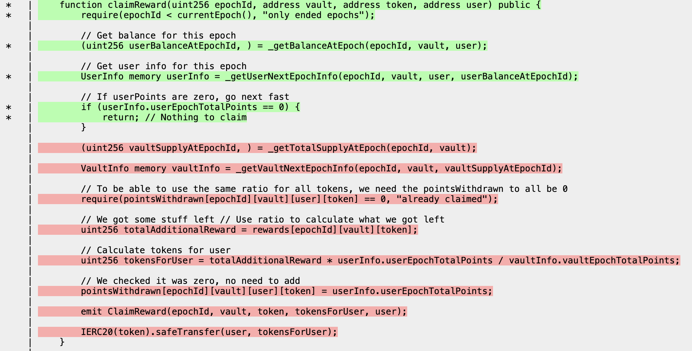

# Part 3 - Writing and Breaking Properties

## Introduction and Goals

In this section we'll finally get to exploring the reason why invariant testing is valuable: breaking properties, but first we need to understand how to define and implement them. 

## Additional Points On Chimera Architecture

In parts 1 and 2 we primarily looked at targets defined in the `MorphoTargets` contract but when you scaffold with Recon you also get the `AdminTargets`, `DoomsdayTargets` and `ManagersTargets` generated automatically. We'll look at these more in depth below but before doing so here's a brief overview of each:

- `AdminTargets` - target functions that should only be called by a system admin (uses the `asAdmin` modifier to call as our admin actor)
- `DoomsdayTargets` - special tests with multiple state changing operations in which we add inlined assertions to test specific scenarios
- `ManagersTargets` - target functions that allow us to interact with any manager used in our system (`ActorManager` and `AssetManager` are added by default)

## The Three Types of Properties

When discussing properties it's easy to get caught-up in the subtleties of the different types, but for this overview we'll just stick with three general ideas for properties that will serve you well.

> If you want to learn more about the subtleties of different property types, see [this](../writing_invariant_tests/implementing_properties.md) section on implementing properties.

### 1. Global Properties

Global properties, as the name implies, relate to the global state of the system, which can be defined by reading values from state variables or by added tracking variables that define values not stored by state variables.

An example of a global property that can be defined in many system types is a solvency property. For a solvency property we effectively query the sum of balances in the token, then query the balance in the system and make an assertion. Any time the system's balance is higher than the actual balance (sum of token balances), we can therefore say that the system is insolvent.

Interesting macro states that can be checked with global properties usually either take the form of one-to-one variable checks like checking a user balance versus internal balance or aggregated checks like the sum of all user balances versus sum of all internal balances.

### 2. State Changing Properties

State changing properties allow us to verify how the state of a system evolves over time with calls to state changing functions. 

For example, we could verify that if we increase a balance on a vault, then our balance of the share token is increased by the correct amount. Similarly, we can check that if we try to withdraw we would want to get back the same amount as was initially deposited. 

Although these types of checks may seem basic, you'd be surprised how many times these types of simple checks have led to uncovering edge cases in private audits for the Recon team. 

### 3. Inline Fuzz Test (Avoid)

Inlined fuzz tests usually tend to not be particularly interesting in terms of finding edge cases as they often test behavior in a similar manner to stateless fuzz tests or unit tests. 

Because these are low value properties they should be avoided for higher value properties. Any time you end up writing inlined fuzz tests you should instead try to rewrite it as an inductive property where if you can prove that a single transition is valid you can then implicitly prove that the set of all transitions is valid. This increases the value of an inlined test because it allows us to prove more than just a single property and instead we can know about the set of all possible states.

An example was our engagement with Centrifuge in which we realized that since there were already global variables that track values of interest, we didn't need to add additional trackers to our test suite which we update inside our handlers. We can instead perform a global before/after check for calls by a given handler to confirm that the state variables change as expected.

**TODO: expand on the above or add a visual example because this one is hard to understand**

## Dealing With Complex Tests

Global and state changing properties allow making an assertion after an individual state change is made, but sometimes you'll want to check for how multiple specific state changes or specific values affect the system. 

For these checks you can use the `stateless` modifier which reverts all state changes after the function call:

```javascript
    modifier stateless() {
        _;
        revert("stateless");
    }
```

This allows you to perform the specific check without maintaining changes to the state of the system. 

This ensures that the actual state exploration done by the fuzzer is handled only by the target functions which call one state changing function at a time and have descriptive names. This approach keeps what we call the "story" clean, where the story is the call sequence that's used to break a property in a reproducer unit test. Having each individual handler responsible for one state changing call makes it easier to determine which call caused the property to break when looking at the test.

Adding the `stateless` modifier to functions defined in `DoomsdayTargets` therefore lets us test specific cases which make multiple state changes or modify the input to the target function in some way, such as withdrawing an entire user's `maxWithdraw` amount from a vault and determining if this sets the user's `maxWithdraw` to 0 after: 

```javascript
    function doomsday_maxWithdraw() public stateless {
        uint256 maxWithdrawBefore = vault.maxWithdraw(_getActor);

        vault.withdraw(amountToWithdraw, _getActor(), _getActor());

        uint256 maxWithdrawAfter = vault.maxWithdraw(_getActor);
        eq(maxWithdrawAfter, 0, "maxWithdraw after withdrawing all is nonzero");
    }
```

If the assertion above fails, we'll get a reproducer unit test in which the `doomsday_maxWithdraw` function is the last one called. If the assertion doesn't fail, the fuzzer will revert the state changes and the function that will be used for exploring state changes related to withdrawals will be the primary withdrawal handler function.

---

## Practical Exercise: `RewardsManager`

For our example we'll be looking at the `RewardsManager` contract, in [this repo](https://github.com/Recon-Fuzz/rewards-manager).

We'll first focus on getting an understanding of how the system works. This is the true first step in building an invariant testing suite when you're unfamiliar with the codebase because it helps us define meaningful properties and know what we need to have coverage over.

> Typically if you designed/implemented the system yourself you'll already have a pretty good idea of what the properties you want to define are so you can usually get defining properties right away.

Then we'll use the Recon extension to add a Chimera scaffolding to the project like we did in [part 1](../bootcamp/bootcamp_part_1.md#practical-implementation---setting-up-morpho), focus on how we can get full coverage, and finally implement the properties we defined earlier. 

## About the `RewardsManager` Contract

The `RewardsManager`, as the name implies, is meant to handle the accumulation and distribution of reward tokens for depositors into a system. Since token rewards are often used as an incentive for providing liquidity to protocols (typically via vaults), this contract is meant to integrate with vaults via a notification system which is triggered by user deposits/withdrawals/transfers. This subsequently triggers updates to reward tracking for a user so any holder of the vault token can receive rewards.

The key function in the notification system that handles this is `notifyTransfer`:

```javascript
    function notifyTransfer(address from, address to, uint256 amount) external {
        require(from != to, "Cannot transfer to yourself");

        if (from == address(0)) {
            _handleDeposit(msg.sender, to, amount);
        } else if (to == address(0)) {
            _handleWithdrawal(msg.sender, from, amount);
        } else {
            _handleTransfer(msg.sender, from, to, amount);
        }

        emit Transfer(msg.sender, from, to, amount);
    }
```

which decrements or increments the reward tracking for a given user based on the action taken.

Looking at the `_handleDeposit` function more closely: 

```javascript
    function _handleDeposit(address vault, address to, uint256 amount) internal {
        uint256 cachedCurrentEpoch = currentEpoch();
        accrueUser(cachedCurrentEpoch, vault, to);
        // We have to accrue vault as totalSupply is gonna change
        accrueVault(cachedCurrentEpoch, vault);

        unchecked {
            // Add deposit data for user
            shares[cachedCurrentEpoch][vault][to] += amount;
        }
        // Add total shares for epoch // Remove unchecked per QSP-5
        totalSupply[cachedCurrentEpoch][vault] += amount;

    }
```

we can see that it accrues rewards to the user and the vault based on the time since the last accrual. It then increases the shares accounted to the user for the current epoch which determine a user's fraction of the total rewards as a fraction of the total shares.

## Initial Property Outline

Now that we have an understanding of how the system works, we can define our first property.

From the above function we can define our first solvency property as "the `totalSupply` of shares tracked is the sum of user share balances": 

```md
totalSupply == SUM(shares[vault][users])
```

which ensures that we never have more shares accounted to users than the `totalSupply` we're tracking.

In addition to the solvency property, we can also define a property that states that: "the sum of rewards are less than or equal to the reward token balance of the `RewardsManager`":

```md
SUM(rewardsInfo[epochId][vaultAddress][tokenAddress]) == rewardToken.balanceOf(address(rewardsManager))
```

## Scaffolding

We can use the same process for scaffolding as we did in [part 1](../bootcamp/bootcamp_part_1.md#practical-implementation---setting-up-morpho). After scaffolding the `RewardsManager`, we should have the following targets: 

```javascript
abstract contract RewardsManagerTargets is
    BaseTargetFunctions,
    Properties
{

    function rewardsManager_accrueUser(uint256 epochId, address vault, address user) public asActor {
        rewardsManager.accrueUser(epochId, vault, user);
    }

    function rewardsManager_accrueVault(uint256 epochId, address vault) public asActor {
        rewardsManager.accrueVault(epochId, vault);
    }

    function rewardsManager_addBulkRewards(uint256 epochStart, uint256 epochEnd, address vault, address token, uint256[] memory amounts) public asActor {
        rewardsManager.addBulkRewards(epochStart, epochEnd, vault, token, amounts);
    }

    function rewardsManager_addBulkRewardsLinearly(uint256 epochStart, uint256 epochEnd, address vault, address token, uint256 total) public asActor {
        rewardsManager.addBulkRewardsLinearly(epochStart, epochEnd, vault, token, total);
    }

    function rewardsManager_addReward(uint256 epochId, address vault, address token, uint256 amount) public asActor {
        rewardsManager.addReward(epochId, vault, token, amount);
    }

    function rewardsManager_claimBulkTokensOverMultipleEpochs(
        uint256 epochStart, 
        uint256 epochEnd, 
        address vault, 
        address[] memory tokens, 
        address user
    ) public asActor {
        rewardsManager.claimBulkTokensOverMultipleEpochs(epochStart, epochEnd, vault, tokens, user);
    }

    function rewardsManager_claimReward(uint256 epochId, address vault, address token, address user) public asActor {
        rewardsManager.claimReward(epochId, vault, token, user);
    }

    function rewardsManager_claimRewardEmitting(uint256 epochId, address vault, address token, address user) public asActor {
        rewardsManager.claimRewardEmitting(epochId, vault, token, user);
    }

    function rewardsManager_claimRewardReferenceEmitting(uint256 epochId, address vault, address token, address user) public asActor {
        rewardsManager.claimRewardReferenceEmitting(epochId, vault, token, user);
    }

    function rewardsManager_claimRewards(
        uint256[] memory epochsToClaim, 
        address[] memory vaults, 
        address[] memory tokens, 
        address[] memory users
    ) public asActor {
        rewardsManager.claimRewards(epochsToClaim, vaults, tokens, users);
    }

    function rewardsManager_notifyTransfer(address from, address to, uint256 amount) public asActor {
        rewardsManager.notifyTransfer(from, to, amount);
    }

    function rewardsManager_reap(RewardsManager.OptimizedClaimParams memory params) public asActor {
        rewardsManager.reap(params);
    }

    function rewardsManager_tear(RewardsManager.OptimizedClaimParams memory params) public asActor {
        rewardsManager.tear(params);
    }
}
```

Since the `RewardsManager` has no constructor arguments, we can see that the project immediately compiles:

```bash
forge build
[⠊] Compiling...
[⠑] Compiling 56 files with Solc 0.8.24
[⠘] Solc 0.8.24 finished in 702.49ms
Compiler run successful!
```

letting us move onto the next step of expanding our setup to improve our line and logical coverage.

## Setting Up Actors and Assets

To start with improving our test setup we'll add three additional actors and token deployments of varying decimal values to the `setup` function:

```javascript
    function setup() internal virtual override {
        rewardsManager = new RewardsManager();

        // Add 3 additional actors (default actor is address(this))
        _addActor(address(0x411c3));
        _addActor(address(0xb0b));
        _addActor(address(0xc0ff3));

        // Deploy MockERC20 assets
        _newAsset(18);
        _newAsset(8);
        _newAsset(6);

        // Mints to all actors and approves allowances to the counter
        address[] memory approvalArray = new address[](1);
        approvalArray[0] = address(rewardsManager);
        _finalizeAssetDeployment(_getActors(), approvalArray, type(uint88).max);
    }
```

Note that in the `ActorManager`, the default actor is `address(this)` which also serves as the "admin" actor which we use to call privileged functions via the `asAdmin` modifier.

The `RewardsManager` doesn't implement access control mechanisms, but we can simulate privileged functions only being called by the admin actor using the CodeLense provided by the Recon extension which we add to the `AdminTargets`. In a real-world setup this allows testing admin functions that would be called in regular operations by ensuring these target functions are always called with the correct actor so they don't revert. 

We'll apply the above mentioned changes to the `rewardsManager_addBulkRewards`, `rewardsManager_addBulkRewardsLinearly`, `rewardsManager_addReward` and `rewardsManager_notifyTransfer` functions:

```javascript
abstract contract AdminTargets is
    BaseTargetFunctions,
    Properties
{
    function rewardsManager_addBulkRewards(uint256 epochStart, uint256 epochEnd, address vault, address token, uint256[] memory amounts) public asAdmin {
        rewardsManager.addBulkRewards(epochStart, epochEnd, vault, token, amounts);
    }

    function rewardsManager_addBulkRewardsLinearly(uint256 epochStart, uint256 epochEnd, address vault, address token, uint256 total) public asAdmin {
        rewardsManager.addBulkRewardsLinearly(epochStart, epochEnd, vault, token, total);
    }

    function rewardsManager_addReward(uint256 epochId, address vault, address token, uint256 amount) public asAdmin {
        rewardsManager.addReward(epochId, vault, token, amount);
    }

    function rewardsManager_notifyTransfer(address from, address to, uint256 amount) public asAdmin {
        rewardsManager.notifyTransfer(from, to, amount);
    }
}
```

This leaves our `RewardsManagerTargets` cleaner and makes it easier to distinguish user actions from admin actions.

## Creating Clamped Handlers

Using our understanding of the system and looking at our target functions we can see there are 3 primary values that we'll need to clamp if we don't want the fuzzer to spend an inordinate amount of time exploring states that are irrelevant: `address vault`, `address token` and `address user`


```javascript
abstract contract RewardsManagerTargets is
    BaseTargetFunctions,
    Properties
{
    ...

    function rewardsManager_accrueUser(uint256 epochId, address vault, address user) public asActor {
        rewardsManager.accrueUser(epochId, vault, user);
    }
    
    ...

    function rewardsManager_claimRewardEmitting(uint256 epochId, address vault, address token, address user) public asActor {
        rewardsManager.claimRewardEmitting(epochId, vault, token, user);
    }

    ...
}
```

Thankfully our setup handles tracking for two of the values we need, so we can clamp `token` with the value returned by `_getAsset()` and the user with the value returned by `_getActor()`. For simplicity we'll clamp the `vault` using `address(this)`, this saves us from having to implement a mock vault which we'd have to add to our actors to call the handlers with.

We'll start off by only clamping the `claimReward` function because it should allow us to reach decent coverage after our first run of the fuzzer: 

```javascript
abstract contract RewardsManagerTargets is
    BaseTargetFunctions,
    Properties
{
    function rewardsManager_claimReward_clamped(uint256 epochId) public asActor {
        rewardsManager_claimReward(epochId, address(this), _getAsset(), _getActor());
    }
}
```

We can then run Echidna in `exploration` mode for 10-20 minutes to see how many of the lines of interest get covered with this minimal clamping applied: 


## Coverage Analysis

After stopping the fuzzer, we can see from the coverage report that all the major functions of interest: `notifyTransfer`, `_handleDeposit`, `_handleWithdrawal`, `_handleTransfer`, and `accrueVault` are fully covered:


We can also see, however, that the `claimReward` function is only being partially covered:



specifically, the epoch being claimed never has any points accumulated for it, so it never has anything to claim. 

So we can then use this additional information to improve our `rewardsManager_claimReward_clamped` function further:

```javascript
    function rewardsManager_claimReward_clamped(uint256 epochId) public asActor {
        uint256 maxEpoch = rewardsManager.currentEpoch();
        epochId = epochId % (maxEpoch + 1);
        
        rewardsManager_claimReward(epochId, address(this), _getAsset(), _getActor());
    }
```

which ensures that we only claim rewards for an `epochId` that has already passed, which makes it more likely that there will be points accumulated for it.

We can then start a new run of the fuzzer to determine whether this has improved coverage as expected. 

**TODO: add image of increased coverage**

## Implementing the First Properties

Often it's good to write out properties as pseudo-code before implementing in Solidity because it allows us to understand which values we can read from state and which we'll need to add additional tracking for. 

In our case we can use our property definitions:
1. the `totalSupply` of shares tracked is the sum of user share balances
2. the sum of rewards are less than or equal to the reward token balance of the `RewardsManager`

To write the following pseudocode: 


In our case we need to know the sum of rewards of a user, which we can get from the **TODO: `rewardsInfo` looks like it's unused so probably changed later down below in actual implementation**. We can then write the following pseudocode to describe what we need our property to do:

```md
## Property 1 
For each epoch, sum all user share balances (`sharesAtEpoch`) by looping through all actors (returned by `_getActors()`)

assert that `totalSupply` for the given epoch is the same as the sum of shares `totalSupply == sharesAtEpoch`

## Property 2
For each epoch, sum all rewards for `address(this)` (our placeholder for the vault)

Using the sum of the above, assert that `total <= token.balanceOf(rewardsManager)`
```

### Implementing the Total Supply Solvency Property

We can now implement the first property in the `Properties` contract as: 

```javascript
    function property_totalSupplySolvency() public {
        // fetch the current epoch up to which rewards have been accumulated
        uint256 currentEpoch = rewardsManager.currentEpoch();
        uint256 epoch;

        while(epoch < currentEpoch) {
            uint256 sharesAtEpoch;

            // sum over all users
            for (uint256 i = 0; i < _getActors().length; i++) {
                uint256 shares = rewardsManager.shares(epoch, address(this), _getActors()[i]);
                sharesAtEpoch += shares;
            }

            // check that sum of user shares for an epoch is the same as the totalSupply for that epoch
            eq(sharesAtEpoch, rewardsManager.totalSupply(epoch, address(this)), "Sum of user shares should equal total supply");

            epoch++;
        }

    }
```

In the above since the `RewardsManager` contract checkpoints the `totalSupply` for each epoch and also tracks user shares for each epoch, the only additional tracking we need to add is an accumulator for the sum of user shares which we use to make our assertion against the `totalSupply`. 

We can then start a new run of the fuzzer with our implemented property to see if it breaks. Ideally you should always run the fuzzer for around 5 minutes after implementing a property (or a few) because it allows you to quickly determine whether your property is correct or whether it breaks as a false positive (most false positives can be triggered with a relatively short run because they're either due to missing preconditions or a misunderstanding of how the system actually works in the property implementation). 

> Implementing many properties without running the fuzzer could result in many false positives that all need to be debugged separately and rerun to confirm they're resolved which ultimately slows down your implementation cycle.  

## Property Refinement Process

Very shortly after we start running the fuzzer, we see that it breaks the property, so we can stop the fuzzer and generate a reproducer using the Recon extension automatically (or use the [Recon log scraper tool](../free_recon_tools/echidna_scraper.md) to generate one): 

```javascript
    function test_property_totalSupplySolvency_0() public {
        vm.warp(block.timestamp + 157880);
        vm.roll(block.number + 1);
        rewardsManager_notifyTransfer(0x0000000000000000000000000000000000000000,0x00000000000000000000000000000000DeaDBeef,1);

        vm.warp(block.timestamp + 446939);
        vm.roll(block.number + 1);
        property_totalSupplySolvency();
    }
```

We can see from this that the only state-changing call that was made in the sequence was to `rewardsManager_notifyTransfer`, which indicates that this is most likely a false positive, which we can confirm by checking the handler function implementation in `AdminTargets`: 

```
abstract contract AdminTargets is
    BaseTargetFunctions,
    Properties
{
    ...

    function rewardsManager_notifyTransfer(address from, address to, uint256 amount) public asAdmin {
        rewardsManager.notifyTransfer(from, to, amount);
    }
}
```

From the handler it becomes clear that the `notifyTransfer` function results in a call to the internal `_handleDeposit` function since the `from` address in the test is `address(0)`:

```javascript
    function notifyTransfer(address from, address to, uint256 amount) external {
        ...

        if (from == address(0)) {
            /// @audit this line gets hit
            _handleDeposit(msg.sender, to, amount);
        } else if (to == address(0)) {
            _handleWithdrawal(msg.sender, from, amount);
        } else {
            _handleTransfer(msg.sender, from, to, amount);
        }

        ... 
    }
```

This results in deposited shares being accounted for the `0x00000000000000000000000000000000DeaDBeef` address. Since we only sum over the share balance of all actors tracked in `ActorManager` in the property, it doesn't account for other addresses (such as `0x00000000000000000000000000000000DeaDBeef`) having received shares, and so we get a 0 value for the sum in `sharesAtEpoch` and a value of 1 wei for the `totalSupply` at the current epoch. 

To ensure we're only allowing transfers to actors tracked by our `ActorManager` we can clamp the `to` address to the currently set actor using `_getActor()`:  

```javascript
    function rewardsManager_notifyTransfer(address from, uint256 amount) public asAdmin {
        rewardsManager.notifyTransfer(from, _getActor(), amount);
    }
```

This type of clamping is often essential to prevent these types of false positives so we don't implement them in a separate clamped handler (as this would still allow the fuzzer to call the unclamped handler with other addresses). 

Clamping these values also doesn't overly restrict the search space because having random values passed in for users or tokens doesn't provide any benefit as they won't actually explore any interesting state. 

> Any time there are addresses representing users or addresses representing tokens in handler function calls we can clamp using the `_getActor()` and `_getAsset()` return values, respectively.

We can then run Echidna again to confirm whether this resolved our broken property as expected. After which, we see that it still fails with the following reproducer:

```javascript
    function test_property_totalSupplySolvency_1() public {
        rewardsManager_notifyTransfer(0x0000000000000000000000000000000000000000,1);

        vm.warp(block.timestamp + 701427);
        vm.roll(block.number + 1);
        rewardsManager_notifyTransfer(0x00000000000000000000000000000000DeaDBeef,0);

        vm.warp(block.timestamp + 512482);
        vm.roll(block.number + 1);
        property_totalSupplySolvency();
    }
``` 

This should be an indicator to us that our initial understanding of how the system works was incorrect and we now need to look at the `notifyDeposit` implementation again more in depth to determine why the property still breaks. 

We can see from the reproducer test that in the calls to `rewardsManager_notifyTransfer`, the first call calls the internal `_handleDeposit` function and the second call calls `_handleTransfer`:

```javascript
 function notifyTransfer(address from, address to, uint256 amount) external {
        ...

        if (from == address(0)) {
            /// @audit this called first with 1 amount
            _handleDeposit(msg.sender, to, amount);
        } else if (to == address(0)) {
            _handleWithdrawal(msg.sender, from, amount);
        } else {
            /// @audit this called second with 0 amount
            _handleTransfer(msg.sender, from, to, amount);
        }

        ...
 }
```

So we note that the first call is essentially registering a 1 wei deposit for the currently set actor (returned by `_getActor()`) and the second call is registering a transfer of 0 from the `0x00000000000000000000000000000000DeaDBeef` address to the currently set actor. 

Since the `rewardsManager_notifyTransfer(0x00000000000000000000000000000000DeaDBeef,0)` call is the last one, we know that something in the `_handleTransfer` call changes state in an unexpected way, which leads our property to break. Looking at the implementation of `_handleTransfer`, we see that since we're passing in a 0 value, the only state-changing calls it makes are to `accrueUser`:

```javascript
    function _handleTransfer(address vault, address from, address to, uint256 amount) internal {
        uint256 cachedCurrentEpoch = currentEpoch();
        // Accrue points for from, so they get rewards
        accrueUser(cachedCurrentEpoch, vault, from);
        // Accrue points for to, so they don't get too many rewards
        accrueUser(cachedCurrentEpoch, vault, to);

        /// @audit anything below these lines don't actually get reached
        unchecked {
            // Add deposit data for to
            shares[cachedCurrentEpoch][vault][to] += amount;
        }

        // Delete deposit data for from
        shares[cachedCurrentEpoch][vault][from] -= amount;
    }
```

This indicates to us that we are updating shares for the user if time has passed since the last update:

```javascript

    function accrueUser(uint256 epochId, address vault, address user) public {
        require(epochId <= currentEpoch(), "only ended epochs");

        (uint256 currentBalance, bool shouldUpdate) = _getBalanceAtEpoch(epochId, vault, user);

        if(shouldUpdate) {
            shares[epochId][vault][user] = currentBalance;
        }

        ...
    }
```

Notably, however, there is no call to `accrueVault` in this transfer (unlike in the `_handleDeposit` and `_handleWithdrawal` functions), indicating that the user balances increase but the vault's `totalSupply` for the current epoch remains the same. We can then test whether this is the source of the issue by making a call to the `accrueVault` target handler:  

```javascript
    function test_property_totalSupplySolvency_1() public {
        rewardsManager_notifyTransfer(0x0000000000000000000000000000000000000000,1);

        vm.warp(block.timestamp + 701427);
        vm.roll(block.number + 1);
        rewardsManager_notifyTransfer(0x00000000000000000000000000000000DeaDBeef,0);

        rewardsManager_accrueVault(rewardsManager.currentEpoch(), address(this));

        vm.warp(block.timestamp + 512482);
        vm.roll(block.number + 1);
        property_totalSupplySolvency();
    }  
```

which then allows the test to pass:

```bash
[PASS] test_property_totalSupplySolvency_1() (gas: 391567)
Suite result: ok. 1 passed; 0 failed; 0 skipped; finished in 7.33ms (2.83ms CPU time)
```

Looking at the `accrueVault` function, we see this is because it sets a new value for the `totalSupply` if the `_getTotalSupplyAtEpoch` function determines that it hasn't updated since the last epoch: 

```javascript
  function accrueVault(uint256 epochId, address vault) public {
        require(epochId <= currentEpoch(), "Cannot see the future");

        (uint256 supply, bool shouldUpdate) = _getTotalSupplyAtEpoch(epochId, vault);

        if(shouldUpdate) {
            // Because we didn't return early, to make it cheaper for future lookbacks, let's store the lastKnownBalance
            totalSupply[epochId][vault] = supply;
        }

        ...
  }
```

In our case, since there is no call to `accrueVault` but there is a call to `accrueUser`, the user is accounted shares for the epoch, but the vault isn't.

We can say that this is a real bug because it causes users to have claimable shares in an epoch in which there are no claimable shares tracked by the total supply. This would cause the following logic in the `claimReward` function to behave incorrectly due to a 0 return value from `_getTotalSupplyAtEpoch`:

```javascript
    function claimReward(uint256 epochId, address vault, address token, address user) public {
        require(epochId < currentEpoch(), "only ended epochs");

        // Get balance for this epoch
        (uint256 userBalanceAtEpochId, ) = _getBalanceAtEpoch(epochId, vault, user);
        
        // Get user info for this epoch
        UserInfo memory userInfo = _getUserNextEpochInfo(epochId, vault, user, userBalanceAtEpochId);

        // If userPoints are zero, go next fast
        if (userInfo.userEpochTotalPoints == 0) {
            return; // Nothing to claim
        }

        /// @audit this would return 0 incorrectly 
        (uint256 vaultSupplyAtEpochId, ) = _getTotalSupplyAtEpoch(epochId, vault);

        VaultInfo memory vaultInfo = _getVaultNextEpochInfo(epochId, vault, vaultSupplyAtEpochId);

        // To be able to use the same ratio for all tokens, we need the pointsWithdrawn to all be 0
        require(pointsWithdrawn[epochId][vault][user][token] == 0, "already claimed");

        // We got some stuff left // Use ratio to calculate what we got left
        uint256 totalAdditionalReward = rewards[epochId][vault][token];

        // Calculate tokens for user
        // @audit this would use the wrong value
        uint256 tokensForUser = totalAdditionalReward * userInfo.userEpochTotalPoints / vaultInfo.vaultEpochTotalPoints;
        
        ...
    }
```

Now that we've identified the source of the issue, we can add the additional call to the `accrueVault` function in `_handleTransfer`:

```javascript
    function _handleTransfer(address vault, address from, address to, uint256 amount) internal {
        uint256 cachedCurrentEpoch = currentEpoch();
        // Accrue points for from, so they get rewards
        accrueUser(cachedCurrentEpoch, vault, from);
        // Accrue points for to, so they don't get too many rewards
        accrueUser(cachedCurrentEpoch, vault, to);
        // @audit added accrual to vault so tracking is correct
        accrueVault(cachedCurrentEpoch, vault);

        ...
    }
```

We can then run the fuzzer again to confirm that our property now passes. After doing so, however, we see that it once again fails with the following reproducer: 

```javascript
// forge test --match-test test_property_totalSupplySolvency -vvv 
function test_property_totalSupplySolvency() public {

    vm.warp(block.timestamp + 56523);
    vm.roll(block.number + 1);
    rewardsManager_notifyTransfer(0x0000000000000000000000000000000000000000,1);

    switchActor(25183731206506529133541749133319);

    vm.warp(block.timestamp + 947833);
    vm.roll(block.number + 1);
    rewardsManager_notifyTransfer(0x0000000000000000000000000000000000000000,0);

    vm.warp(block.timestamp + 206328);
    vm.roll(block.number + 1);
    property_totalSupplySolvency();
}
```

which upon further investigation reveals that the call from `notifyTransfer` to `_handleDeposit` with a 0 value for `amount` causes the `totalSupply` to accrue for the vault but not the user since they have no value deposited:

```javascript
    function _handleDeposit(address vault, address to, uint256 amount) internal {
        uint256 cachedCurrentEpoch = currentEpoch();
        // @audit this accrues nothing since the actor that's switched to has no deposits
        accrueUser(cachedCurrentEpoch, vault, to);
        // @audit this accrues totalSupply with the amount deposited by the first actor 
        accrueVault(cachedCurrentEpoch, vault);
        
        ...
    }
```

This indicates that we should refactor our property to use a less than or equal to check (`lte`) instead of strict equality (`eq`):

```javascript
    function property_totalSupplySolvency() public {
        uint256 currentEpoch = rewardsManager.currentEpoch();
        uint256 epoch;

        while(epoch < currentEpoch) {
            uint256 sharesAtEpoch;

            // sum over all users
            for (uint256 i = 0; i < _getActors().length; i++) {
                uint256 shares = rewardsManager.shares(epoch, address(this), _getActors()[i]);
                sharesAtEpoch += shares;
            } 

            // check if solvency is met
            lte(sharesAtEpoch, rewardsManager.totalSupply(epoch, address(this)), "Sum of user shares should equal total supply");

            epoch++;
        }

    }
```

We can modify the assertion in this way because we can logically reason that if we have a `totalSupply` greater than or equal to the shares accounted to users, then the system is solvent and able to repay all depositors, but if we have less than this amount, the system would be unable to repay all depositors. 

After running the fuzzer with this new property implementation for 5-10 minutes, it holds, confirming that it is now properly implemented. 

## Conclusion 

This shows how invariant testing can often highlight misunderstandings of a system by giving you ways to easily test assumptions that can't be tested with unit tests or stateless fuzzing. When these assumptions fail, it's either due to a false positive or a misunderstanding of how the system works, or both, as we saw above. 

When you're forced to refactor your code to resolve an issue identified by a broken property, you can then run the fuzzer to confirm whether you resolved the issue for all cases, which as we saw above made us realize that our property implementation was overly strict.

One of the other key benefits of invariant testing besides explicitly identifying exploits is that it allows you to ask and answer questions about **whether it's possible to get the system into a specific state**. If the answer is yes and the state is unexpected, this can often be used as a precondition that can lead to an exploit of the system. 

In part 4, we'll look at how a precondition was able to identify a multi-million dollar bug in a real-world codebase before it was pushed to production. 