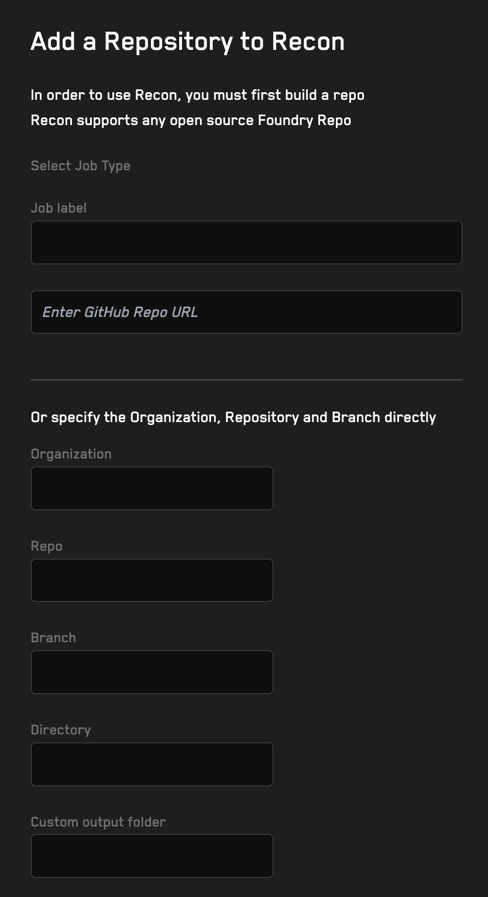
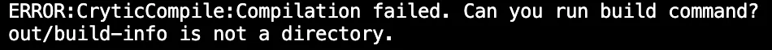
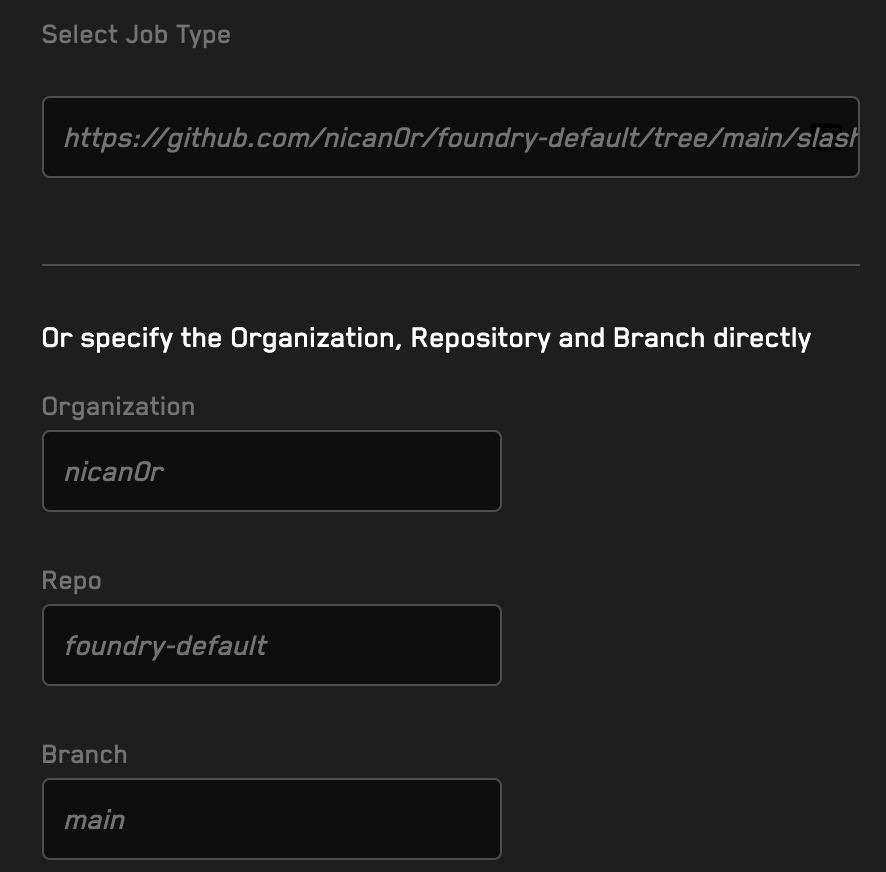

# Building Handlers 

## What Are Handlers?

Handlers are functions that help you test invariants by wrapping a call to a target contract with a function that allows you to add clamping (reduces the search space of the fuzzer) and properties all in the same execution. 

For example, if we want to test the deposit function of an ERC4626 vault, we can build a handler that will call the deposit function and then assert some property about the state of the vault after the deposit is complete.

```solidity
// this is the handler
function vault_deposit(uint256 assets, address receiver) public {  
    // we can add clamping here to reduce the search space of the fuzzer    
    assets = assets %  underlyingAsset.balanceOf(address(this));

    // this is the call to the target contract
    vault.deposit(assets, receiver);

    // we can add properties here to test the state of the vault after the deposit is complete
    eq(vault.balanceOf(receiver) == assets);
}
```

## Building Handlers In Recon

### Adding A Standard Repo
After you have your project setup with Foundry and have ensured your repository is public navigate to the _Add Repos_ tab on the left-hand side menu. 

In the form that appears, you'll see a field for the _GitHub Repo URL_, add the url of your repository here. 



When building a **standard repo** (all source files are in the root directory of the default branch) this is all you need to do and can click the _Build your Handler_ button for recon to scrape your contract ABIs so you can start building handlers on the _Build your Handlers_ tab. 

### Adding Nonstandard Repos

Nonstandard repositories that meet one or more of the following criteria will need more information to be specified in the form above:

- use a branch name other than `main` as their default branch
- locate their source contracts in a directory other than the root
- have specified an output directory in their `foundry.toml` other than `out`

#### Branch Other Than Main

If your repository uses a branch other than `main` as its default branch, you can specify the branch name in the _Branch_ field.

#### Source Contracts in a Directory Other Than the Root

If your repository's source contracts are located in a directory other than the root, you can specify the directory name in the _Directory_ field.

#### Output Directory in Foundry.toml

If your repository has specified an compilation output directory in its `foundry.toml` file other than `out`, you can specify the directory name in the _Output Directory_ field.

An example of a `foundry.toml` file that specifies a non-default output directory is:

```toml
out = "artifacts"
```

## Running The Build

After you have added your repository and filled out the form, you can click the _Build your Handler_ button. 

Your job will be submitted to Recon’s cloud service which scrapes the contract ABIs to generate the necessary scaffolding for your test handlers. You'll get a notification on the bottom of the screen that you've successfully created a job with a unique ID string.


Once the job is complete, you'll be able to see the handlers you've built under the _Build your Handlers_ tab. 

If a scaffolding has been built from the same repository by other users, Recon uses the existing ABI and your job will be immediately available with the following message: 


## Common Build Issues

### Building A Private Repository

The free tier of Recon only allows building public GitHub repositories so if you try to build a private repository you’ll get an error when trying to submit your build job. 

To build private repositories, you can upgrade to the Pro tier of Recon. 

### Not Specifying Custom Output Folder

If you fail to specify a custom output folder as it’s defined in the foundry.toml file for projects that use a non-default output folder of out, Recon will successfully build your project but you will encounter the following error when trying to run Echidna



You will see a similar error for Medusa. To resolve this you will need to rebuild the Recon scaffolding by following the steps above and correctly specifying your output folder in the form.

### Incorrectly Specifying Branch

For repositories that use a default branch name other than main, if you fail to specify the branch name correctly in the Branch form field you will get a build error.

### Branches With “/” In Name

For repositories with a default branch whose name includes a “/” in their name, the builder will only recognize the leading half of the branch name when autofilling the branch name in the form field. 

For example, if you have a repository as below whose default branch name is `main/slash` only `main` gets recognized and added to the form:



This will throw an error because the builder will not be able to find the branch name in the repository. 

To resolve this, you can manually specify the branch name in the form field. In the above example you would specify `main/slash` as the branch name. 

