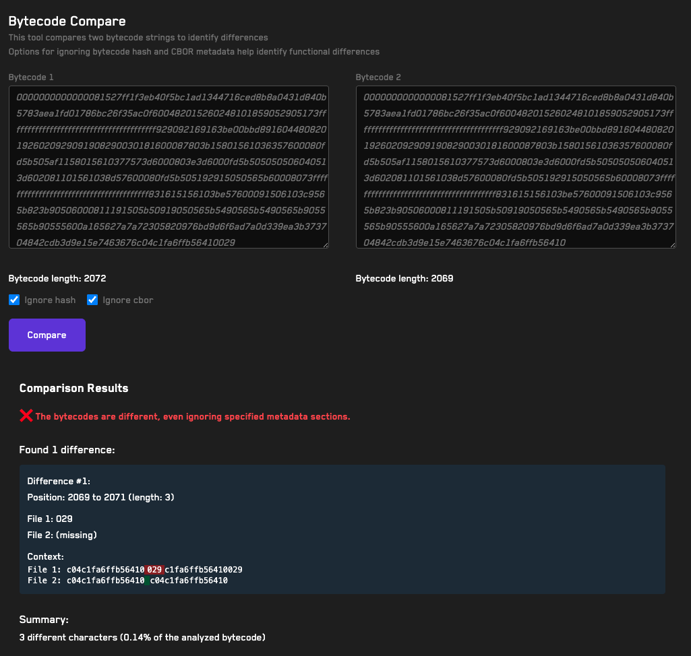

# <a href="https://getrecon.xyz/tools/bytecode-compare" target="_blank" rel="noopener noreferrer">Bytecode Compare</a>

## Usage
1. Paste 2 contract bytecodes
2. Use the "Compare" button to generate a diff between them, optionally ignoring metadata
