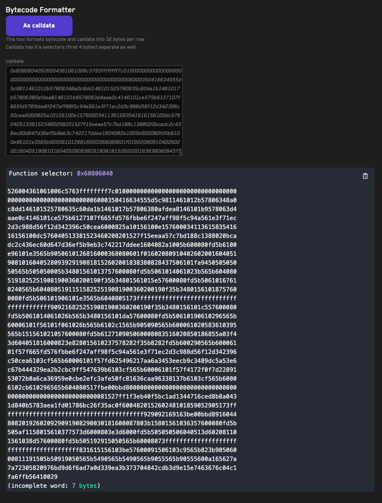

# <a href="https://getrecon.xyz/tools/bytecode-formatter" target="_blank" rel="noopener noreferrer">Bytecode Formatter</a>

## Usage
1. Use the _As calldata_/_As words_ buttons to select how you'd like to display the formatted data.
1. Paste bytecode or calldata into the _calldata_ field
2. The tool will automatically format the bytecode or calldata into 32 bytes per row. For calldata the first four bytes will be used to extract the function selector.
