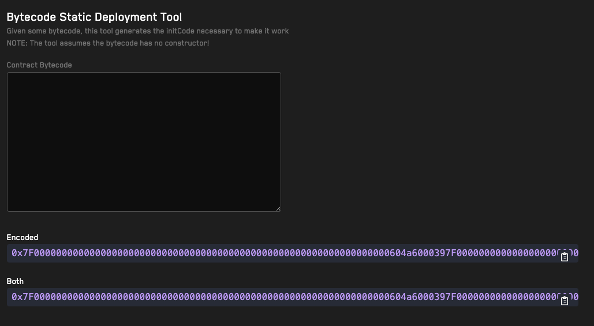

# <a href="https://getrecon.xyz/tools/bytecode-static-deployment-tool" target="_blank" rel="noopener noreferrer">Echidna Log Scraper</a>

## Usage
1. Paste the deployed bytecode of EVM contract (this should not include the constructor as it will generate the Initcode from the bytecode)
2. The tool will automatically output the Initcode (constructor bytecode that gets executed on contract deployment) in the _Encoded_ field
3. The _Both_ field will include the Initcode and the deployed bytecode.