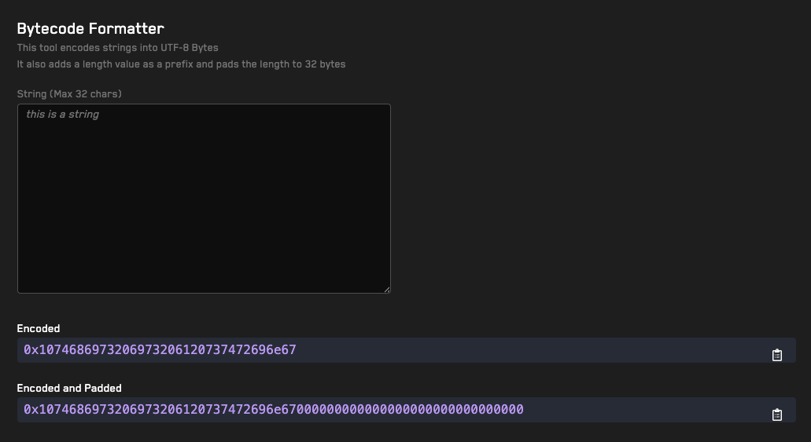

# <a href="https://getrecon.xyz/tools/bytecode-string-tool" target="_blank" rel="noopener noreferrer">String To Bytes</a>

## Usage 
1. Type a string in the _String_ field (only strings less than 32 bytes are supported)
2. The tool will automatically format the string using UTF-8 bytes encoding and add a length parameter. The topmost output will display the string without padding and the bottommost output will displat the string with padding.