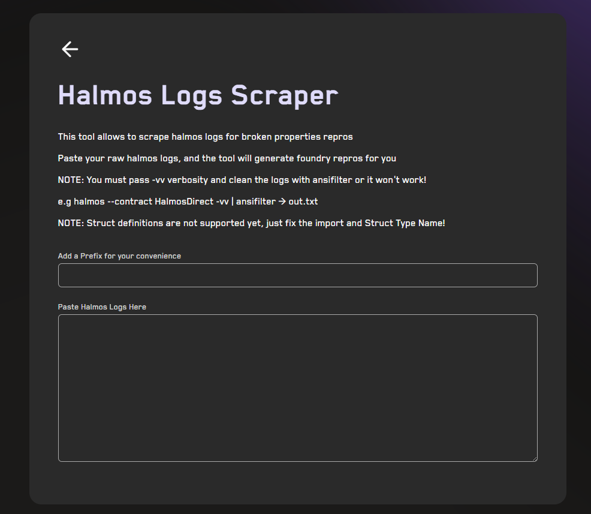

# <a href="https://getrecon.xyz/tools/halmos" target="_blank" rel="noopener noreferrer">Halmos Logs Scraper</a>

## Usage

1. Paste your raw Halmos logs
2. Broken properties will be scraped automatically from the pasted logs
3. A Foundry reproducer unit test will be generated for each broken property
4. Add a prefix for convenience (optional)

## Notes

* You must run Halmos with `-vv` verbosity and strip ANSI codes, otherwise parsing will fail:

  * `halmos --contract HalmosDirect -vv | ansifilter > out.txt`
* Struct definitions are not supported yet; fix the import and struct type name manually in the generated repro
