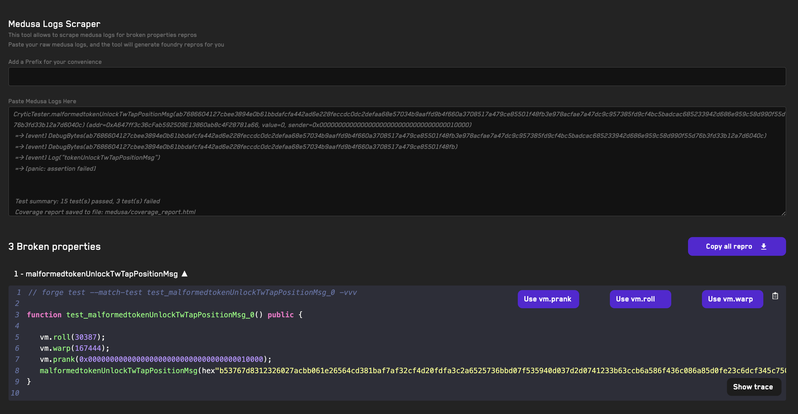

# <a href="https://getrecon.xyz/tools/medusa" target="_blank" rel="noopener noreferrer">Medusa Log Scraper</a>

## Usage
1. Paste your Medusa logs generated at the end of your test run
2. All function calls will be scraped automatically from the pasted logs
3. Each property will generate a Foundry reproducer unit test
4. Toggle cheatcodes as needed