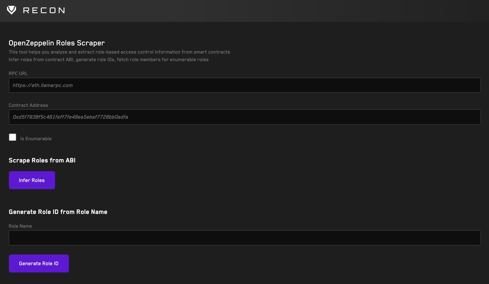

# <a href="https://getrecon.xyz/tools/roles" target="_blank" rel="noopener noreferrer">OpenZeppelin Roles Scraper</a>

This tools allows scraping any role from the contract ABI

It also allows to retrieve the hash of any name

If the contract uses the Enumerable Roles Extensions you can also retrieve all addresses that have a role assigned to them

## Usage

Paste any valid address and RPC Url

### Get Role Members (Enumerable)

Retrieve all role members. Simply paste the role hash in the input and click on `Get Role Members`

### Scrape Roles from ABI

Simply click the button, the tool will use WhatsABI to infer the contract ABI and return any public getter that ends with `_ROLE`

### Generate the Role Bytes ID

Paste any role name (or any string)

And click on `Generate Role ID` to retrieve the role hash
