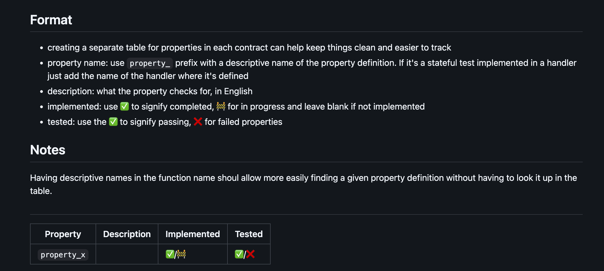

# <a href="https://github.com/Recon-Fuzz/properties-table" target="_blank" rel="noopener noreferrer">Properties Table</a>

This repo provides a template for creating a table to track properties that have been implemented for an invariant testing suite using the format that the [Recon](https://getrecon.xyz/) team uses in our engagements. 

## Examples

The following are examples of the use of this table for Recon engagements:

- [Liquity Governance](https://github.com/liquity/V2-gov/blob/temp-invariant/test/recon/PROPERTIES.md)
- [eBTC](https://github.com/ebtc-protocol/ebtc/blob/main/packages/contracts/specs/PROPERTIES.md)
