# Recon Extension
The Recon extension is a Visual Studio Code extension that allows you to use Recon's suite of tools directly in your code editor. It requires a Foundry project to be open in your workspace to use.

## Installation and Source Code

### VS Code:

https://marketplace.visualstudio.com/items?itemName=Recon-Fuzz.recon

### Github:

https://github.com/Recon-Fuzz/recon-extension

## Getting Started
After installing the extension, your project will automatically be compiled when you open a new window in your code editor. 

If your `foundry.toml` file is located in a directory other than the root of your project, your project will not be compiled automatically. You can select the location in the sidebar under the _RECON COCKPIT_ section:

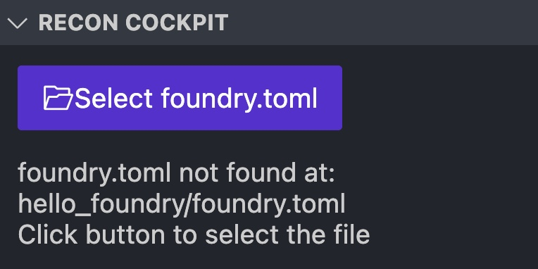

which will allow you to build your project from the directory containing the `foundry.toml` file.

## Scaffold Your Target Functions
After building your project, you can choose which of your contract functions you want to add target functions for using the _CONTRACTS_ section in the sidebar. 

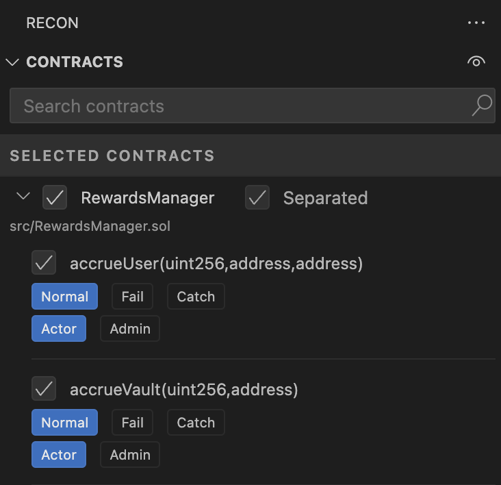

Once you've selected the contract functions you'd like to scaffold, you can generate a [Chimera Framework](./chimera_framework.md) template for your project using the _Scaffold_ button in the sidebar under the _RECON COCKPIT_ section: 

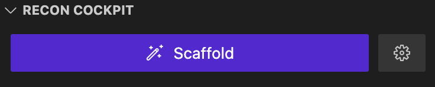

This will install the [Chimera](https://github.com/Recon-Fuzz/chimera) dependency, generate the necessary fuzzer config files, and generate all the necessary test files for your project using the [Create Chimera App template](https://github.com/Recon-Fuzz/create-chimera-app). 

Your scaffolded target functions will be added to the `recon/targets` directory as `ContractName + TargetFunctions.sol` (e.g. `Counter.sol`'s target functions will be called `CounterTargetFunctions.sol`).

> Note: You can change settings for the project build configurations by clicking the gear icon next to the _Generate Chimera Template_ button. This allows you to change the Echidna and Medusa configuration files as well as the project settings.

For more on how to use the Chimera Framework, check out the [Chimera Framework](./chimera_framework.md) section.

## Function Handlers 

### Testing Modes
When selecting which contract functions you'd like to target, you can select from three testing modes to help define how you'd like to test your target functions: 

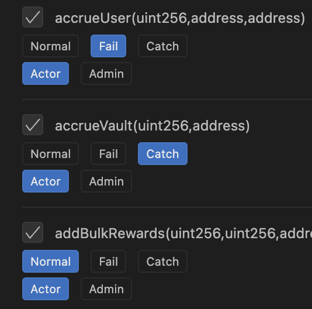

- Normal Mode - This just adds a handler function as a wrapper around the underlying target function.  
- Fail Mode - This will add a handler function that includes an assertion at the end of the call to the target function. You can replace this assertion with any other assertion you'd like to test.
- Catch Mode - This will add a handler function that includes a try catch block around the call to the target function. You can add any custom logic to the catch block such as an assertion about when a function should or shouldn't revert.

The testing mode for each target function can later be changed in the generated target function contract above each function using the codelense buttons:

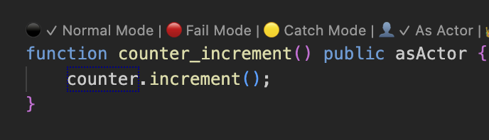

### Actor Mode 
Actor modes allow you to specify which actor should be calling the target function:

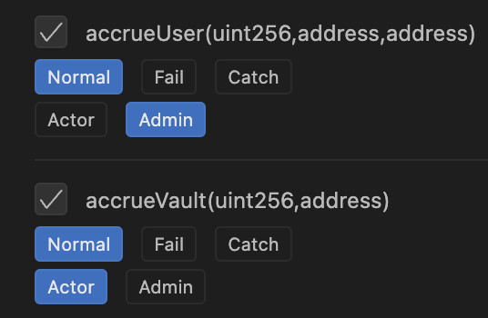

- Actor - This uses the currently set actor returned by `_getActor()` to prank and call the target function.
- Admin - This uses the admin role to call the target function (this is defaulted to `address(this)`).

The actor mode for each target function can later be changed in the generated target function contract above each function using the codelense buttons:

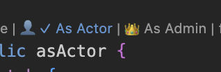

## Auto Mocking
The Recon extension allows you to auto-mock your target functions using the Auto Mock tool. This tool will generate a mock of system contracts based on the contract's parameters and return values. Auto Mocking is useful for quickly getting to coverage on the core contracts of your project that you target with your target functions while simulating functionality of periphery contracts.

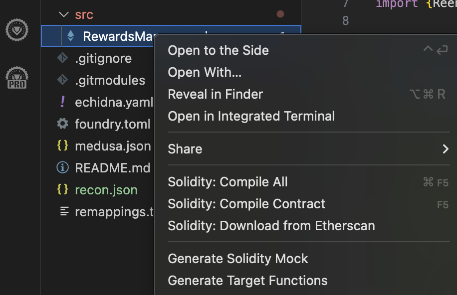

Auto Mocking is triggered by right clicking on the ABI file or a Contract file of the contract you'd like to mock in the `out` directory and selecting _Generate Solidity Mock_. This will generate a mock of the contract in the path specified in the _RECON COCKPIT_ settings in the _Mocks Folder Path_ field as `ContractName + Mocks.sol` (e.g. `Counter.sol`'s mocks will be called `CounterMocks.sol`).

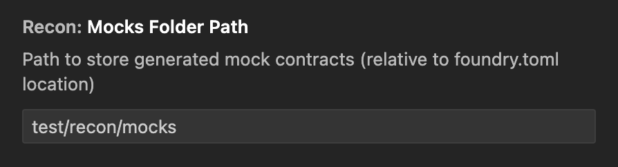

## Run with Echidna and Medusa 
After generating a Chimera template for your project you can use the _Run Echidna_ and _Run Medusa_ buttons in the bar at the bottom of your code editor to run your suite with Echidna and Medusa. 

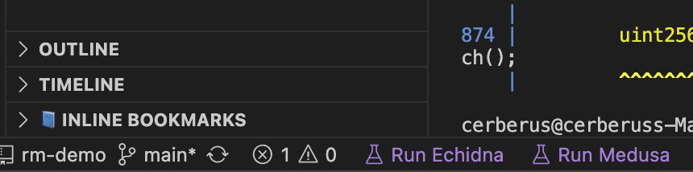

### Report Generation 
After running your suite with Echidna or Medusa a report is automatically generated which you can see in the _COVERAGE REPORT_ section in the sidebar. 

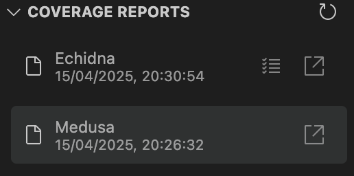

This provides an markdown report of all the properties that were tested and the results. 

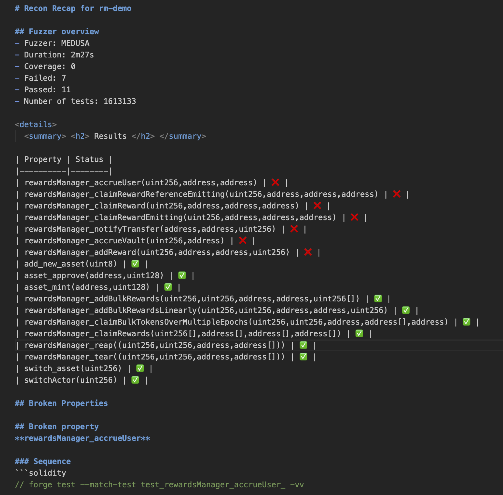

You can also view a condensed version of the coverage report which removes contracts that aren't touched by the fuzzer by clicking the open in new tab button in the report section. 

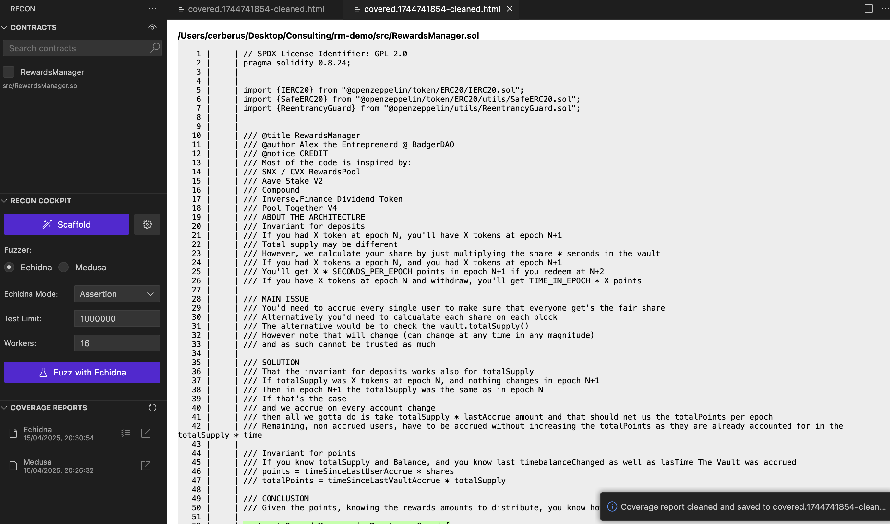

### Reproducer Generation
If a property breaks, the extension will automatically generate a Foundry unit test reproducer for the property. 

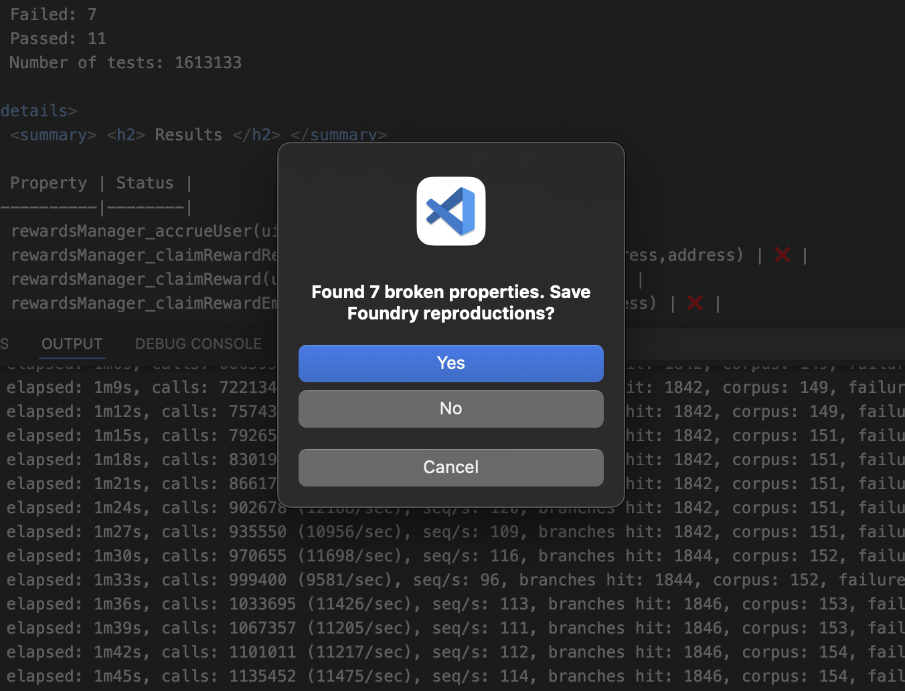

Clicking yes will add the reproducer to the `CryticToFoundry` contract created when you generate a Chimera template. 

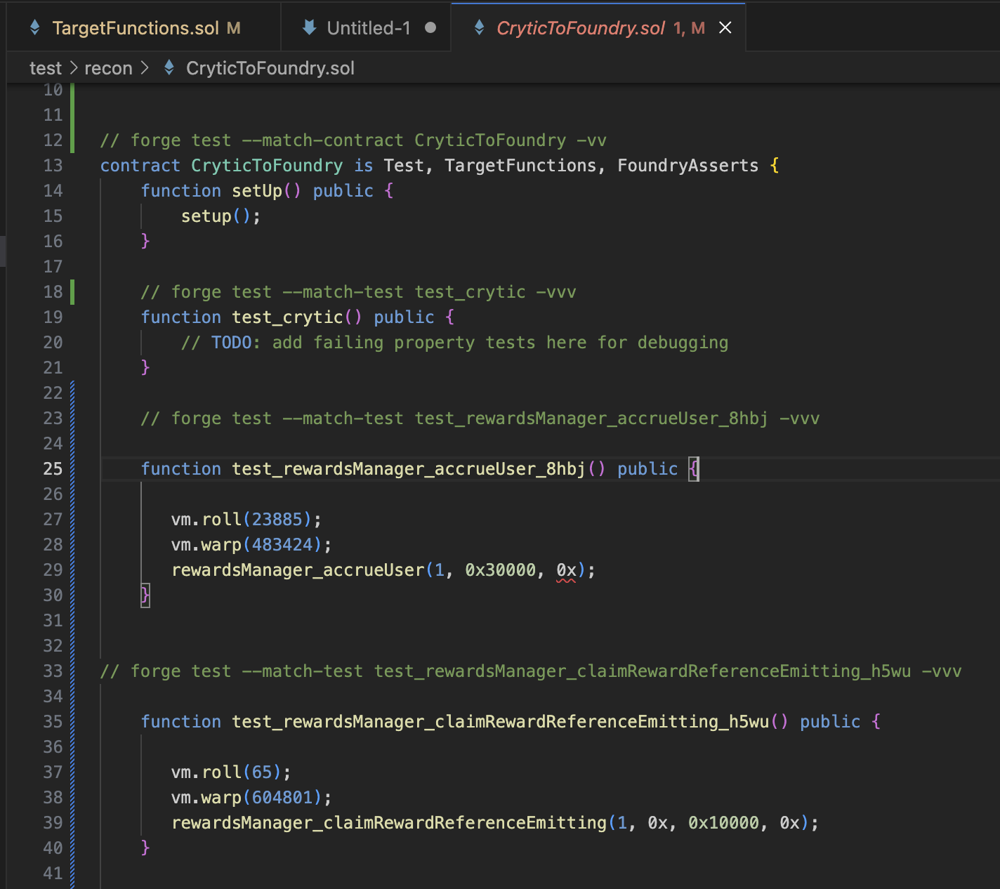

The Recon extension also provides a codelense utility for running the Foundry test function above the function via the _Run Test_ button. 
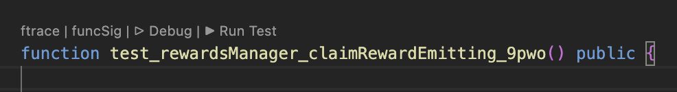

## Coverage Report Compressor 
- Right click on the coverage report and select "Clean Up Coverage Report"
- This will compress the report by removing irrelevant contracts from the coverage report

## Display coverage report as overlay with coverage gutters
- To do this you just need to have the coverage gutters extension installed and click the report in the _COVERAGE REPORT_ section
- This will display the coverage report as an overlay using coverage gutters
- To remove the coverage gutters you can click the _File Uncovered_ button on the bottom of your VS code window

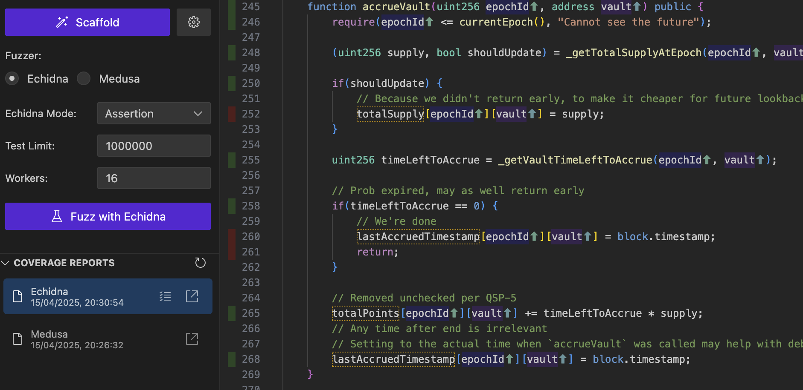

