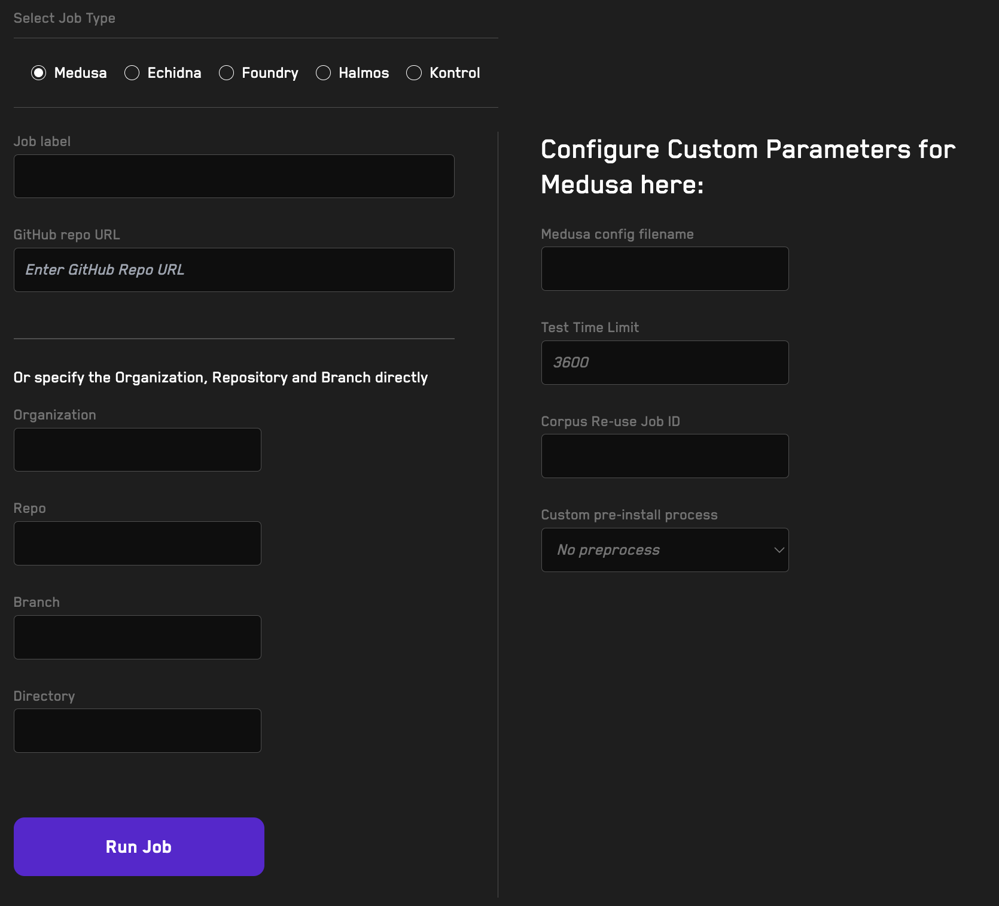

# Running Jobs In The Cloud With Recon 

Using Recon’s Job running feature you can offload long-duration jobs to Recon’s cloud service so you don’t waste computational resources locally and can run long-term jobs without worrying about something failing at the last minute because of something you did on your local machine.

## How To Run A Fuzzing Job

On the _Jobs_ tab you'll see the following form for running a job:

