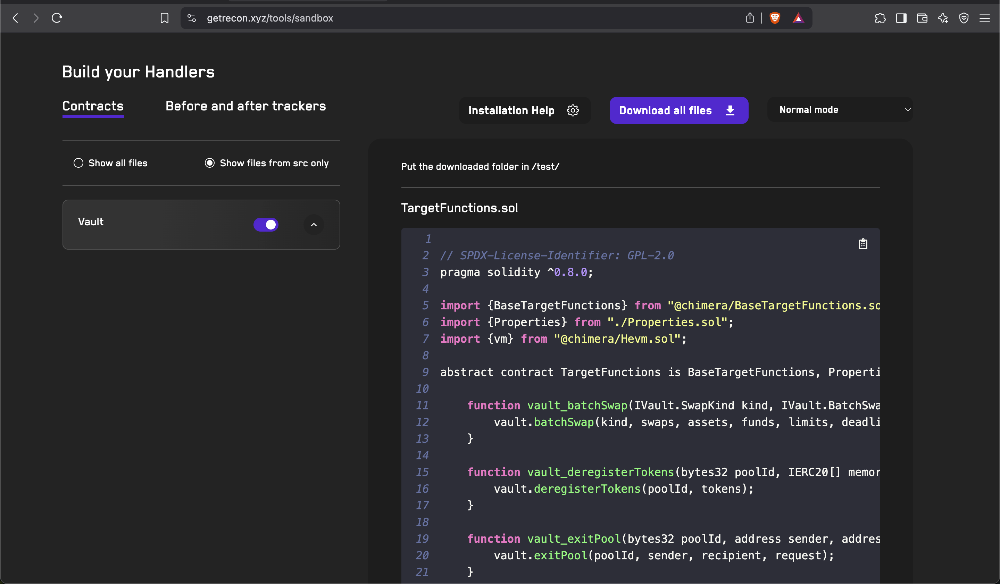

# <a href="https://getrecon.xyz/tools/sandbox" target="_blank" rel="noopener noreferrer">Invariants Builder</a>

Scaffold an Invariant Testing suite in seconds!

## Usage
- Paste your contract's ABI (available in the `out/` directory after building your contracts using Foundry)
- Add the name of your pasted contract's ABI in the "Your_Contract" form field
- Download the generated contracts into your repo using the "Download All Files" button
- Follow the instructions in the "Installation Help" section for the next steps after you've added the files to your repo
