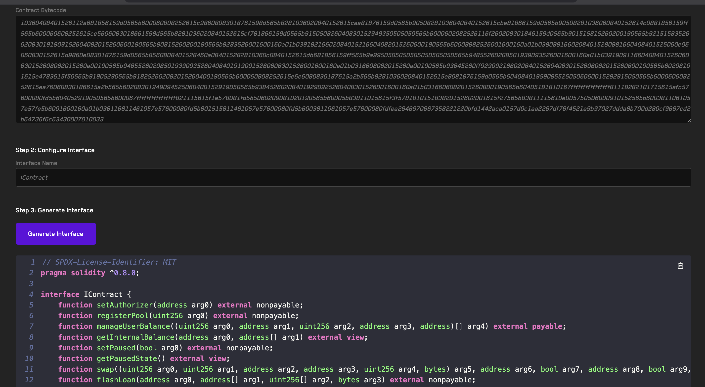

# Bytecode To Interface

[https://getrecon.xyz/tools/bytecode-to-interface
](https://getrecon.xyz/tools/bytecode-to-interface)

- Using Reserve Engineering tools (evmole)
- Generates a Solidity Interface given any bytecode

[https://getrecon.xyz/tools/bytecode-to-interface](https://getrecon.xyz/tools/bytecode-to-interface)