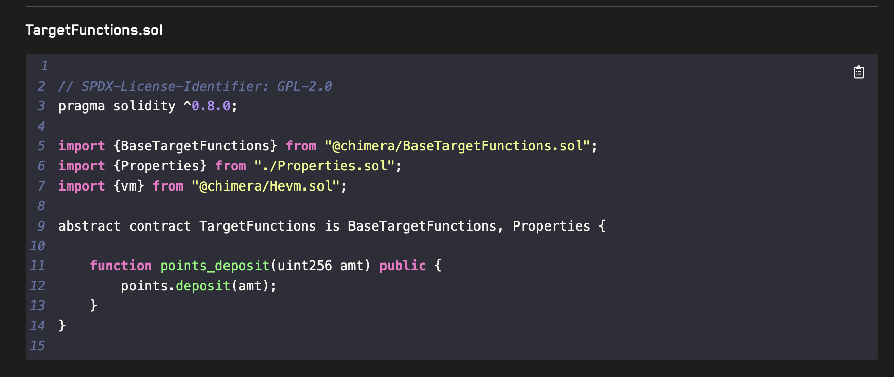

# Introduction

In this simple article we'll use Create Chimera App to create a simple Contract and run Invariant Tests on it

## Getting started

Clone: https://github.com/Recon-Fuzz/create-chimera-app

Or use `forge init --template https://github.com/Recon-Fuzz/create-chimera-app`

## Writing the Contract

Let's write a simple contract that given a deposit will vest your points over time

```solidity

contract Points {
    mapping (address => uint256) depositAmount;
    mapping (address => uint256) depositTime;

    function deposit(uint256 amt) external {
        depositAmount[msg.sender] += amt;
        depositTime[msg.sender] = block.timestamp;
    }

    function power(address who) external view returns (uint256) {
        return depositAmount[msg.sender] * (block.timestamp - depositTime[msg.sender]);
    }
}
    
```

## Dealing with the Boilerplate

Let's delete `Counter.t.sol` since we won't be writing unit tests

Rename `Counter.sol` to `Points.sol`

Now we need to fix some imports

### Delete all handlers in TargetFunctions

```solidity
// TargetFunctions.sol

// SPDX-License-Identifier: GPL-2.0
pragma solidity ^0.8.0;

// Chimera deps
import {vm} from "@chimera/Hevm.sol";

// Helpers
import {Panic} from "@recon/Panic.sol";

// Targets
// NOTE: Always import and apply them in alphabetical order, so much easier to debug!
import {AdminTargets} from "./targets/AdminTargets.sol";
import {DoomsdayTargets} from "./targets/DoomsdayTargets.sol";
import {ManagersTargets} from "./targets/ManagersTargets.sol";

abstract contract TargetFunctions is
    AdminTargets,
    DoomsdayTargets,
    ManagersTargets
{
   
}

```

### Delete all handlers in AdminTargets and Doomsday Targets

```solidity
// AdminTargets.sol
// SPDX-License-Identifier: GPL-2.0
pragma solidity ^0.8.0;

import {BaseTargetFunctions} from "@chimera/BaseTargetFunctions.sol";
import {BeforeAfter} from "../BeforeAfter.sol";
import {Properties} from "../Properties.sol";
import {vm} from "@chimera/Hevm.sol";

abstract contract AdminTargets is
    BaseTargetFunctions,
    Properties
{

}
```

```solidity
// DoomsdayTargets.sol
// SPDX-License-Identifier: GPL-2.0
pragma solidity ^0.8.0;

import {BaseTargetFunctions} from "@chimera/BaseTargetFunctions.sol";
import {BeforeAfter} from "../BeforeAfter.sol";
import {Properties} from "../Properties.sol";
import {vm} from "@chimera/Hevm.sol";

abstract contract DoomsdayTargets is
    BaseTargetFunctions,
    Properties
{

    /// Makes a handler have no side effects
    /// The fuzzer will call this anyway, and because it reverts it will be removed from shrinking
    /// Replace the "withGhosts" with "stateless" to make the code clean
    modifier stateless() {
        _;
        revert("stateless");
    }

}
```

### Delete the calls for Ghost Variables

```solidity
// BeforeAfter.sol
// SPDX-License-Identifier: GPL-2.0
pragma solidity ^0.8.0;

import {Setup} from "./Setup.sol";

// ghost variables for tracking state variable values before and after function calls
abstract contract BeforeAfter is Setup {
    struct Vars {
        uint256 counter_number;
    }

    Vars internal _before;
    Vars internal _after;

    modifier updateGhosts {
        __before();
        _;
        __after();
    }

    function __before() internal {
    }

    function __after() internal {
    }
}

```


### Delete the `targetContract` line from `CryticToFoundry`

```solidity
// SPDX-License-Identifier: GPL-2.0
pragma solidity ^0.8.0;

import {FoundryAsserts} from "@chimera/FoundryAsserts.sol";

import "forge-std/console2.sol";

import {Test} from "forge-std/Test.sol";
import {TargetFunctions} from "./TargetFunctions.sol";


// forge test --match-contract CryticToFoundry -vv
contract CryticToFoundry is Test, TargetFunctions, FoundryAsserts {
    function setUp() public {
        setup();
    }

    // forge test --match-test test_crytic -vvv
    function test_crytic() public {
        // TODO: add failing property tests here for debugging
    }
}
```

### Delete the Properties

```solidity
// SPDX-License-Identifier: GPL-2.0
pragma solidity ^0.8.0;

import {Asserts} from "@chimera/Asserts.sol";
import {BeforeAfter} from "./BeforeAfter.sol";

abstract contract Properties is BeforeAfter, Asserts {
}

```

### Let's fix the Setup

The code should fail to compile due to:

```python
Error: Compiler run failed:
Error (6275): Source "src/Counter.sol" not found: File not found. Searched the following locations: "/temp/example-recon".
ParserError: Source "src/Counter.sol" not found: File not found. Searched the following locations: "/temp/example-recon".
  --> test/recon/Setup.sol:16:1:
   |
16 | import "src/Counter.sol";
```

We just have to fix the import and the deployment:

```solidity
// Setup.sol
// SPDX-License-Identifier: GPL-2.0
pragma solidity ^0.8.0;

// Chimera deps
import {BaseSetup} from "@chimera/BaseSetup.sol";
import {vm} from "@chimera/Hevm.sol";

// Managers
import {ActorManager} from "@recon/ActorManager.sol";
import {AssetManager} from "@recon/AssetManager.sol";

// Helpers
import {Utils} from "@recon/Utils.sol";

// Your deps
import "src/Points.sol";

abstract contract Setup is BaseSetup, ActorManager, AssetManager, Utils {
    Points points;

    /// === Setup === ///
    /// This contains all calls to be performed in the tester constructor, both for Echidna and Foundry
    function setup() internal virtual override {
        // New Actor, beside address(this)
        _addActor(address(0x411c3));
        _newAsset(18); // New 18 decimals token

        points = new Points();

        // Mints to all actors and approves allowances to the counter
        address[] memory approvalArray = new address[](1);
        approvalArray[0] = address(points);
        _finalizeAssetDeployment(_getActors(), approvalArray, type(uint88).max);
    }

    /// === MODIFIERS === ///
    /// Prank admin and actor
    
    modifier asAdmin {
        vm.prank(address(this));
        _;
    }

    modifier asActor {
        vm.prank(address(_getActor()));
        _;
    }
}

```

### Running the fuzzer

We should now be able to run the fuzzer (although with no state exploration)

Before we commit to using the fuzzer (better tool but slower feedback cycle)

Let's use Foundry to check that everything compiles

Just run `forge test`

It's passing, meaning the deployment is working

Let's now run medusa

`medusa fuzz`

```bash
medusa fuzz
⇾ Reading the configuration file at: /temp/example-recon/medusa.json
⇾ Compiling targets with crytic-compile
⇾ Running command:
crytic-compile . --export-format solc --foundry-compile-all
⇾ Finished compiling targets in 5s
⇾ No Slither cached results found at slither_results.json
⇾ Running Slither:
slither . --ignore-compile --print echidna --json -
⇾ Finished running Slither in 7s
⇾ Initializing corpus
⇾ Setting up test chain
⇾ Finished setting up test chain
⇾ Fuzzing with 16 workers
⇾ [NOT STARTED] Assertion Test: CryticTester.switch_asset(uint256)
⇾ [NOT STARTED] Assertion Test: CryticTester.add_new_asset(uint8)
⇾ fuzz: elapsed: 0s, calls: 0 (0/sec), seq/s: 0, branches hit: 289, corpus: 0, failures: 0/0, gas/s: 0
⇾ [NOT STARTED] Assertion Test: CryticTester.asset_approve(address,uint128)
⇾ [NOT STARTED] Assertion Test: CryticTester.asset_mint(address,uint128)
⇾ [NOT STARTED] Assertion Test: CryticTester.switchActor(uint256)
⇾ fuzz: elapsed: 3s, calls: 70172 (23389/sec), seq/s: 230, branches hit: 481, corpus: 126, failures: 0/692, gas/s: 8560148887
⇾ fuzz: elapsed: 6s, calls: 141341 (236
```

At this point we expect close to no lines being covered

We'll address this soon.

You should note that Medusa is picking up the `ManagerTargets` which can help you setup multiple-tokens multiple-actor tests

Stop medusa with `CTRL + C`

Open the coverage report located at `/medusa/coverage/coverage_report.html`

Green lines means the line was hit

Red lines means the line was not hit


Let's rectify the situation by adding target functions

## Building Target Functions

Foundry produces an `/out` folder, which contains the ABI of the `Points` contract

We will use that in conjunction with our ABI builder to quickly generate `TargetFunctions`

- Open `out/Points.sol/Points.json`
- Copy the whole contents
- Navigate to [https://getrecon.xyz/tools/sandbox](https://getrecon.xyz/tools/sandbox)
- Paste the abi
- Rename the contract to `points`

This generates the `TargetFunctions` for `Points` in this case it's just oen



You can just copy the handler into your `TargetFunctions.sol`

Make sure to add the `updateGhosts asActor` modifiers to this `public` function if they are not present

`updateGhosts` means we will update all ghost variables
`asActor` means we will ensure that the call is done by the currently active actor

```solidity
// SPDX-License-Identifier: GPL-2.0
pragma solidity ^0.8.0;

// Chimera deps
import {vm} from "@chimera/Hevm.sol";

// Helpers
import {Panic} from "@recon/Panic.sol";

// Targets
// NOTE: Always import and apply them in alphabetical order, so much easier to debug!
import {AdminTargets} from "./targets/AdminTargets.sol";
import {DoomsdayTargets} from "./targets/DoomsdayTargets.sol";
import {ManagersTargets} from "./targets/ManagersTargets.sol";

abstract contract TargetFunctions is
    AdminTargets,
    DoomsdayTargets,
    ManagersTargets
{
    function points_deposit(uint256 amt) public updateGhosts asActor {
        points.deposit(amt);
    }
}

```

Let's run `medusa fuzz` again

And then we'll check coverage

The coverage report is effectively our eyes into what the fuzzer is doing


We now see that the function `deposit` is fully covered

You can tell that `power` is not being tested

This gives us an opportunity to write a global property

## Writing Global Properties

2 very simple properties are:
- Monotonicity -> Since we cannot remove points points should increase over time
- Solvency of Accounting -> The Sum of each user points must match the total points

TODO: We don't really have these

## Checking for Overflow

Reverts are not detected by default by Medusa and Echidna

To explicitly test for these we can use a try catch in `DoomsdayTargets.sol`

```solidity
// DoomsdayTargets.sol
// SPDX-License-Identifier: GPL-2.0
pragma solidity ^0.8.0;

import {BaseTargetFunctions} from "@chimera/BaseTargetFunctions.sol";
import {BeforeAfter} from "../BeforeAfter.sol";
import {Properties} from "../Properties.sol";
import {vm} from "@chimera/Hevm.sol";

abstract contract DoomsdayTargets is
    BaseTargetFunctions,
    Properties
{

    /// Makes a handler have no side effects
    /// The fuzzer will call this anyway, and because it reverts it will be removed from shrinking
    /// Replace the "withGhosts" with "stateless" to make the code clean
    modifier stateless() {
        _;
        revert("stateless");
    }

    function doomsday_deposit_revert(uint256 amt) public stateless asActor {
        try points.deposit(amt) {} catch {
            t(false, "Should never revert");
        }
    }

}
```

The handler `doomsday_deposit_revert` is what we call a doomsday test, a property that should never fail as a failure indicates the system breaking in some way

We use `stateless` to make it so that we don't need to track ghost variables for this test

This pattern is very useful if you want to perform extremely specific tests that would make your code more complex

Run `medusa fuzz` and we should get a broken property!

## Debugging Broken Properties

The Chimera Framework is extremely opinionated, in a way that we think is good

We believe that reading Medusa and Echdina traces is a very slow way to debug broken properties

That's why all of our templates come with the ability to repro broken properties in Foundry

Instead of debugging from logs, let's use foundry

- Copy the logs from medusa
- Go to [https://getrecon.xyz/tools/medusa](https://getrecon.xyz/tools/medusa)
- Paste the logs
- You'll see a broken property
- Open it by clicking it
- Disable vm.prank by clicking on it (as we're overriding medusa's behaviour)
- Click on the clipboard icon to copy the repro


- Go to `CryticToFoundry.sol` 
- Paste the Repro
- Run it with Foundry by using the command in the comment above it

```solidity
// CryticToFoundry.sol
// SPDX-License-Identifier: GPL-2.0
pragma solidity ^0.8.0;

import {FoundryAsserts} from "@chimera/FoundryAsserts.sol";

import "forge-std/console2.sol";

import {Test} from "forge-std/Test.sol";
import {TargetFunctions} from "./TargetFunctions.sol";


// forge test --match-contract CryticToFoundry -vv
contract CryticToFoundry is Test, TargetFunctions, FoundryAsserts {
    function setUp() public {
        setup();
    }

    // forge test --match-test test_crytic -vvv
    function test_crytic() public {
        // TODO: add failing property tests here for debugging
    }

    // forge test --match-test test_doomsday_deposit_revert_0 -vvv 

    function test_doomsday_deposit_revert_0() public {
    
    vm.roll(20125);
    vm.warp(424303);
    points_deposit(47847039802010376432191764575089043774271359955637698993445805766260571833418);
    
    vm.roll(51974);
    vm.warp(542538);
    doomsday_deposit_revert(71706648638691613974674094072029978422499381042277843030097252733530259068757);
    }
            
}
```

We now have a Foundry repro! Much easier to debug than using console.log from scraped logs

## Testing for Monotonicity

The contract power is monotonically increasing since there's no way to withdraw

Let's prove it with a global property and ghost variables

To keep things simple, let's just test on the current actor

Go to `BeforeAfter.sol` and add a way to fetch the power before and after:

```solidity
// SPDX-License-Identifier: GPL-2.0
pragma solidity ^0.8.0;

import {Setup} from "./Setup.sol";

// ghost variables for tracking state variable values before and after function calls
abstract contract BeforeAfter is Setup {
    struct Vars {
        uint256 power;
    }

    Vars internal _before;
    Vars internal _after;

    modifier updateGhosts {
        __before();
        _;
        __after();
    }

    function __before() internal {
        _before.power = points.power(_getActor());
    }

    function __after() internal {
        _after.power = points.power(_getActor());
    }
}
```

From this we can specify the property in `Properties.sol`

```solidity
// SPDX-License-Identifier: GPL-2.0
pragma solidity ^0.8.0;

import {Asserts} from "@chimera/Asserts.sol";
import {BeforeAfter} from "./BeforeAfter.sol";

abstract contract Properties is BeforeAfter, Asserts {
    function property_powerIsMonotonic() public {
        gte(_after.power, _before.power, "property_powerIsMonotonic");
    }
}
```

We don't expect this property to break, but you should still run the fuzzer to check

And here's a fun result, the fuzzer broken the property

I'll leave you as an exercise to figure out why!