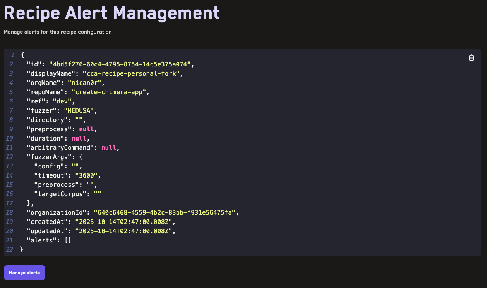
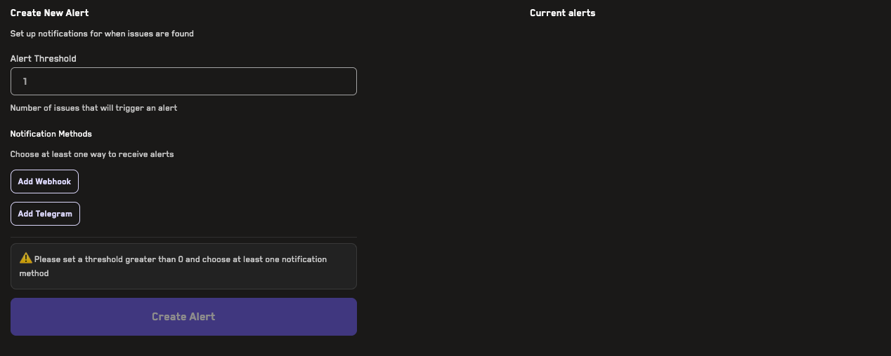
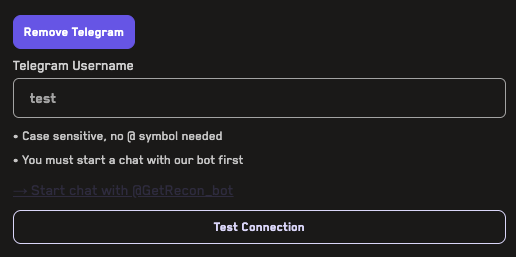
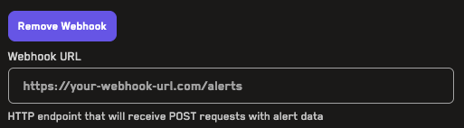
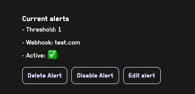

# Alerts

Alerts allow you to receive notifications when properties break during one of your runs to allow you to quickly take action. They can be added to any [recipe](/recipes.html) and specify whether an alert should trigger a Webhook or send a message on Telegram.

**Video Tutorial:** [Alerts](https://www.youtube.com/watch?v=xMRdHU4uH8M) (2min)

## Creating, Updating, and Viewing Alerts

Navigate to a Recipe


Click the _Manage Alerts_ button on the top right which will redirected you to a page that allows you to create and modify alerts for a given recipe.



Scrolling down and clicking the _Manage Alerts_ button displays all existing alerts attached to this Recipe and allows creating new alerts.



Each alert requires specifying a threshold which is the number of properties that will trigger the alert.

## Telegram Alerts 

For Telegram alerts, you simply have to specify your Telegram username in the form field.

Before creating a Telegram alert you must click the `Test Connection` button which will send a message to our Telegram Bot: `@GetRecon_bot`. Always confirm the ID of the bot and message us on [discord](https://discord.gg/aCZrCBZdFd) if you have any questions.



## Webhook Alerts

For webhooks, you can provide any URL:



Which will be sent the following payload to it once an alert is triggered:

```typescript
{
  alerted: string,
  jobId: string,
  broken property: string,
  sequence: string
}
```

## Modifying Alerts
Once you have an existing alert you can delete, disable, or edit it on the right hand side:

