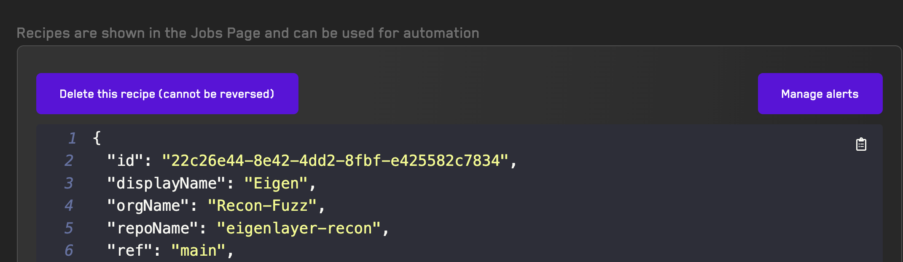
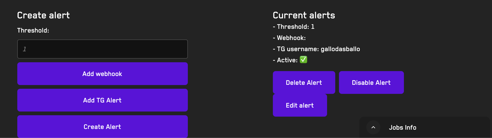

# Alerts 

Alerts can be added to any [recipe](/recipes.html)

You can specify whether an alert should trigger a Webhook or send a message on Telegram.

## Creating, Updating, and Viewing Alerts tied to a Recipe

Navigate to a Recipe


Click on `Manage Alerts` on the top right

You'll be redirected to a page that displays all your alerts for that recipe.

Scroll down and click on `Manage Alerts` to display and create all alerts attached to this Recipe


You will then be able to Delete, Disable, or Edit an alert.

Each alert can have:
- A threshold, which means the number of broken properties at which the alert will trigger

For Telegram Alerts, you just have to specify your TG username.

Make sure to `Test Telegram Username` which requires sending a message to our TG Bot

Recon's bot is `@GetRecon_bot` Please always confirm the ID of the bot and message us with any questions

## Webhook Alerts

For webhooks, you can provide any URL and we will be sending the following data to it once an alert is triggered.

```typescript
{
  alerted: string,
  jobId: string,
  broken property: string,
  sequence: string
}
```