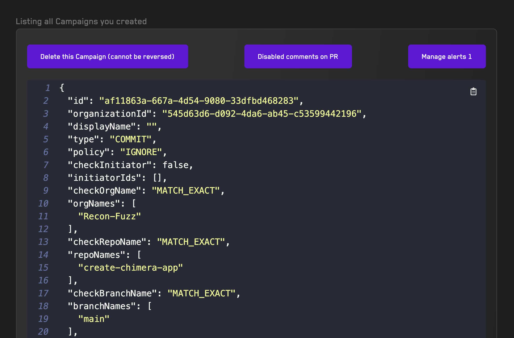

# Campaigns

Campaigns are specific CI/CD automations.

Each campaign is tied to an Organization, Repository and Branch and requires a [recipe](./recipes.md)

Whenever you push code to the branch, the Organization, Repo and Branch will be replaced to the recipe you setup for the campaign.

A job will run off of the recipe you configured.

If you added an [alert](./alerts.md) to your run then alerts will also be triggered whenever they match their criteria.

By default campaigns will leave a comment on the PR that triggered them.

They will also print a summary of the run, with a findings table and foundry repros for each broken property

## Creating a Campaign

Creating a campaign requires having [created a recipe first](./recipes.md)

Simply config the branch that you will be PRing from (e.g. if you're working on `dev` and pushing to `main`) write `dev` in the `branch` field.

If you wish to pause the campaign, delete it or manage alerts, simply scroll down to the campaign and click the buttons at the top.

At this time it's not possible to edit a campaign, however, any change to the recipe will be reflected to the campaign.