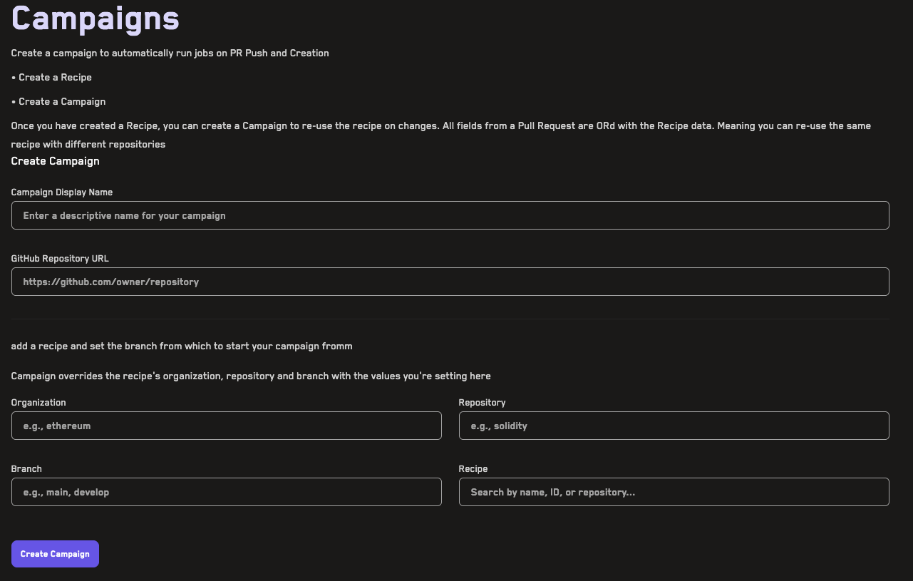
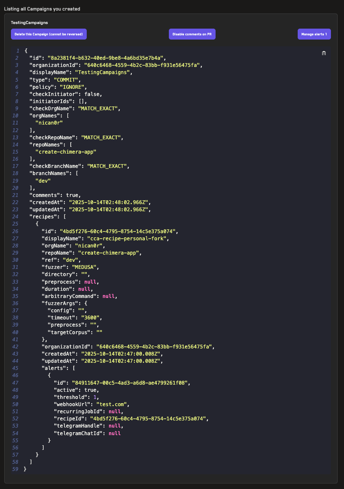
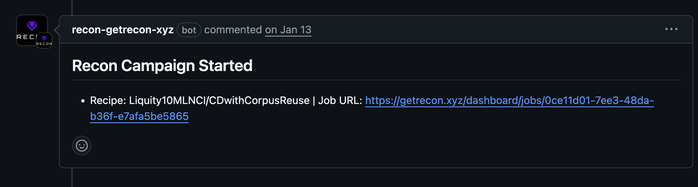
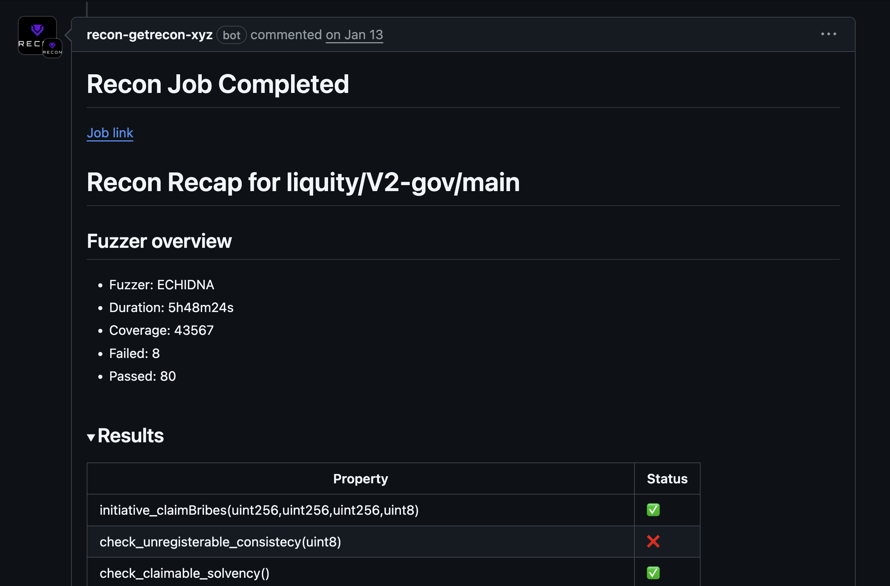

# Campaigns

Campaigns are CI/CD automations that automatically run cloud fuzzing jobs when commits are pushed to a specified branch. They integrate directly into your development workflow by running fuzzing tests on pull requests and providing immediate feedback through PR comments.

**Video Tutorial:** [Campaigns](https://www.youtube.com/watch?v=YFkwtb-RFyU) (3min)

## How Campaigns Work

Campaigns connect a specific branch in your repository to a [recipe](./recipes.md) that defines the fuzzing configuration. When you push code to the monitored branch, Recon automatically:

1. Triggers a fuzzing job using the configured campaign 
3. Runs the job with your recipe's fuzzing settings
4. Posts results directly to the pull request as comments

If you've configured [alerts](./alerts.md) for the recipe, they will also be triggered when their criteria are met during campaign runs.

## Creating a Campaign

Before creating a campaign, you must first [create a recipe](./recipes.md) that defines your fuzzing configuration.

To create a campaign:

1. Navigate to the Campaigns page
2. Fill in the campaign configuration form:
   - **Recipe**: Select the recipe to use for this campaign
   - **Organization** (optional): Your GitHub organization or username, if you are using a different organization than the one in your recipe
   - **Repository** (optional): The name of your repository, if you are using a different repository than the one in your recipe
   - **Branch** (optional): The branch you'll be pushing from (e.g., `dev` if you're creating PRs from `dev` to `main`), if you are using a different branch than the one in your recipe
3. Click the _Create Campaign_ button to activate the campaign

Once created, your campaign will automatically trigger fuzzing jobs whenever new commits are pushed to the specified branch.

## Managing Campaigns

After creating a campaign, you can modify it by scrolling to the campaign in the list and using the control buttons:

Available management options include:

- **Pause Campaign**: Temporarily stop the campaign from triggering new jobs without deleting it
- **Delete Campaign**: Permanently remove the campaign
- **Manage Alerts**: Add, edit, or remove alerts associated with the campaign's recipe

**Note**: Campaigns cannot be directly edited. However, any changes made to the underlying recipe will automatically be reflected in the campaign's behavior. To modify a campaign's configuration, update the associated recipe instead.

## Pull Request Integration

By default, campaigns will leave a comment on the PR when a fuzzing job starts:

Once the job completes, campaigns post a detailed summary that includes a table with all the tested properties and Foundry unit test reproducers for each broken property:

