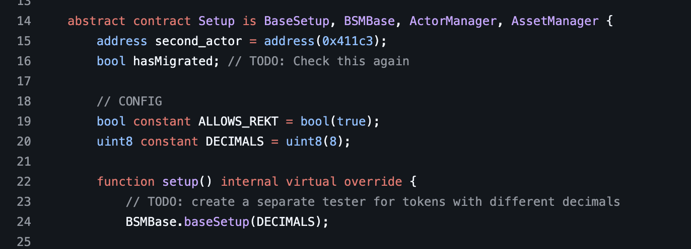
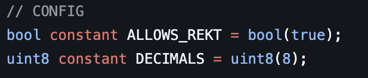
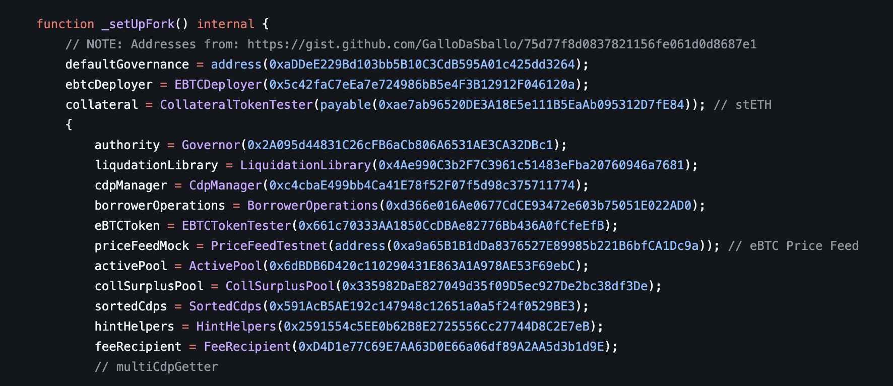
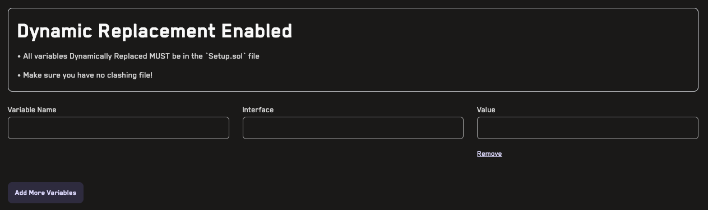

# Dynamic Replacement

Dynamic replacement allows you to replace the value of any variable in your contracts.

> To see an interactive demo of how dynamic replacement works see [here](https://getrecon.xyz/dynamic-replacement-demo), to use dynamic replacement on a real project with a Recon pro account click [here](https://getrecon.xyz/dashboard/dynamic-replacement).

**Video Tutorial:** [Dynamic Replacement](https://www.youtube.com/watch?v=fk-xl0FkhDw) (1min)

The key idea of dynamic replacement is to allow you to test multiple setup configuration variations or behaviors in your code.

You may be accustomed to creating separate "config" files that allow you to test different suite setup parameters such as:
- Maximum precision loss
- Number of actors

and other aspects of the suite.

With dynamic replacement you can change one line, click a button, and run multiple jobs that have different setup configurations, without needing to create and manage multiple branches. The chosen variables are replaced before running the fuzzer and every other part of the setup remains the same, allowing you to fine tune your testing approach for different scenarios.

## When to use Dynamic Replacement

### Toggle behavior via a boolean or by adding specific calldata

In the example above we want to allow certain unsafe ERC4626 operations via the `ALLOWS_REKT` constant. We can use dynamic replacement in this case to toggle the boolean to true or false so that we don't need to maintain two forked branches to test this minor change.

### Using constants for precision, decimals, hardcoded addresses

In the example above the suite was written to target a 18 decimal token. However, if the business requirements change and we want to be able to use the same suite for testing tokens of different decimal values, we can use dynamic replacement to reuse the suite with a different decimal value setup.

### Fork testing

In the example above we can see the common practice of hardcoding multiple addresses on a fork test for a given chain. Using dynamic replacement we can replace these in the same branch, performing fork testing on new targets, or new chains.

## Using Dynamic Replacement

Dynamic Replacement applies only to the `Setup.sol` file in your repository. 

To use:
- add the name of the variable you want to replace
- specify the interface/type of the variable 
- specify the value you want to replace the existing value with
- (optional) add additional values you'd like to replace

