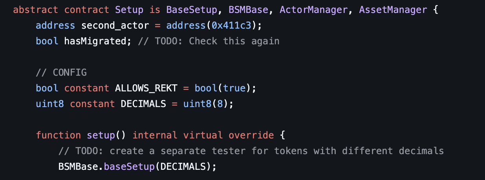

# dynamic replacement

dynamic replacement allows you to test multiple configuration variations of your contracts without managing separate branches or config files. By replacing variable values in your `Setup.sol` file before fuzzing runs, you can quickly test different scenarios with the same codebase.

**Video Tutorial:** [dynamic replacement](https://www.youtube.com/watch?v=fk-xl0FkhDw) (1min)

> **Try it out:** See an [interactive demo](https://getrecon.xyz/dynamic-replacement-demo) or use dynamic replacement with your [Recon Pro account](https://getrecon.xyz/dashboard/dynamic-replacement).

## How It Works

dynamic replacement enables you to change the value of any variable in your [`Setup.sol`](../writing_invariant_tests/chimera_framework.md#setup) file before running a fuzzing job. Instead of creating multiple branches or config files to test different scenarios, you can:

1. Identify the variables you want to modify.
2. Specify replacement values in the Recon interface.
3. Run multiple jobs with different configurations from the same branch.

The chosen variables are replaced before the fuzzer runs, while everything else in your setup remains identical. This allows you to fine-tune your testing approach for different scenarios efficiently.

## When to Use dynamic replacement

### Toggle Behavior with Boolean Flags

You can use dynamic replacement to toggle feature flags or behavior switches without maintaining separate branches. In the example above, the `ALLOWS_REKT` constant controls whether certain unsafe ERC4626 operations are permitted. By using dynamic replacement to toggle this boolean between `true` and `false`, you can test both scenarios without duplicating code.

**Common use cases:**
- Enabling/disabling specific protocol features
- Testing with and without safety checks
- Toggling between different execution modes

### Test Different Precision and Decimal Configurations

When testing contracts that interact with tokens or handle numerical precision, dynamic replacement allows you to reuse test suites across different configurations. In the example above, the suite was originally written for an 18-decimal token. Using dynamic replacement, you can test the same suite with 6-decimal or 8-decimal tokens without rewriting your tests.

**Common use cases:**
- Testing different token decimal values (6, 8, 18)
- Adjusting precision loss thresholds
- Modifying numerical constants like maximum slippage or fees

### Fork Testing with Different Addresses

Fork tests often require hardcoded addresses for contracts deployed on specific chains. dynamic replacement enables you to swap these addresses to test against different protocols, chains, or deployment versions without modifying your codebase.

**Common use cases:**
- Testing the same protocol on different chains (Ethereum, Arbitrum, Optimism)
- Comparing behavior across protocol versions
- Testing against different token addresses or pool configurations

## Using Dynamic Replacement

Dynamic replacement applies only to variables defined in your `Setup.sol` file.

To use dynamic replacement:

1. Navigate to the _Fuzzing Jobs_ or _Recipes_ page and toggle the _Enable Dynamic Replacement_ switch
2. For each variable you want to replace, provide:
   - **Variable Name**: The exact name of the variable in your `Setup.sol` file
   - **Type**: The variable's type/interface (e.g., `bool`, `uint256`, `address`)
   - **Value**: The new value to replace the existing value with
3. (Optional) Click _Add More Variables_ to specify additional replacement values for testing multiple configurations
4. Run your job or save the recipe with the dynamic replacements configured

Each replacement configuration will run as a separate job, allowing you to compare results across different variable values in parallel.

## Best Practices

- **Use descriptive variable names**: Make it clear what each variable controls to avoid confusion when setting up replacements
- **Document your configurations**: Keep track of which replacement values represent which scenarios for easier analysis
- **Combine with recipes**: Save frequently used replacement configurations as recipes for quick reuse
