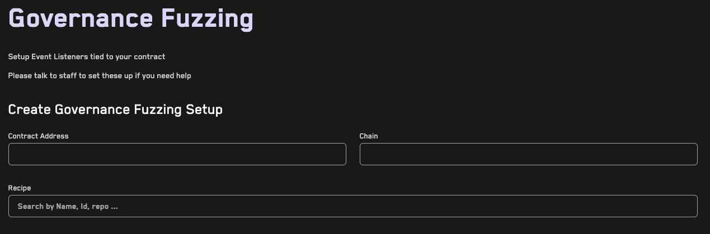
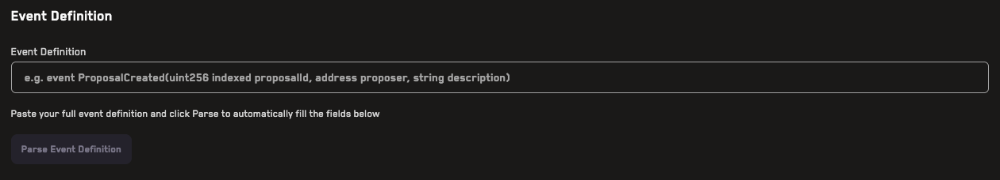
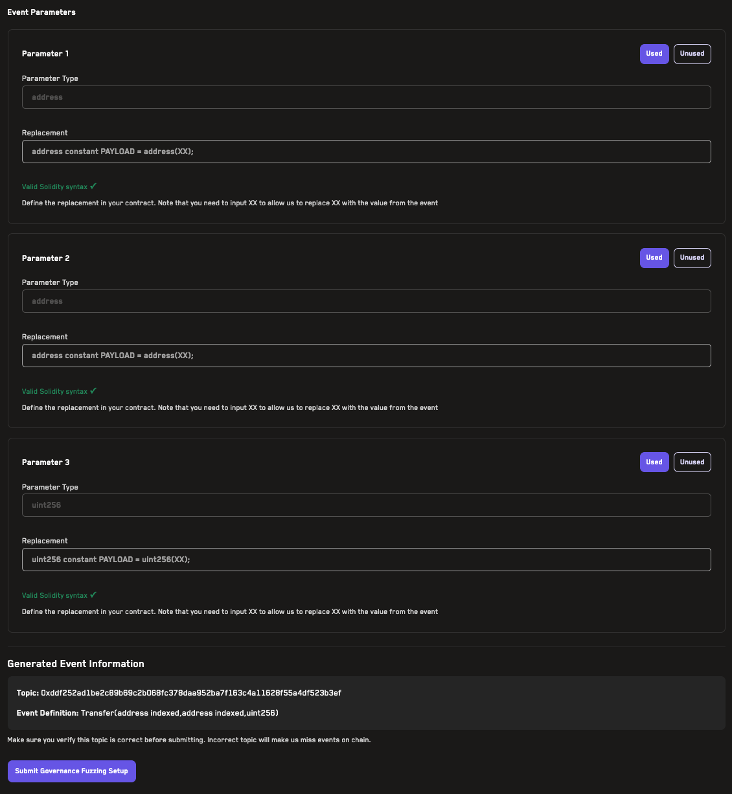

# Governance Fuzzing

Governance fuzzing allows you to automatically trigger fuzzing jobs in response to on-chain events. This is particularly useful for testing how governance proposals or system configuration changes affect your invariants before they are executed on-chain.

**Video Tutorial:** [Governance Fuzzing](https://www.youtube.com/watch?v=nrPCa59nl9M) (2min)

## What is Governance Fuzzing?

Governance fuzzing monitors on-chain events from a specific contract address and automatically runs a fuzzing job when that event is emitted. The event parameters can be used to dynamically replace values in your `Setup.sol` file, allowing you to test how different configurations affect your invariants.

Common use cases include:
- Testing governance proposals before they are executed
- Validating parameter changes suggested by governance
- Monitoring system configuration updates
- Testing emergency actions or admin changes

## How It Works

Governance fuzzing works in three main steps:

1. **Event Monitoring**: Recon listens for specific events on a contract address you specify
2. **Dynamic Replacement**: When the event is detected, parameters from the event are injected into your `Setup.sol` file using [dynamic replacement](./dynamic_replacement.md)
3. **Automatic Job Execution**: A fuzzing job is automatically triggered using a pre-configured [recipe](./recipes.md)

## Setting Up Governance Fuzzing

### Prerequisites

Before setting up governance fuzzing, you need:
- A [recipe](./recipes.md) configured for your project with fork testing enabled
- A fork testing setup that achieves full coverage over the contracts of interest
- The contract address that emits the events you want to monitor
- The event definition you want to listen for

> **Important**: Your fork setup must include calls to `vm.roll` and `vm.warp` cheatcodes because Echidna does not automatically warp to the timestamp at the block it's forking from.

### Configuration Steps

1. **Navigate to the Governance Fuzzing page** in the Recon dashboard



2. Enter the **contract address** you want to monitor for events

3. Select the **chain** where the contract is deployed

4. Choose a **recipe** that will be used to run the fuzzing job when the event is detected

5. Define the **event** you want to monitor by either pasting the full event definition (e.g., `event ProposalCreated(uint256 indexed proposalId, address proposer, string description)`)
   


6. Configure **parameter replacements**: Click _Parse Event Definition_ to automatically extract the event name and parameters for each event, specifying how it should be injected into your `Setup.sol` file:
   - **Type**: The Solidity type of the parameter
   - **Indexed**: Whether the parameter is indexed in the event (automatically detected)
   - **Replacement**: The variable in your `Setup.sol` file to replace, using `XX` as a placeholder for the event value
   - **Unused**: Toggle this if you want to ignore this parameter



### Example: Monitoring Governance Proposals

Let's say you have a governance contract that emits:

```solidity
event ProposalCreated(
    uint256 indexed proposalId,
    address proposer,
    uint256 newParameter
);
```

And you have a constant in your `Setup.sol`:

```solidity
uint256 constant TARGET_PARAMETER = 100;
```

In the governance fuzzing setup:
1. Enter your governance contract address
2. Select the appropriate chain
3. Choose your recipe
4. Paste the event definition and click "Parse Event Definition"
5. For the `newParameter` field, set the replacement to: 

```solidity
   uint256 constant TARGET_PARAMETER = uint256(XX);
```

When a `ProposalCreated` event is emitted, Recon will:
- Detect the event on-chain
- Extract the `newParameter` value from the event
- Replace `XX` in your Setup.sol with the actual value
- Run a fuzzing job to test if the new parameter breaks any invariants

## Verifying Your Setup

After configuring your governance fuzzing setup, verify:
- **Topic**: The event topic hash is displayed - make sure this matches the actual event
- **Event Definition**: The reconstructed event definition should match your contract
- **Replacements**: Review that the `XX` placeholders are in the correct positions


> **Warning**: An incorrect topic will cause Recon to miss events on-chain. Always double-check the generated topic before submitting.

## Managing Governance Fuzzing Setups

Once created, you can:
- **Edit** existing setups to modify event parameters or replacements
- **Toggle** setups on/off to pause/resume monitoring
- **Delete** setups you no longer need

All automatically triggered jobs will appear on your regular Jobs page with links to the triggering event.

## Advanced Features

### Multiple Parameter Replacements

You can configure multiple parameters from a single event to replace different values in your `Setup.sol`. For example, if an event emits both a new fee percentage and a new admin address, you can replace both values in your test setup.

### Unused Parameters

Mark parameters as "unused" if you want to monitor an event but don't need all of its parameters for your fuzzing setup. This is useful when events contain data that isn't relevant to your test configuration.

### Testing Before On-Chain Execution

The most powerful use case is testing proposals during the governance voting period, before they are executed. This gives you time to identify potential issues and raise them with the community before changes go live. 