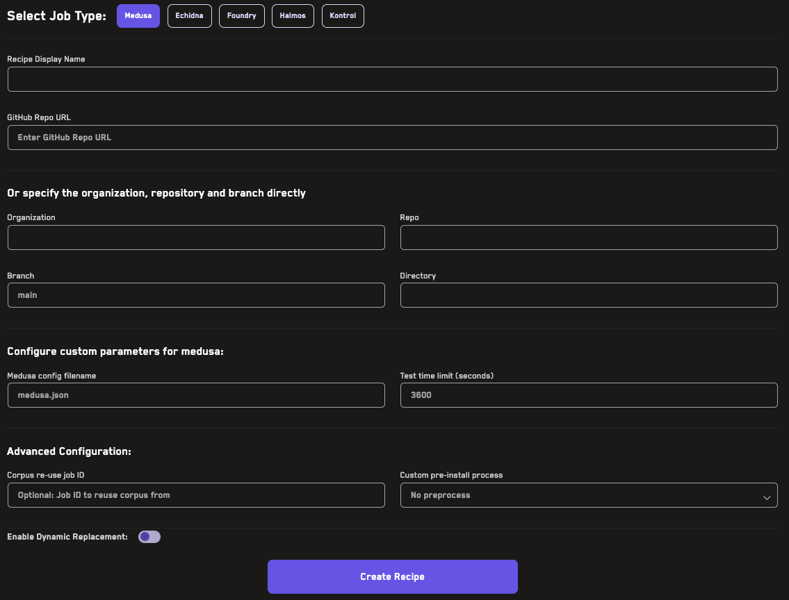
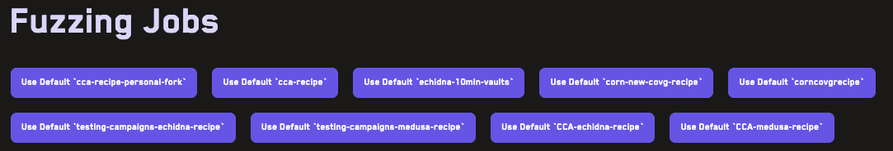

# Recipes

Recipes allow you to save job configurations for easy reuse when running jobs on Recon.

## Creating A Recipe

To create a recipe, you can use the _Recipes_ page. 

1. First you need to select the tool you want to create the recipe for (Echidna, Medusa, Foundry, Halmos, or Kontrol). 

2. Next you need to enter a name for your recipe. 

3. You can add the URL of the repo you want to create the recipe for which will autofill the Organization, Repo, and Branch fields or if you prefer, you can manually fill in these fields. 

4. Next you can add the fuzzing configuration for the recipe which will override the configurations in the config file for the tool. 

5. If your project uses a dependency system in addition to foundry, you can select the custom preinstall process in the dropdown menu. 

6. Once you've filled in all the fields, you can click the _Create Recipe_ button to save the recipe. 

Your recipe will then appear in the list of recipes at the bottom of the page. Recipes can be edited (using the _Edit this Recipe_ button) or deleted (using the _Delete this Recipe_ button) at any time. 

## Using A Recipe

To use a recipe, you can select the recipe from the list of recipes at the top of the _Jobs_ page. This will prefill all the form fields for the job configuration and you can then edit any of the values as needed. The job can then be run as normal using the _Run Job_ button. 