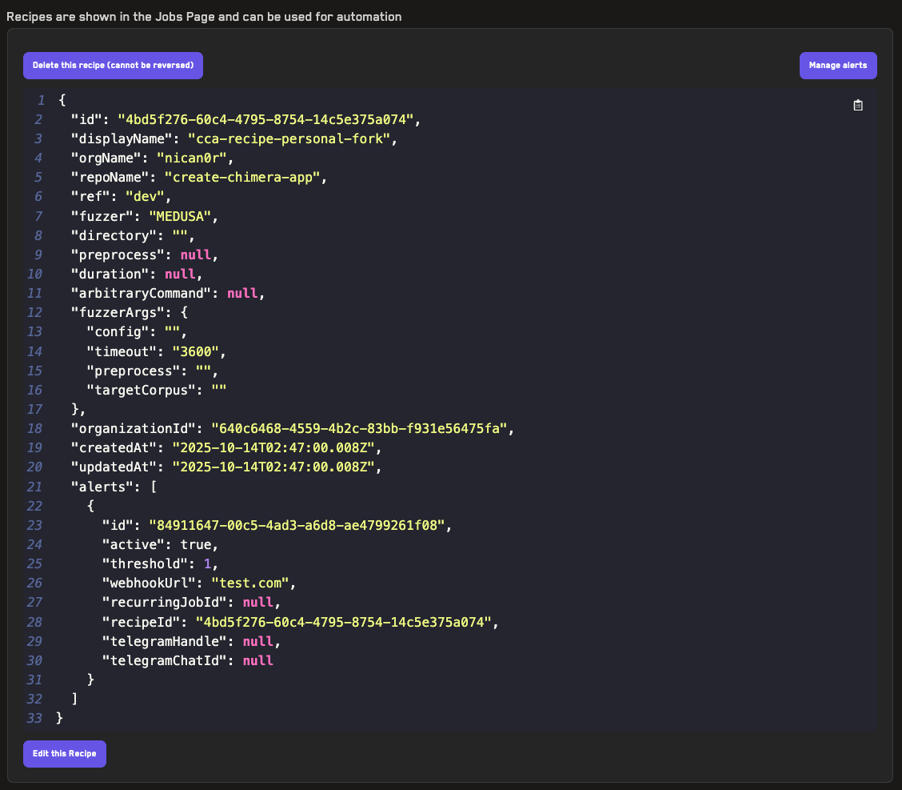

# Recipes

Recipes allow you to save and reuse job configurations for your fuzzing and verification tests. Instead of manually configuring job settings each time you run a test, recipes store your preferred configurations for quick access and consistent testing across your projects.

**Video Tutorial:** [Recipes](https://www.youtube.com/watch?v=3lByqfsxQWg) (2min)

## Why Use Recipes

Recipes provide several benefits:

- **Save time**: Avoid repeatedly entering the same configuration parameters
- **Ensure consistency**: Use identical settings across multiple test runs
- **Enable automation**: Required for setting up [campaigns](./campaigns.md) that run automatically on CI/CD
- **Share configurations**: Team members can use the same testing configurations
- **Quick iteration**: Easily modify saved configurations without starting from scratch

## Creating a Recipe

To create a recipe, navigate to the _Recipes_ page.

Follow these steps to configure your recipe:

1. **Select the tool**: Choose the fuzzing or verification tool for this recipe:
   - **Echidna**: Property-based fuzzing tool
   - **Medusa**: Go-based fuzzing framework
   - **Foundry**: Solidity testing framework with fuzzing capabilities
   - **Halmos**: Symbolic testing tool for formal verification
   - **Kontrol**: Formal verification tool using K Framework

2. **Name your recipe**: Enter a descriptive name that indicates the purpose or configuration (e.g., "MainNet Fork Test" or "High-Depth Fuzzing")

3. **Specify the repository**: You have two options:
   - **GitHub Repo URL**: Paste the full repository URL, which will automatically populate the Organization, Repo, and Branch fields
   - **Manual entry**: Manually fill in the Organization, Repo, and Branch fields if you prefer

4. **Configure tool settings** (Optional): Add fuzzing or verification configuration parameters that will override the settings in your tool's config file:
   - Test depth/duration
   - Number of workers
   - Corpus directory
   - Custom test filters
   - Any other tool-specific parameters

5. **Set up dependencies** (Optional): If your project uses a dependency system beyond Foundry (e.g., npm, yarn, or custom build scripts), select the appropriate preinstall process from the dropdown menu

6. **Configure Dynamic Replacement** (Optional): Use [dynamic replacement](./dynamic_replacement.md) to specify variables in your `Setup.sol` file that should be replaced with different values

7. **Click _Create Recipe_**: Save your configuration

Your recipe will appear in the list at the bottom of the page, where you can manage it using the available controls.

## Managing Recipes

Once created, recipes appear in the list at the bottom of the _Recipes_ page. Each recipe includes management options:

- **Edit this Recipe**: Modify any of the recipe's settings, including tool configuration, repository details, or dynamic replacements
- **Delete this Recipe**: Permanently remove the recipe (Note: this will also delete any campaigns using this recipe)
- **Manage Alerts**: Set up [alerts](./alerts.md) to receive notifications when properties break during fuzzing runs

## Using a Recipe

To use a saved recipe when running a job:

1. Navigate to the _Jobs_ page
2. Click the _Select Recipe_ dropdown at the top of the job configuration form
3. Choose your desired recipe from the list
4. The form fields will automatically populate with the recipe's configuration
5. (Optional) Modify any values as needed for this specific run
6. Click _Run Job_ to start the fuzzing or verification test

**Note**: Changes made to field values when running a job do not affect the saved recipe. To permanently update a recipe's configuration, use the _Edit this Recipe_ button on the _Recipes_ page.

## Recipe Configuration in Campaigns

Recipes are essential for [campaigns](./campaigns.md), which automatically run fuzzing jobs on commits. When a campaign triggers:

- The campaign uses the recipe's tool and configuration settings
- The Organization, Repo, and Branch values from the commit override the recipe's values
- All other settings (tool parameters, dynamic replacements, alerts) remain as configured in the recipe

This allows you to maintain consistent fuzzing configurations across your CI/CD pipeline while testing different branches and repositories.
