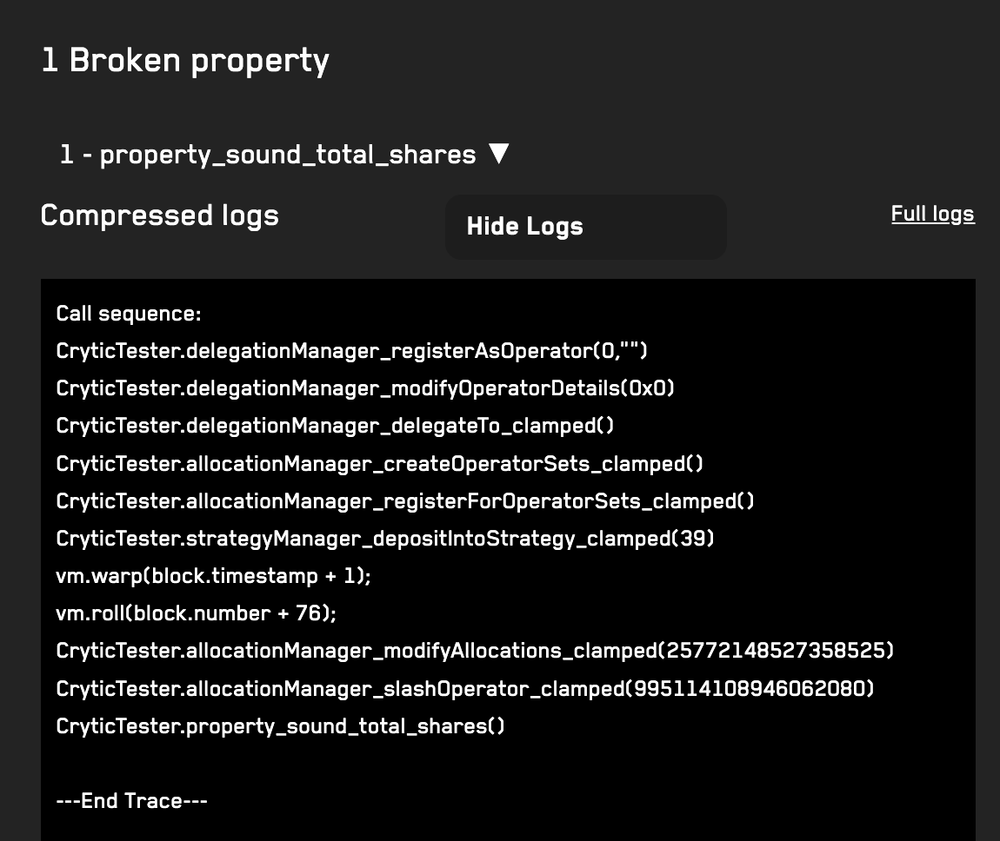

# Recon Tricks

We've been using Recon for over a year to run all of our cloud runs.

Here's some tips and tricks:

**Video Tutorial:** [Recon Magic Workflow](https://www.youtube.com/watch?v=Hrshkv7ID2U) (8min)

## Run in exploration mode for an excessive amount of tests

Exploration mode is faster and builds a corpus faster.

While building your suite, make use of this mode.

## Think about Corpus Reuse

**Video Tutorial:** [Corpus Reuse](https://www.youtube.com/watch?v=U0GmaE_P4Jc) (2min)

Some runs can take days to explore all states.

If you reuse corpus, these days' worth of data can be replied to within minutes.

Always use corpus re-use.

There's a reason why we prominently allow you to download corpus and paste it into any job, it's because we know it works.

## Don't acknowledge small precision losses before using Optimization Mode

Sometimes you'll break a property with a small precision threshold and think you're done.

From our experience, you should run some Optimization Tests.

The way the corpus for Optimization is built is a bit different, so running Optimization tests can lead you to different results.

## Share your Jobs as soon as they start

You can save a lot of back and forth by creating a share and sending it to your team or auditors.

Recon jobs update automatically every minute, so once you know the job will work you can share it and go afk

## Use Dynamic Replacement for Config

Thinking about multi-deployment tests?
Admin Mistakes?
Hardcoded Precision Tolerance?

Just set these as constants in your `Setup` file and then use Dynamic Replacement.

You already paid for the cloud service, save time and run a few extra runs to help you test all edge cases.

## Reuse your suite for Monitoring

Some invariant testing suites end up having hundreds of thousands of dollars worth of effort put into them.

Echidna, Medusa, and Foundry all support fuzzing on Forked tests

Repurposing a Chimera suite to work with forking takes just a couple of hours, and Recon supports API jobs with Dynamic Replacement.

We've demoed using Invariant Testing as the best monitoring at [Fuzz Fest](https://www.youtube.com/watch?v=Cqmu-mhSLt8&t=5657s)