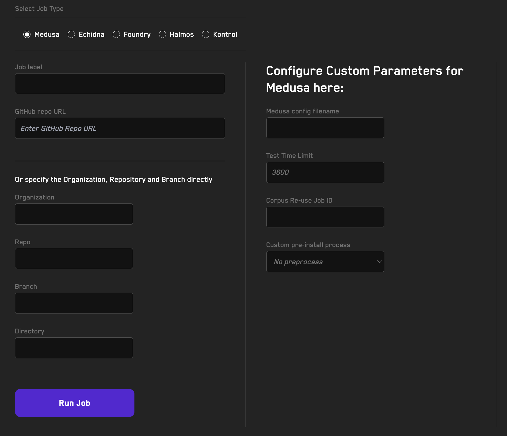

# Running Jobs In The Cloud With Recon

The jobs page is where you can run new fuzzing jobs on Recon's cloud service and see existing jobs you've run.

Using Recon's Job running feature you can offload long-duration jobs to Recon's cloud service so you don't waste computational resources locally and can run long-term jobs without worrying about something failing at the last minute because of something you did on your local machine.

You can run jobs on both public and private repositories. For private repos, you'll need to [install the Recon GitHub App](./getting_started.md#using-private-repositories) first.

**Video Tutorial:** [Run Jobs with Recon Pro](https://www.youtube.com/watch?v=LWQeFSZ9kz4) (5min)

## How To Run A Fuzzing Job

On the _Jobs_ tab you'll see a form for running a job. 

1. First select the tool you'd like to use to run your job. The Echidna, Medusa, and Foundry options use fuzzing. The Halmos and Kontrol options use formal verification. 

2. Next add the repository you'd like to fuzz or verify in the _GitHub Repo Url_ field. Additionally, you can specify a custom name for the job in the _Job Name_ field. If you don't specify a custom name, Recon will generate one for you that is a hash with numbers and letters. 

3. If you'd prefer to specify the organization, repo name, branch, and directory where the `foundry.toml` file is located, you can do so in the _Organization_, _Repo Name_, _Branch_ and _Directory_ fields. 

4. Next you can specify the configuration parameters for the tool you selected in step 1 using a config file or by specifying values in the form fields directly (NOTE: these will override any parameters set in the config file if one is passed in). 

5. If your project uses a dependency system in addition to foundry, you can select the custom preinstall process in the dropdown menu.

## Tool-Specific Video Tutorials

- [Echidna Jobs](https://www.youtube.com/watch?v=JvPrJPGTjY8) (5min)
- [Foundry Jobs](https://www.youtube.com/watch?v=GIURs72Nqno) (2min)
- [Medusa Jobs](https://www.youtube.com/watch?v=xXd0CV92Rp8) (1min)
- [Halmos Jobs](https://www.youtube.com/watch?v=PxD7xSCtnPA) (1min)
