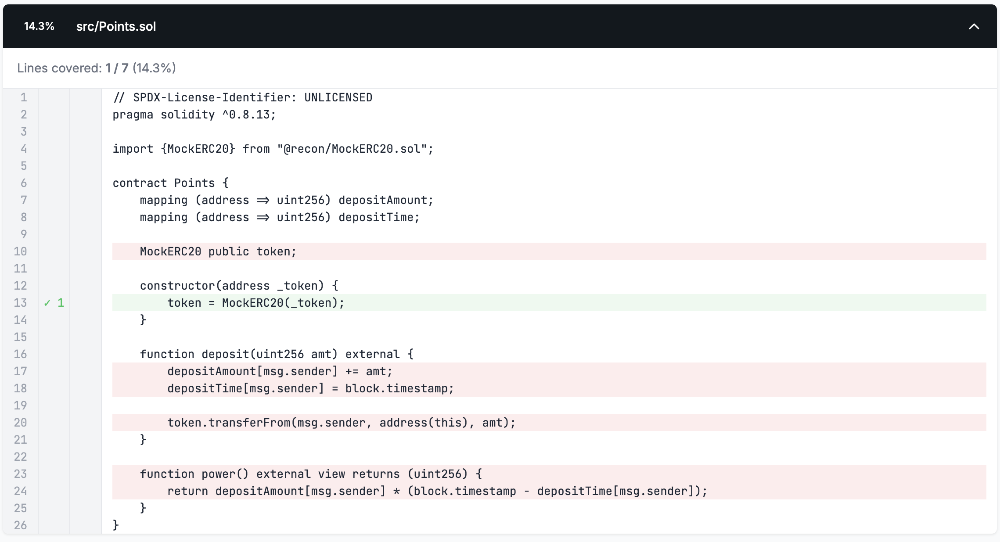

# Introduction

In this section, we'll use the [Create Chimera App](../oss/create_chimera_app.md) template to create a simple contract and run invariant tests on it.

> Prerequisites: the example shown below requires that you have [Foundry](https://getfoundry.sh/introduction/installation)  and [Medusa](https://github.com/crytic/medusa?tab=readme-ov-file#install) installed on your local machine

## Getting started

Clone the [create-chimera-app-no-boilerplate](https://github.com/Recon-Fuzz/create-chimera-app-no-boilerplate) repo.

Or 

Use `forge init --template https://github.com/Recon-Fuzz/create-chimera-app-no-boilerplate`

## Writing the contract

First, in the `src/` directory we'll create a simple `Points` contract that allows users to make a deposit and earn points proportional to the amount of time that they've deposited for, where longer deposits equal more points:

```javascript

// SPDX-License-Identifier: UNLICENSED
pragma solidity ^0.8.13;

import {MockERC20} from "@recon/MockERC20.sol";

contract Points {
    mapping (address => uint88) depositAmount;
    mapping (address => uint256) depositTime;
    uint256 totalDeposits; 

    MockERC20 public token;

    constructor(address _token) {
        token = MockERC20(_token);
    }

    function deposit(uint88 amt) external {
        depositAmount[msg.sender] += amt;
        depositTime[msg.sender] = block.timestamp;
        totalDeposits += amt;

        token.transferFrom(msg.sender, address(this), amt);
    }

    function power() external view returns (uint256) {
        return depositAmount[msg.sender] * (block.timestamp - depositTime[msg.sender]);
    }
}
    
```

## Adding to `Setup`

Now with a contract that we can test, we can deploy it in the `Setup` contract:

```javascript
abstract contract Setup is BaseSetup, ActorManager, AssetManager, Utils {
    Points points;

    /// === Setup === ///
    function setup() internal virtual override {
        _newAsset(18); // deploys an 18 decimal token

        // Deploy Points contract
        points = new Points(_getAsset()); // uses the asset deployed above and managed by the AssetManager

        // Mints the deployed asset to all actors and sets max allowances for the points contract
        address[] memory approvalArray = new address[](1);
        approvalArray[0] = address(points);
        _finalizeAssetDeployment(_getActors(), approvalArray, type(uint256).max);
    }

    /// === MODIFIERS === ///
    modifier asAdmin {
        vm.prank(address(this));
        _;
    }

    modifier asActor {
        vm.prank(address(_getActor()));
        _;
    }
}
```

The [AssetManager](../oss/setup_helpers.md#assetmanager) allows us to deploy assets (using `_newAsset`) that we can use in our `Points` contract with simplified fetching of the currently set asset using `_getAsset()`. 

We then use the `_finalizeAssetDeployment` utility function provided by the `AssetManager` to approve the deployed asset for all actors (tracked in the [ActorManager](../oss/setup_helpers.md#actormanager)) to the `Points` contract.

## Running the fuzzer

We can now run the fuzzer with no state exploration since we haven't added [handler](../using_recon/building_handlers.md#what-are-handlers) functions.

Before we run the fuzzer however we'll use Foundry to check that the project compiles correctly because it provides faster feedback on this than Medusa.

Running `forge build` we see that it compiles successfully, meaning the deployment in the `Setup` contract works as expected:

```python
$ forge build
[⠊] Compiling...
[⠘] Compiling 44 files with Solc 0.8.28
[⠃] Solc 0.8.28 finished in 717.19ms
Compiler run successful!
```

We can now run the [Medusa](https://github.com/crytic/medusa) fuzzer using `medusa fuzz`, which gives us the following output:

```bash
medusa fuzz
⇾ Reading the configuration file at: /temp/example-recon/medusa.json
⇾ Compiling targets with crytic-compile
⇾ Running command:
crytic-compile . --export-format solc --foundry-compile-all
⇾ Finished compiling targets in 5s
⇾ No Slither cached results found at slither_results.json
⇾ Running Slither:
slither . --ignore-compile --print echidna --json -
⇾ Finished running Slither in 7s
⇾ Initializing corpus
⇾ Setting up test chain
⇾ Finished setting up test chain
⇾ Fuzzing with 16 workers
⇾ [NOT STARTED] Assertion Test: CryticTester.switch_asset(uint256)
⇾ [NOT STARTED] Assertion Test: CryticTester.add_new_asset(uint8)
⇾ fuzz: elapsed: 0s, calls: 0 (0/sec), seq/s: 0, branches hit: 289, corpus: 0, failures: 0/0, gas/s: 0
⇾ [NOT STARTED] Assertion Test: CryticTester.asset_approve(address,uint128)
⇾ [NOT STARTED] Assertion Test: CryticTester.asset_mint(address,uint128)
⇾ [NOT STARTED] Assertion Test: CryticTester.switchActor(uint256)
⇾ fuzz: elapsed: 3s, calls: 70172 (23389/sec), seq/s: 230, branches hit: 481, corpus: 126, failures: 0/692, gas/s: 8560148887
⇾ fuzz: elapsed: 6s, calls: 141341 (236
```

You can now stop medusa with `CTRL + C`.

At this point, we expect almost no lines to be covered (indicated by the low `corpus` value in the console logs). We can note however that because the `corpus` value is nonzero, something is being covered, in our case this is the exposed functions in the [`ManagerTargets`](../oss/setup_helpers.md) which provide handlers for the functions in the `AssetManager` and `ActorManager`.

We can now open the coverage report located at `/medusa/coverage/coverage_report.html` to confirm that none of the lines in the `Points` contract are actually being covered.

In our coverage report a line highlighted in green means the line was reached by the fuzzer, a line highlighted in red means the line was not.



Let's rectify the lack of coverage in our `Points` contract by adding target function handlers.

## Building target functions

Foundry produces an `/out` folder any time you compile your project which contains the ABI of the `Points` contract.

We'll use this in conjunction with our [Invariants builder](../free_recon_tools/builder.md) to quickly generate target function handlers for our `TargetFunctions` contract using the following steps:
1. Open `out/Points.sol/Points.json`
2. Copy the entire contents
3. Navigate to the <a href="https://getrecon.xyz/tools/sandbox" target="_blank" rel="noopener noreferrer">Invariants Builder</a>
4. Paste the ABI
5. Rename the contract to `points` replacing the text in the "Your_contract" form field

This generates a `TargetFunctions` contract for `Points`. In our case we'll first just add the handler created for the `deposit` function:


In this case you can just copy the `points_deposit` handler into your `TargetFunctions.sol` contract. When working on a larger project however, you can use the _Download All Files_ button to add multiple handlers directly into your project at once.

Make sure to add the `updateGhosts` and `asActor` modifiers to the `points_deposit` function if they are not present:
- `updateGhosts` - will update all ghost variables before and after the call to the function
- `asActor` - will ensure that the call is made by the currently active actor (returned by `_getActor()`)

Your `TargetFunctions` contract should now look like:

```javascript
abstract contract TargetFunctions is
    AdminTargets,
    DoomsdayTargets,
    ManagersTargets
{
    function points_deposit(uint88 amt) public updateGhosts asActor {
        points.deposit(amt);
    }
}
```

We can now run Medusa again to see how our newly added target function has changed our coverage. 


We now see that the `deposit` function is fully covered, but the `power` function is not since we haven't added a handler for it. Since the power function is non-state-changing (indicated by the `view` decorator) we'll leave it without a handler for now as it won't affect our ability to test properties.

> The coverage report is effectively our eyes into what the fuzzer is doing.

We can now start defining properties to see if there are any edge cases in our `Points` contract that we may not have expected.

--- 

## Implementing Properties 

### Checking for overflow

A standard [property](../writing_invariant_tests/implementing_properties.md#what-are-properties) we might want to check in our `Points` contract is that it doesn't revert due to overflow. 

Reverts due to over/underflow are not detected by default in Medusa and Echidna, so to explicitly test for this we can use a try-catch block in our `DoomsdayTargets` contract (this contract is meant for us to define things that should never happen in the system):

```javascript
...
import {Panic} from "@recon/Panic.sol";

abstract contract DoomsdayTargets is
    BaseTargetFunctions,
    Properties
{
    /// Makes a handler have no side effects
    /// The fuzzer will call this and because it reverts it will be removed from call sequences during shrinking
    modifier stateless() {
        _;
        revert("stateless");
    }

    function doomsday_deposit_revert(uint88 amt) public stateless asActor {
        try points.deposit(amt) {
            // success
        } catch (bytes memory err) {
            expectedError = checkError(err, Panic.arithmeticPanic); // catches the specific revert we're interested in
            t(!expectedError, "should never revert due to under/overflow");
        }
    }
}
```
> We use the `checkError` function from the [Utils](../oss/setup_helpers.md#utils) contract to allow us to check for a particular revert message. The [`Panic`](../oss/setup_helpers.md#panic) library allows us to easily check for an arithmetic panic in particular without having to specify the panic code (note that this needs to be added as an import in the above). 

We use the `stateless` modifier so that state changes made by this function call aren't preserved because they make the same changes as the `points_deposit` function. 

Having two handlers that make the same state changes makes it more difficult to debug when we have a broken call sequence because we can easily tell what the `points_deposit` function does but it's not as clear from the name what the `doomsday_deposit_revert` does. Having `doomsday_deposit_revert` be stateless ensures that it only gets executed as a test in a call sequence for specific behavior that should never happen. 

This pattern is very useful if you want to perform extremely specific tests that would make your normal handlers unnecessarily complex.

### Testing for monotonicity

We can say that the `Points` contract's `power` variable value should be monotonically increasing (always increasing) since there's no way to withdraw, which we can prove with a global property and ghost variables.

To keep things simple, we'll only test this property on the current actor (handled by the [`ActorManager`](../oss/setup_helpers.md#actormanager)) which we can fetch using `_getActor()`.

Next we'll need a way to fetch the `power` for the deposited user before and after each call to our `points_deposit` target function using the `BeforeAfter` contract:

```javascript
abstract contract BeforeAfter is Setup {
    struct Vars {
        uint256 power;
    }

    Vars internal _before;
    Vars internal _after;

    modifier updateGhosts {
        __before();
        _;
        __after();
    }

    function __before() internal {
        // reads value from state before the target function call 
        _before.power = points.power();
    }

    function __after() internal {
        // reads value from state after the target function call 
        _after.power = points.power();
    }
}
```

This will update the `power` value in the `_before` and `_after` struct when the `updateGhosts` modifier is called on the `points_deposit` handler.

Now that we can know the state of the system before our state changing call, we can specify the property in the `Properties` contract:

```javascript
abstract contract Properties is BeforeAfter, Asserts {
    function property_powerIsMonotonic() public {
        gte(_after.power, _before.power, "property_powerIsMonotonic");
    }
}
```

If we now run `medusa fuzz` we should get two broken properties!

---

## Broken properties

### Generating reproducers
After running the fuzzer you should see the following broken property in the console logs: 
```python
⇾ [FAILED] Assertion Test: CryticTester.doomsday_deposit_revert(uint88)
Test for method "CryticTester.doomsday_deposit_revert(uint88)" resulted in an assertion failure after the following call sequence:
[Call Sequence]
1) CryticTester.points_deposit(uint88)(235309800868430114045226835) (block=2, time=573348, gas=12500000, gasprice=1, value=0, sender=0x10000)
2) CryticTester.doomsday_deposit_revert(uint88)(102431335005787171573853953) (block=2, time=573348, gas=12500000, gasprice=1, value=0, sender=0x30000)
[Execution Trace]
 => [call] CryticTester.doomsday_deposit_revert(uint88)(102431335005787171573853953) (addr=0x7D8CB8F412B3ee9AC79558791333F41d2b1ccDAC, value=0, sender=0x30000)
         => [call] StdCheats.prank(address)(0x7D8CB8F412B3ee9AC79558791333F41d2b1ccDAC) (addr=0x7109709ECfa91a80626fF3989D68f67F5b1DD12D, value=0, sender=0x7D8CB8F412B3ee9AC79558791333F41d2b1ccDAC)
                 => [return ()]
         => [call] Points.deposit(uint88)(102431335005787171573853953) (addr=0x6804A3FF6bcf551fACf1a66369a5f8802B3C9C58, value=0, sender=0x7D8CB8F412B3ee9AC79558791333F41d2b1ccDAC)
                 => [panic: arithmetic underflow/overflow]
         => [event] Log("should never revert due to under/overflow")
         => [panic: assertion failed]
```
For all but the simplest call sequences this is very difficult to read and even harder to debug. This is why we made the Chimera Framework extremely opinionated, because we believe that reading Medusa and Echdina traces is a very slow and difficult way to debug broken properties.

As a result of this, all of our templates come with the ability to reproduce broken properties as unit tests in Foundry.

So instead of debugging our broken property from the Medusa logs directly, we'll use Foundry:
1. Copy the Medusa output logs in your terminal
2. Go to the <a href="https://getrecon.xyz/tools/medusa" target="_blank" rel="noopener noreferrer">Medusa Log Scraper</a> tool
3. Paste the logs
4. A reproducer unit test will be created for the broken property automatically
5. Click the dropdown arrow to show the unit test


6. Disable the `vm.prank` cheatcode by clicking the button (as we're overriding Medusa's behavior)
7. Click on the clipboard icon to copy the reproducer 
8. Open the `CryticToFoundry` contract and paste the reproducer unit test
10. Run it with Foundry using the `forge test --match-test test_doomsday_deposit_revert_0 -vvv` command in the comment above it

```javascript
// forge test --match-contract CryticToFoundry -vv
contract CryticToFoundry is Test, TargetFunctions, FoundryAsserts {
    function setUp() public {
        setup();
    }

    // forge test --match-test test_doomsday_deposit_revert_0 -vvv 
    function test_doomsday_deposit_revert_0() public {
        vm.roll(2);
        vm.warp(573348);
        points_deposit(235309800868430114045226835);
        
        vm.roll(2);
        vm.warp(573348);
        doomsday_deposit_revert(102431335005787171573853953);
    }
}
```

We now have a Foundry reproducer! This makes it much easier to debug because we can quickly test only the call sequence that causes the property to break and add logging statements wherever needed.

You'll also notice that although intuitively the `property_powerIsMonotonic` property should not break because we don't allow deposits to be withdrawn, the fuzzer breaks it:
```python
⇾ [FAILED] Assertion Test: CryticTester.property_powerIsMonotonic()
Test for method "CryticTester.property_powerIsMonotonic()" resulted in an assertion failure after the following call sequence:
[Call Sequence]
1) CryticTester.points_deposit(uint88)(38781313) (block=9757, time=110476, gas=12500000, gasprice=1, value=0, sender=0x10000)
2) CryticTester.points_deposit(uint88)(0) (block=44980, time=367503, gas=12500000, gasprice=1, value=0, sender=0x20000)
3) CryticTester.property_powerIsMonotonic()() (block=44981, time=422507, gas=12500000, gasprice=1, value=0, sender=0x10000)
[Execution Trace]
 => [call] CryticTester.property_powerIsMonotonic()() (addr=0x7D8CB8F412B3ee9AC79558791333F41d2b1ccDAC, value=0, sender=0x10000)
         => [event] Log("property_powerIsMonotonic")
         => [panic: assertion failed]
```

Debugging the cause of this break is left as an exercise for the reader, but we'll learn some useful tricks in the next section below for debugging the broken property in `points_deposit`.

### Debugging the overflow property

Running the reproducer for the `doomsday_deposit_revert` property we can clearly see that we get an over/underflow but it's not very clear from the call trace where this happens exactly:

```python
    ├─ [843] Points::deposit(102431335005787171573853953 [1.024e26])
    │   └─ ← [Revert] panic: arithmetic underflow or overflow (0x11)
    ├─ [7048] Utils::checkError(0x4e487b710000000000000000000000000000000000000000000000000000000000000011, "Panic(17)")
    │   ├─ [6142] Utils::_getRevertMsg(0x4e487b710000000000000000000000000000000000000000000000000000000000000011)
    │   │   ├─ [930] Utils::_checkIfPanic(0x4e487b710000000000000000000000000000000000000000000000000000000000000011)
    │   │   │   └─ ← true
    │   │   ├─ [5062] Utils::_getPanicCode(0x4e487b710000000000000000000000000000000000000000000000000000000000000011)
    │   │   │   └─ ← "Panic(17)", false
    │   │   └─ ← "Panic(17)", false
    │   └─ ← true
    ├─ [0] VM::assertTrue(false, "should never revert due to under/overflow") [staticcall]
    │   └─ ← [Revert] should never revert due to under/overflow
    └─ ← [Revert] should never revert due to under/overflow
```

We can add console logs to the `Points` contract and the reproducer to see where exactly it overflows:

```javascript
    function deposit(uint88 amt) external {
        console2.log("here 1");
        depositAmount[msg.sender] += amt;
        console2.log("here 2");
        depositTime[msg.sender] = block.timestamp;
        console2.log("here 3");
        totalDeposits += amt;
        console2.log("here 4");

        token.transferFrom(msg.sender, address(this), amt);
    }
```

```javascript
    function test_doomsday_deposit_revert_0() public {
        console2.log("=== Before Deposit ===");
        vm.roll(2);
        vm.warp(573348);
        points_deposit(235309800868430114045226835);
        
        console2.log("=== Before Doomsday ===");
        vm.roll(2);
        vm.warp(573348);
        doomsday_deposit_revert(102431335005787171573853953);
    }
```

Which gives us the following console logs when we run the test:

```python
  === Before Deposit ===
  here 1
  here 2
  here 3
  here 4
  === Before Doomsday ===
  here 1
```

This indicates to us that the issue is in the second increment of `depositAmount`. If we check the type of `depositAmount` we see that it's a `uint88`. 

```javascript
contract Points {
    mapping (address => uint88) depositAmount;
    ...
}
```

This indicates that we must be depositing more than `type(uint88).max`, and if we check if the sum of the deposited amounts in the test is greater than `type(uint88).max`, we get the following:

```javascript
  sum of deposits 337741135874217285619080788
  type(uint88).max 309485009821345068724781055
  sum of deposits > type(uint88).max true
```

So we can see that the issue happens because in our `Setup` we initially mint `type(uint256).max` to the actor so they can deposit more than `type(uint88).max` over multiple calls: 

```javascript
    function setup() internal virtual override {
        ...
        _finalizeAssetDeployment(_getActors(), approvalArray, type(uint256).max);
    }
```

This means that to fix the broken property we either need to change the type of the `depositAmount` variable to `uint256` or limit the amount that we initially mint to the actor. For our purposes we'll change the type of the `depositAmount` variable. 

Now when we run the fuzzer we can see that the property no longer breaks:

```python
^C⇾ Fuzzer stopped, test results follow below ...
⇾ [PASSED] Assertion Test: CryticTester.add_new_asset(uint8)
⇾ [PASSED] Assertion Test: CryticTester.asset_approve(address,uint128)
⇾ [PASSED] Assertion Test: CryticTester.asset_mint(address,uint128)
⇾ [PASSED] Assertion Test: CryticTester.doomsday_deposit_revert(uint88)
⇾ [PASSED] Assertion Test: CryticTester.points_deposit(uint88)
⇾ [PASSED] Assertion Test: CryticTester.switch_asset(uint256)
⇾ [PASSED] Assertion Test: CryticTester.switchActor(uint256)
⇾ [FAILED] Assertion Test: CryticTester.property_powerIsMonotonic()
Test for method "CryticTester.property_powerIsMonotonic()" resulted in an assertion failure after the following call sequence:
[Call Sequence]
1) CryticTester.points_deposit(uint88)(73786976294838206465) (block=19477, time=38924, gas=12500000, gasprice=1, value=0, sender=0x30000)
2) CryticTester.asset_mint(address,uint128)(0x7D8CB8F412B3ee9AC79558791333F41d2b1ccDAC, 79387721835223434743036999817) (block=43362, time=399548, gas=12500000, gasprice=1, value=0, sender=0x10000)
3) CryticTester.points_deposit(uint88)(0) (block=43362, time=399548, gas=12500000, gasprice=1, value=0, sender=0x10000)
4) CryticTester.property_powerIsMonotonic()() (block=43363, time=882260, gas=12500000, gasprice=1, value=0, sender=0x30000)
[Execution Trace]
 => [call] CryticTester.property_powerIsMonotonic()() (addr=0x7D8CB8F412B3ee9AC79558791333F41d2b1ccDAC, value=0, sender=0x30000)
         => [event] Log("property_powerIsMonotonic")
         => [panic: assertion failed]


⇾ Test summary: 7 test(s) passed, 1 test(s) failed
```

This is one of the key benefits of having properties defined, they allow you to check your codebase against any changes you make to ensure that you don't introduce new bugs.

> Note that changing the `depositAmount` to `uint256` only resolves this issue when we have a single actor that deposits, if there are multiple actors that deposit whose balances sum to more than `type(uint256).max` the property will break again.

Now it's your turn, see if you can apply the techniques discussed here to figure out why the `property_powerIsMonotonic` breaks! 

If you get stuck or need help, reach out to the Recon team in our [discord](https://discord.gg/aCZrCBZdFd)!